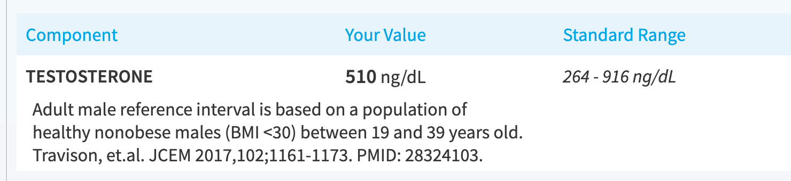
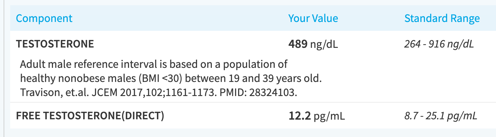

# Supplements

I play around with various supplements and see how it affects my body.

Alphabetical order, but you can always search on the top right.

## Creatine

Many studies conclude that creatine makes your muscles grow better. Is this true?

### Hypothesis

I didn't have one and didn't know what to expect. I just wanted to look swole.

### Accidental Experiment

Each week, I do the exercise I hate the most: leg extensions to failure. Failure meaning:

> My quads can no longer activate to complete the range of motion to pull the stack up.

I forgot to take creatine for a week and retook it the next week.

### Results

#### Physical

|                   | Month 1 | Month 2 | Month 3 | Month 4 | Month 5       |
| ----------------- | ------- | ------- | ------- | ------- | ------------- |
| Weight            | **130** | **140** | **155** | **160** | **170**       |
| Week 1 reps (max) | 20      | skip    | 26      | 24      | 23            |
| Week 2 reps (max) | 24      | 24      | 25      | 25      | (in progress) |
| Week 3 reps (max) | 25      | 25      | 24      | 25      |               |

I forgot to take it in month 2, week 2, and then retook it month 2, week 3. I went from:

* 140 lbs, 25 max -> 155 lbs, 26 max.

I also took a week off creatine between month 4 week 3, and month 5 week 1 (rested for a week, forgot to take creatine). Went from:

* 160 lbs, 25 max -> 170 lbs, 23 max

With creatine it seems like I can keep the reps up month-to-month even when I increase weights. But when I stop it, I lose out on a couple reps. **This is important because it's the last few reps that give you most of your gains.**

This is very small sample size so I might add more later.

#### Mental

I feel "flat" now if I forget to take creatine for a bit and I work out. If I take creatine my muscles feel more "full." Could be placebo.

### Conclusion

I think it is working. The numbers certainly don't disprove it. And the effects are more or less subtle, but with creatine I feel "good" at the gym. Without, I feel normal. There's almost infinite studies to show that creatine does help with muscle fullness and muscle growth though, so I do not think it is placebo.

## Tongkat Ali

This is all the hype for boosting testosterone. Having high test is good for:

* Muscle recovery
* Stamina
* Getting stronger, faster

And probably a plethora of other things. This claim was popularized by Andrew Huberman. So I tried it out.

### Hypothesis

I took a testosterone test last year and back then I was just fat and didn't do any weightlifting. Just some light cardio each day.

Given the hype, I am expecting a huge increase in test.

Compare this to now, **where I am**:

1. <mark>**Doing zone 2 cardio 4 times a week, at 30-45 mins each session.**</mark>
2. <mark>**Lifting 4 times a week, about 45-90mins each session.**</mark>

You could argue that the intense lifting to failure increases test and cardio decreases test, and they cancel each other out. And that last year where I was only doing cardio only has a strict decrease in test.

Bro science.

Thus, I should naturally have higher test, even without the tongkat. But with 2-months of tongkat, I should see a *significant increase* to my test.

### Experiment

I took a 2-month cycle of tongkat ali, at 400mg per day, as recommended by Andrew Huberman's podcast. This was supplemented with weightlifting which is correlated with increasing test.

### Results

I took a testosterone test last year:

After many months of weightlifting + creatine + tongkat, my results are thus:

<mark>**My test levels *decreased* by 5%.**</mark> WTF?

Some of this can be due to intraday fluctuations, as test levels fluctuate up to 30-35% a day. So we can just say "my test level stayed about the same (at a very low level)."

Anyway, I was looking for a result that is more than 50% (or 765++) to be able to confirm tongkat's efficacy. This is because a tiny increase in test is not going to help me much for weightlifting nor muscle building. Anyway, this was not the case for me, so I will say <mark>**tongkat ali is completely ineffective** for *me*.</mark>

### Conclusion

I think tongkat ali is hype and makes me suspicious a lot of these health podcasts. Or it's maybe like the keto diet where some bodies respond to it and some don't. The reason why I say this is because the Amazon reviews for this specific tongkat ali supplement had testimonials where customers gave before/after of their test, and talked about how it *did* increase *for them.* 

It just didn't work *for me.*

If you want to boost your test, you may consider trying this out for a month and do a testostrone test before and after (with a lot of bitching from your primary care provider). If it *significantly* increases your test, then you can avoid TRT; but if it doesn't do anything for you, you may consider more aggressive alternatives or avoid increasing your testostrone altogether since other methods have significantly adverse side effects.
