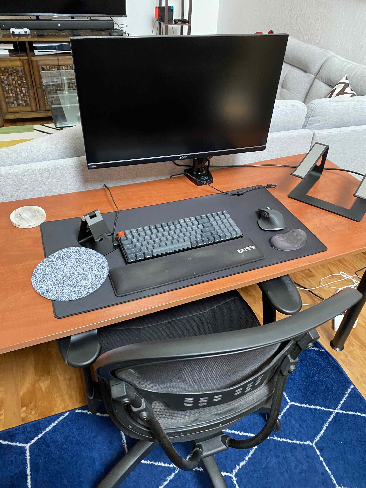
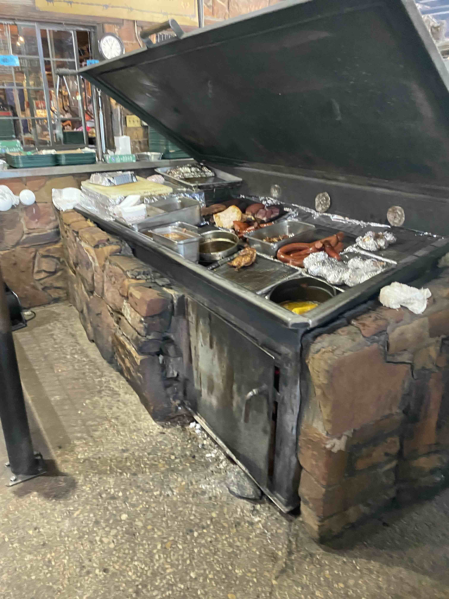
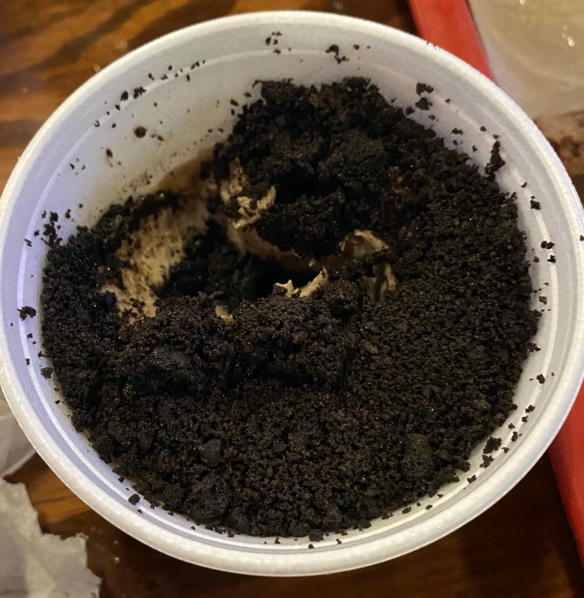
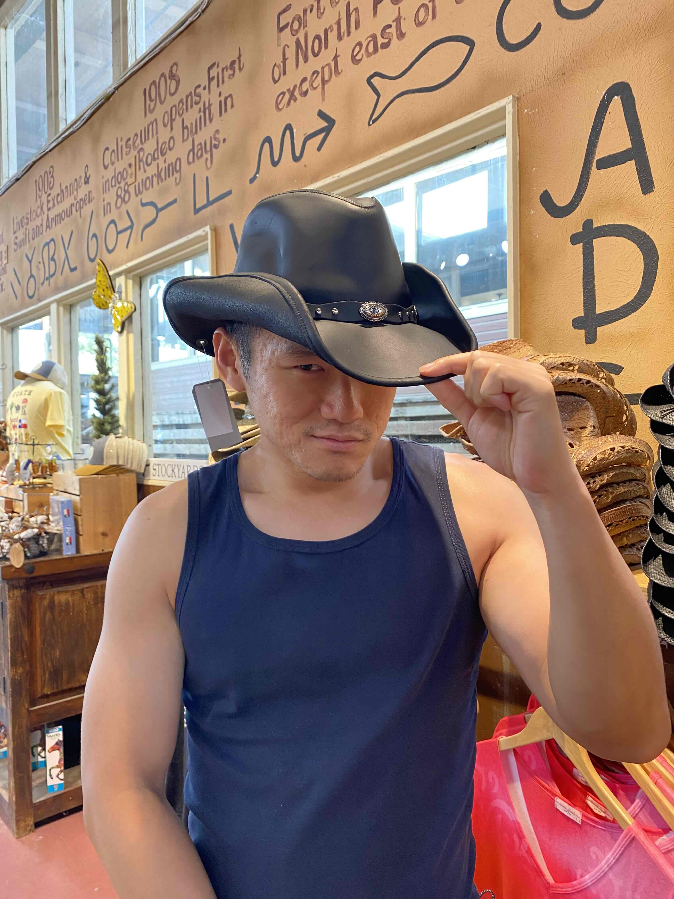
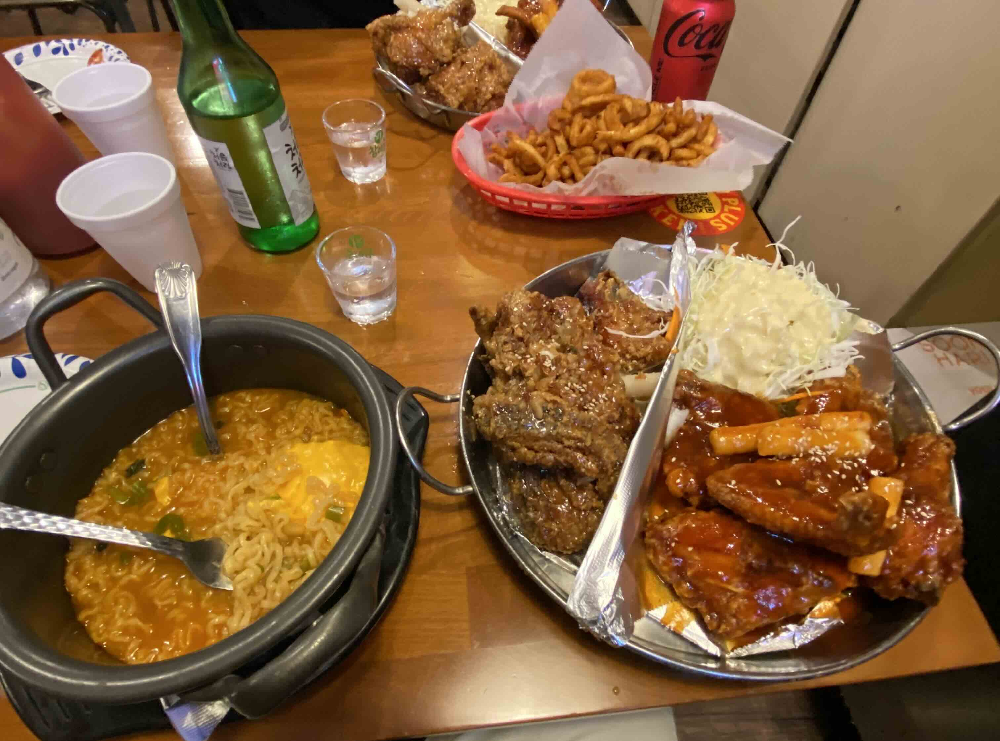
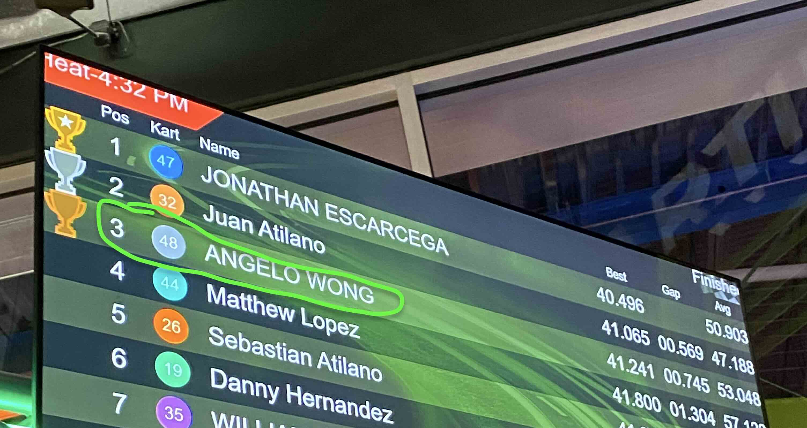
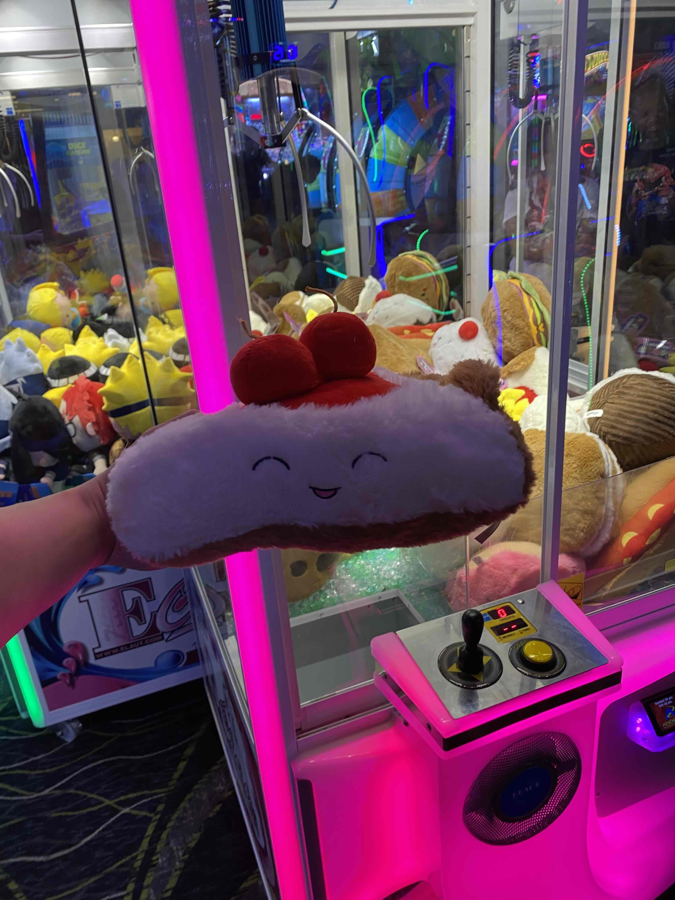

# Dallas Weekend 2024

## Overview

This is a 3-day weekend trip traveling to Dallas to visit a good friend of mine while Serena's out on a business trip. July 26-28.

Note: This is written retroactive.

## Friday

### Southwest + Dropping off bags

My friend works at Southwest and got me a 20% off. Flew to LUV.

Flight went by pretty quickly.

Then I went to drop off my bag at my friend's place, as I'm crashing on his place on the weekend. But you know how someone just *knows* you?

This guy knows me because he knows I like coding SaaS up and set up this workstation for me:

<figure markdown>   { width="600" }
  <figcaption>With an MX Master 3S + Keychron setup!</figcaption>
</figure>

The great thing about this workstation is that I love mechanical keyboards. I type ~140WPM on an ergo keyboard, and about the same in a mechanical. But mechanicals just feel so good.

But Serena doesn't let me use it because "it's too noisy" even though I close the door when I use it. So it's really nice to click-clack. Also, I bought an MX Master back in 2015 according to Amazon, and the 3S is a huge improvement. It's got a really satisfying soft-click that makes you want to *work.*

Honestly I could have just worked for 72 hours with this setup without any itinerary. So it's even more better that my friend planned an itinerary for me.

### The JFK museum

I thought this would be a museum about what JFK did and more or less about his presidency ***(yawn).***

Turns out, this museum's mostly about him getting whacked in Dallas ***(woo!)***. And this museum is built literally at the same spot where the shooter killed JFK. In fact, they have a corner in the exhibit in the exact location where the alleged shooter was supposed to have shot JFK:

In the museum you can see the spot where JFK was killed. They marked X's on the asphalt for:

1. Where JFK was first shot.
2. Where JFK received his lethal shot through the skull.

In 2024, this is a public road which is an onramp. People jump on the road to take pictures all the time.

Idiots.

Here's the lethal X close up when I jumped on the road to take pictures of it.

After donning myself as a man of culture as I visited a museum about bullets flying into a president's body, we ate.

### Hole in the wall

Went to a restaurant *that's inside a Mexcian supermarket.*

People eating there were mostly Mexican construction workers.

This is how you know the food will be good AF. And it was. I had these tacos:

* Lengua x 2
* Chicharron
* Something else -- maybe al pastor.

Love the use of herbs/spices here. Juxtaposes the heavy meat's taste and texture. It is spicy enough to have a kick, but not spicy enough to overwhelm the flavor of the meat.

They also had bottles of hot sauces you can grab from the refrigerator and just squirt a bunch of hot sauce into your tacos.

Simple. Easy. **5/5.**

I could have just ate this for all 3 meals for Fri-Sun there. But grain of salt as this is coming from a man that's just come off his cut where [he eats 0% fat yogurt with canned salmon](/Body%20experiments/DietProtocol2024/)

### Gym + Post workout snack

Went back to my friend's place and kicked it for a bit. Then I signed up for a free LA fitness pass. My friend said the gym is "meh" so I had low expectations. But it actually had a shit ton of equipment.

It even has a t-bar row which I have not seen or used in ages. When I used this, there was a small part of me that wanted to cry as it was reminescent of an old Gold's Gym I went to in California.

I love the movement and damn it felt satisfying to use it.

My rating of the gym may be inflated though as this is coming from a man that's been training in a basement gym for ~3 years where there's a power rack, a smith machine, a cable machine, and dumbbells that go up to...50 lbs.

Then, we went to a place called Empamundo where they have really good empanadas. I had these:

I liked spicy chicken the best as it had the best balance of flavors. The cheesesteak / blue cheese chicken was OK but the cheese was too overpowering and made the dish just taste salty.

Would have been a 3.5/5 but actually 4/5 because the spicy sauce was in the middle really help nerf the salty flavors.

I'd say the spicy chicken rivals empanadas in Spain / Portugal in terms of flavor. Though it's about twice as expensive in the US.

### Promotion

My friend's girlfriend has a military promotion ceremony. When I hear "promotion," I hear "more money," not "dress formal."

So I borrowed a dress shirt / pants from my friend to wear to the ceremony, as I only packed only tank tops and shorts (it's summer).

I went to the promotion ceremony and the first thing they did when we went in is they handed us table clothes to sit on, as the church pews were wet due to an unexpected cleaning. I immediately thought:

> Wow this is my shit right here--I love the adaptability of these guys.

The best thing here is that they did this adaptation and did not make a huge fuss about it. IRL, you see people having to make a minor adjustment in some trivial thing they have to do, and either they can't do it or break down mentally. So it's refreshing to see a group of people that will just adapt and roll with the punches. Life needs more people like this.

Anyway, they just handed out new shoulder badges in the promotion ceremony instead of big checks.

We had cake after, it was good.

### What? A burger?

Still hungry, we went to whataburger, a famous burger chain in Texas. The drinks were huge and the burgers + fries looked like this:

It was many calories and it was filling. It tastes like what a burger is expected to taste like.

Fries are good; much better than In-N-Out's take.

Overall, it was a satisfying meal but nothing that stands out where if I went back to Dallas again I would insist on having to go there, like the first hole-in-the-wall place. So, 3/5.

Or maybe they meant

> What a burger!

## Saturday

### Cardio

We went to a botanical garden on Saturday morning. And I believe like the JFK museum, this is free because my friend's girlfriend has a military discount.

We walked around for about 2 hours. There was a Japanese garden whose structure looked Japanese, but the cleanliness was American. Moss growing on lakes everywhere and dirt / leaves all over the zen garden.

Here's a picture of me critiquing Monet drawing the garden though:

I'd say he did a decent job painting the surroundings, but it's not really in his [water lily style](https://www.denverartmuseum.org/en/edu/object/water-lily-pond#:~:text=Monet%20worked%20his%20canvases%20over,texture%20of%20the%20canvas%20underneath.). Didn't pay him enough commission.

### Texas BBQ

I've had a terrible experience with Texas BBQ before in Austin. Went to *several places,* some of which are recommended by locals. All had bone-dry brisket. All were hella expensive. Almost all places I had to throw away some portion of meat as it was inedible.

So of course we went to a Dallas BBQ place, and it was a bit better.

We had:

* Ribeye
* Sausage
* Brisket
* Ribs
* Dessert

<figure markdown>   { width="600" }
  <figcaption>They'd scoop out cooked meat for you when you order, so it's basically eating leftover food.</figcaption>
</figure>

As the caption says, I am not a fan of scooping out lukewarm food to eat as like most human beings, I prefer freshly cooked food. Especially at their price point, made-to-order would have been expected. Still, for the meat portion, I liked the ribeye and sausages the most. The ribeye *was* made to order and hot AF when served. Also they gave you a couple of grilled jalapenos to chase. The sausage was nice and moist and soft.

The ribs were mostly good but had some parts that were a little dry.

The brisket was about 2/3rds good and 1/3rd dry.

Though none of this as dry as Austin BBQ. Seriously, I don't know what they're doing in Austin -- their BBQ is dryer than if I were to just toss a chicken breast in the oven.

It was OK. Would be a 3/5 but actually 3.5/5 because the dessert was really damn good. Some oreo pudding, which sounds way too sweet but actually only the crust is sweet. The rest is nicely balanced in flavor.

<figure markdown>   { width="600" }
  <figcaption>Presentation is in a styrofoam cup, but this is a banger and probably my 2nd favorite thing here next to the ribeye.</figcaption>
</figure>

### Animal abuse

Went to my friend's home for a bit and worked on SaaS for a little. Then, we went to a rodeo. I think I've only went once in Colorado but don't have a lot of memories of it.

But damn, this was a night to remember.

We went early and we walked around some shops in a place called the *Stockyards.* It's basically a place that's built to look like a Western movie. I went into a shop and took this photo:

<figure markdown>   { width="600" }
  <figcaption>Working on releasing a Magic Mike calendar. Do you think this is more an April or a July cover?</figcaption>
</figure>

Made our way to our seats and [the rodeo](https://www.cowtowncoliseum.com/) opening ceremony goes like this:

* Super patriotic songs
* Something about the military. And more importantly, a jeans' company sponsorship
* National anthem, sang off-key
* Prayer

Kind of all over the place and not sure what to make of this as none of this has to do with the rodeo. Except for the prayer, where they prayed for safety as this is *the most dangerous sport.* The prayer really sounded to me like:

> Dear heavenly father,
>
> Tonight, please let us fuck with these animals.
>
> But don't let us find out.
>
> Amen.

I don't know if God exists, but it's clear to me God doesn't interfere with basic physics. If you are about to jump off a roof and pray that the fall does not kill you, you will die if you jump. In the same way, if you aggravate a 1-ton animal and they decide to snap your spine in half, I don't think there is any divine interference to prevent that from happening.

I'm not an activist and I don't particularly care what they do down south to animals. As apex predators, our habit is to farm any creature we perceive to be lesser than us anyway. And the same will be done to us if AI becomes all powerful. Cycle of life.

But anyway I'd respect them a lot more if they doubled down on what they're actually doing instead of pretending it's something else.

Overall, the opening was a fun time and as much as the tone of this sounds like I am complaining, I love the vibe. I've always thought South Park to be a parody, not a documentary. But this showed me that it is the latter and I am glad to experience this.

Anyway, here's a clip of a cowboy body-slamming a baby cow and tying it up:

<figure>
<video controls>
  <source src="../images/dallas/animal.mp4" type="video/mp4">
  Your browser does not support the HTML5 video tag.
</video>
    <figcaption>It's like jiujutsu, but for cattle.</figcaption>
</figure>

After a night of watching animals get exploited but not even getting to eat them, we got hungry and went for a meal.

### Korean fried chicken

Korean fried chicken is normally double-batter, so it's thicker. We got an assortment of goods. And if you watch any Netflix drama, this seems familiar:

<figure markdown>   { width="600" }
  <figcaption>Ramen, fried chicken, and more.</figcaption>
</figure>

* The curly fries were really good. Nice and hot and crunchy.
* The soju was nice and smooth. Though I couldn't finish it all.
* The instant ramen was just regular black shin ramen and they added a sheet of cheap kraft cheese on top of it. This is a compliment, not a complaint. Tasted homey and you can't go wrong with instant ramen.
* The fried chicken was flavorful and the batter was nice and crunchy. Some parts (breast) were very dry though.

Next to us was a 2 older guys talking about Texas Hold 'Em and they seemed to be really into it. By "it" I mean losing money. As an aside, to get good at poker and making money from it, you just need to know:

* Pot odds
* How to find people that are so noob they don't know pot odds, and play with them only. Preferably, they are rich

Anything else is gambling and not an income generating model.

Overall, very tasty and very full with the exception of the breast which was a bit dry. Couldn't even finish the meal we were so full. 4/5.

## Sunday

### Wacky art museum

There's this chain of art museum called Meow Wolf. Basically it's a compilation of 50+ different artists doing modern art stuff and they put it all in a museum, and wrap it in a story.

It's gigantic and here's what one of the room looks like:

However, I don't really know how the commissioned art works for the museum as there's a Keith Herring wallpaper, and he's been dead for a while. Normally post-humous works are framed so you can move them around.

I'm easily confused and also didn't really get the story, other than that it's about some boy that travels multiple dimensions as an excuse for a bunch of alien-themed art. Eventually, the boy made it back home but by what means I'm not sure.

It's whacky and kind of cool to enjoy the art, albeit slightly confusing.

Has a pretty Rick-and-Morty vibe to it so if you like that kind of stuff, you'll enjoy this.

### Actually pretty good burger

After the art, we went to a burger joint. And it was actually really good. I had:

* Loaded chili cheese fries
* Cactus burger
* Vanilla milkshake

The vanilla milkshake was great in that it's reminescent of a nice, smooth McDonald's milkshake.

The cactus burger is good in that it was herbacious while creamy. Something about the cactus flavor tastes really unique and not like any other ingredient I've had before in a burger. There's always the concern of "everybody's so creative" but in this case the creativity is justified as the burger ended up tasting quite delicious while being unique.

Loaded chili cheese fries is also yum. As you'd expect in any high-fat content food.

Satiating, 5/5.

### Arcade and ice cream

We went to a *huge* arcade place where there were go-karts and a bunch of arcade machines. We played a wide variety of games. The ones I remember were go-kart and fishing for plushies.

For go-kart I landed 3rd place:

<figure markdown>   { width="600" }
  <figcaption>Placing 3rd is just means I'm the 2nd loser.</figcaption>
</figure>

The secret to go-kart and placing is to step on the gas with reckless abandon and you should almost never brake. I was slamming the car all over the walls on turns as I was going too fast. I think I could go faster next time if I remember to lean as to prevent the wheels from sliding on very tight turns. I did it for a few turns but kept forgetting.

Then there was a giant, 2-story high claw crane machine. I had no room in my luggage for a plushy if I won one, but I made a promise to myself if I won a gigantic one, I'd just hug that shit all the way back to New York on my flight back.

Mostly, I wanted to win a plushy for Serena as she loves this stuff.

Well, I didn't win a giant one.

But on a second attempt, I was able to get this cherry pie which is reminiscent of Jelly Cat plushies:

<figure markdown>   { width="600" }
  <figcaption>Serena thought this was a sushi at first, because she was in Japan for a business trip when I went to Texas.</figcaption>
</figure>

We then had ice cream after and it was great.

## Conclusion

Dallas is a much better experience than Austin.

On Twitter if I say this they'll throw terms around like "liberal" or "conservative," as if I care about that stuff.

No, Dallas was better because the food was a lot more diverse, and I did a lot more in Dallas than in Austin, so my impression's better.

While Dallas itself isn't the world's most exciting place, I think what really made this trip are friends.

There are 3 things in life and copywriting:

* Wealth
* Health
* Relationships

As I grow older and my net worth increases, and already being obsessed with health, I find that I have few and far good friends in between.

I'm not a sentimental guy but having a good friend that welcomed me with open arms and insisting to drive me to the airport at 4AM (even though I offered to Uber as not to inconvenience him) really made all activities above more fun and better.

I wish I had more friends like this.

And more importantly, that I could learn to be that friend to others.

In conclusion, while friends is probably not *more* important than health, but they're definitely more important than money.

At least, that's what it says on my Lululemon tote.

