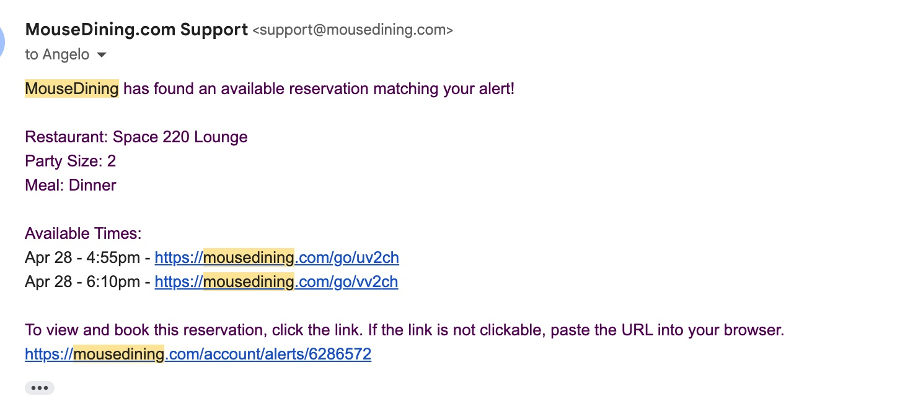
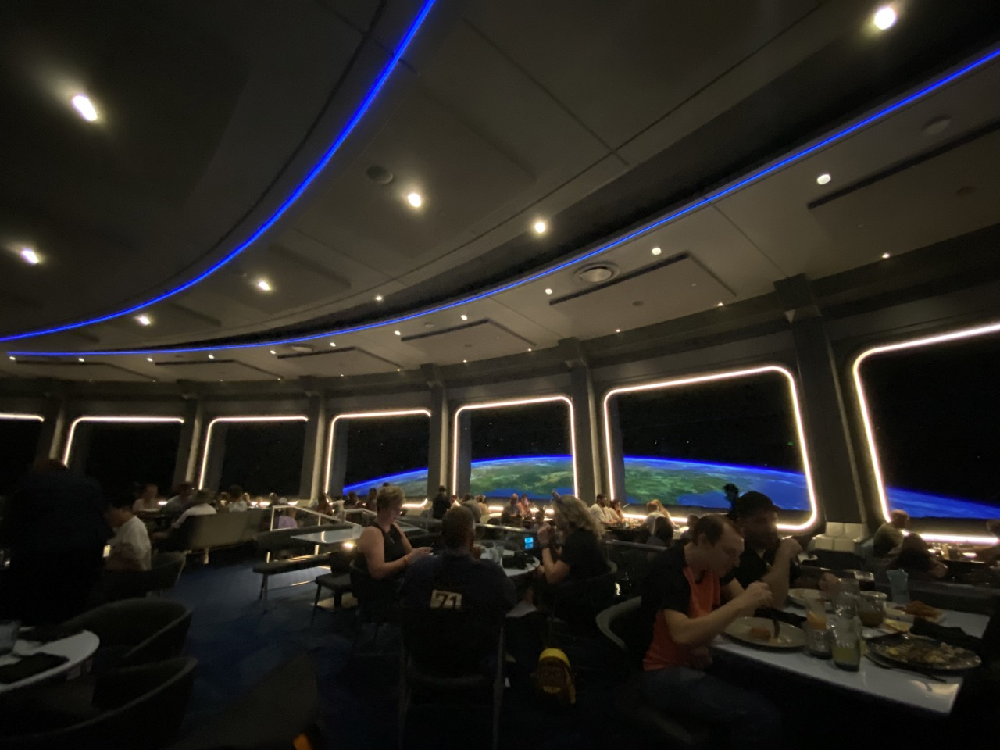
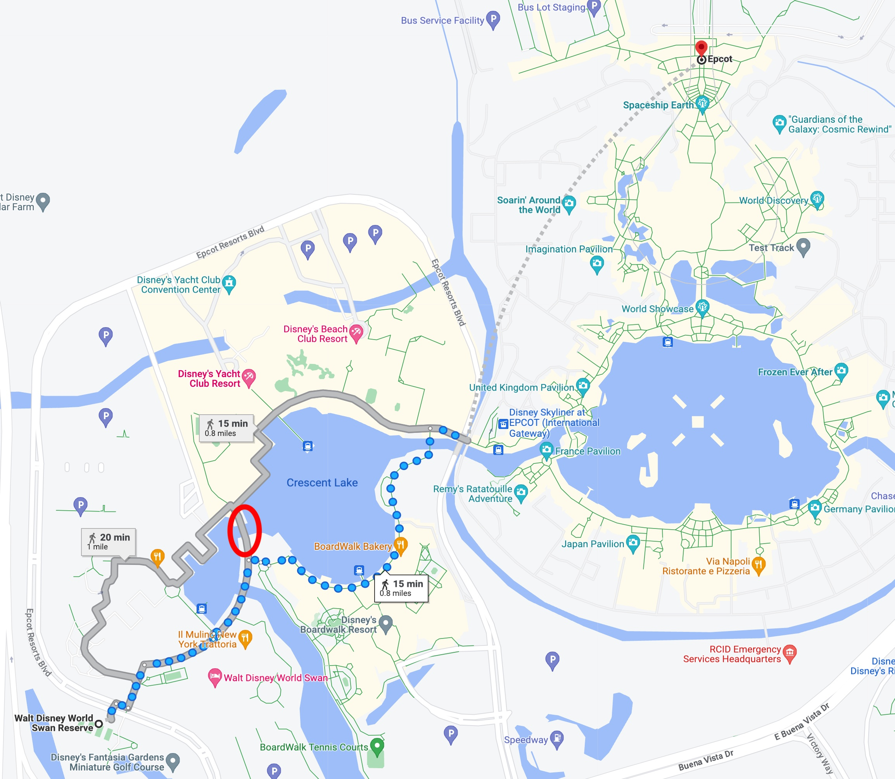

# Orlando (Disney + Universal)

## Overview

We traveled from **April 27 thru May 1, 2023.**

### Schedule

The main objective was for this trip to be more or less a surprise for Serena's birthday. She likes Disney so the plan was to go to Disney World for 2 days, and then Universal Orlando for 1 day. I avoided all 3 days at Disney because that seems like overkill. Basically:

* April 27 = land and chill
* April 28, 29 = go HAM on Disney World
* April 30 = Universal Studios
* May 1 = go home

### Not really a "surprise"

Surprise-wise, I did tell her a few days before we actually traveled though, because there's a lot of logistics going into these parks and there's a lot of strategy and tactics if you want to navigate these parks properly (mostly Disney World).

## Disney World (Apr 28-29)

Normally, a theme park is a theme park. But Disney World is actually a collection of 4 theme parks, which is very confusing for me.

### All 4 parks, quick summary

These are the 4 parks:

* Disney World
* Hollywood Studios
* Epcot
* Animal kingdom

Let's break it down into 2 main categories: **rides** and **food.**

The <mark>**best rides** are in **Disney World** and **Hollywood Studios**</mark>. Their food is mediocore.

Disney World + Hollywood Studios have more exciting rides in general, whereas Epcot's rides are more chill and Animal Kingdom's attractions is basically nature-based.

The <mark>**food is best** in **Epcot**</mark> in my opinion, due to its diversity and large amounts of restaurants available. Animal kingdom is OK too. Disney World and Hollywood Studios have abysmal food (think greasy, overpriced, SAD diet).

We brought a bunch of snack bars but ended up not snacking too much.

#### Park hours

Here comes the 1st complication. **Park hours can change last minute** depending on weather, or apparently, staff mood. **Always check park hours the night before so you show up on time**.

For example, if they change opening time from 8:30AM to 8AM and only a subset of parkgoers checked for this last minute change, the park may be emptier than usual at park open = shorter lines = good for you.

### Booking stuff

You need the [Disney World app](https://disneyworld.disney.go.com/plan/my-disney-experience/mobile-apps/) to book stuff effectively. Optionally sign up for an online Disney World account if you want to book with your computer.

#### Ride schedule

Here was our plan, with highest-to-lowest priority rides. We ended up pushing Tron into the afternoon (see why [below](#pay-to-play)), but everything else we generally did in order.

| Friday        |                                                              |
| ------------- | ------------------------------------------------------------ |
| magic kingdom |                                                              |
|               | Tron ride                                                    |
|               | 7 dwarfs mine train (needs LL a la carte, so go first to save  $) |
|               | haunted mansion                                              |
|               | 2. Big Thunder Mountain Railroad                             |
|               | Mad hat                                                      |
|               | Enchanted tales                                              |
|               | Winnie the pooh                                              |
|               | space mountain                                               |
|               | peoplemover                                                  |
|               | Liberty Square Riverboat                                     |
|               | NO splash mountain (closed)                                  |
| epcot         | 6.10 dinner                                                  |
|               | Frozen                                                       |
|               | Spaceship earth                                              |
|               | Nemo                                                         |
|               | Remi the rat                                                 |

For Saturday, we did all the Stars Wars stuff before the park opened (see why in the [lodging](#lodging) section), and we did that because the rides were closest to each other and we didn't want to run around the park.

| Saturday          |                                                              |
| ----------------- | ------------------------------------------------------------ |
| hollywood studios |                                                              |
|                   | star wars: rise of resistance (needs LL a la carte so go  first) |
|                   | tower of terror                                              |
|                   | star tours the adventures continue                           |
|                   | Alien saucer                                                 |
|                   | Toy story mania                                              |
|                   | millennium falcon smuggler's run                             |
|                   | mickey & minnie's runaway                                    |
|                   | slinky dog dash                                              |
|                   | Muppets                                                      |
|                   | rock n' roller coaster (closed)                              |
|                   |                                                              |
| animal kingdom    | kilimanjaro safari                                           |
|                   | avatar right of passage                                      |
|                   | Expedition                                                   |
|                   | Navi                                                         |
|                   | Kali river                                                   |
|                   | Lion king                                                    |

##### Pay-to-play

There's 2 levels of pay-to-play for rides if you don't want to waste a bunch of time lining up:

1. **Genie+: This is basically like FastPass + ride photos.** By default, buying this lets you go into the Lightning Lane lines, which are a lot faster than the normal line.
    1. **Kicker: There's a 2 hour cooldown**. But you can start reserving your first ride at 7AM if I recall correctly. Then, the first cooldown is done 2 hours after park open. Example:
        1. You book some ride at 7AM.
        2. Park opens at 8AM and you do that ride at 8AM.
        3. The next time you can do another Lightning Lane (LL) via Genie+ is 10AM (8+2).
        4. You book another LL at 10AM.
        5. Next LL is available for you at 12PM.
2. **Lightning Lane by purchase:** If you purchased Genie+, you get the privilege of paying Disney even more money by paying for Lightning Lane for some rides. That is, Genie+ itself won't get you into these rides. These rides include things like the new Tron ride and other extremely popular rides. You should check in advance to see which rides require a LL purchase so you can see if you can line up for those first.

**Tron** is one of the newest rides and most popular. There's actually 2 ways to line up:

* Virtual queue, which is a queue that you can join from the Disney app. When it's your group's turn to board, you have a window of time to show up to the attraction and do the ride. Unfortunately, for Tron, the virtual queue is gone within the 1st second of when it opens (usually opens for reservation at 7AM).
* **Lightning Lane: It was $20 to ride Tron per person.** Since we couldn't get into the virtual queue, I coughed up $40. And even then, the earliest ride available was in the afternoon. So we tired to do everything else in our itinerary first.

Not all rides have virtual queue, and most rides don't require Lightning Lane. Just be cognizant of which ride has what combos (non-paid lightning lane, paid lightning lane, virtual queue, regular queue) so you can plan your schedule accordingly.

**Side note on Genie+:** On our 2nd day in Disney World, the app for some reason kept resetting our cooldown and so we were able to average a new LL reservation once an hour, instead of once every 2 hours which was good. We think it's a glitch but maybe there's some nuance here that I don't get.

#### Food

Disney food is meh. Years ago, friend of mine has a [Club 33](https://disneyworld.disney.go.com/guest-services/club-33/) membership, I went, and the food was good but it wasn't mind-blowing. Certainly nowhere near Michelin Star level. Disney food ranges from intolerably bad to "that was a good meal" only.

But there's 1 restaurant I want to book, and that's Space 220. The reasoning being is that [it's really cool](https://www.youtube.com/watch?v=0fHd4EnBawg&ab_channel=wdwmagic).

Other than that, nothing else is worth booking.

##### Successfully booking Space 220

Online reservations start at 5:45AM to 6AM EST. Phone reservations start much later. These **book out the 1st second** when reservations open.

I tried for 2 days straight, waking up and refreshing the page from 5:45AM to 6AM EST window and I wasn't able to book it.

On the 3rd day, I wrote a simple Javascript script that'll:

1. Keep pressing the search for reservations button (I noticed that the server returned an AJAX-like request as opposed to HTML / reloading the page when you press the search for reservations button, and thus there's no need to refresh the whole page).
2. If a reservation is found, book the first available timeslot.

I tested this on the 2nd-midday on less popular restaurants to make sure it worked. Then, I opened up 5 tabs across 2 computers to try to book this fucking restaurant:

<figure>
<video controls>
  <source src="../images/orlando-bot.mp4" type="video/mp4">
  Your browser does not support the HTML5 video tag.
</video>
    <figcaption>5 tabs auto-searching every 1 second, averaging a 0.2 second latency.</figcaption>
</figure>

**And finally, through the power of technology...**

**...still wasn't able to book a reservation!**

I'll explain more in the next section as to why. But let's end the saga here with how I actually booked it. I used a free service called [Mouse Dining](https://mousedining.com/), and they were able to find me a reservation:

<mark>**The main thing to keep in mind here is that when they send you an email, you have probably a minute to react and claim your booking**.</mark> Which I did. Maybe I should sell a SaaS booking hard-to-book restaurants and just charge a $10 fee for a booking? Lmk.

Below's a picture of the ambience.

<figure markdown>      <figcaption>View from Space 220 Lounge, not Restaurant.</figcaption> </figure>

Space 220 has 2 seatings: **Space 220 Restaurant**, and **Space 220 Lounge**. I wanted the restaurant because the lounge menu just looked like bar food and I wanted to eat their tasting menu. I also thought the lounge would only have bar seating which kind of sucks. But I thought:

> Oh well, I'll just pick the lounge because I'll enjoy the vibe and beggars can't be choosers

But the lounge turns out to be better than the restaurant. Here are the differences:

* **Space 220 Restaurant:** Tasting menu **only**. You get to sit very close to those space windows.
* **Space 220 Lounge:** You can have bar food OR the tasting menu, so you're not restricted in the food. There's actual seating and not just bar seating. You sit maybe 20 feet away from the windows.

Knowing what I know now, I prefer the lounge over the restaurant due to the optionality. We ordered the main tasting menu and it turned out to be delicious and we were extremely full. But it's nice to have the option to additionally order more bar food / snacks as well.

### Lodging

I wanted to book a Disney Resort hotel because I wanted a shuttle to go to the parks and didn't want a car. Little did I know there are many other benefits. And thank goodness also, because it was **$2K+** for 3 nights only at the [Swan Reserve](https://www.marriott.com/en-us/hotels/mcokc-walt-disney-world-swan-reserve/overview/). It's a 5-star hotel--they had a nice gym (which we used to refill water) and a swimming pool, but no other real amenities. Even breakfast wasn't free.

To be fair though, we got the topmost room that had:

- A view of Hollywood Studios (they called it the Studio suite or something, which meant it looked over Hollywood Studios. I mistook "studio" for not having a bedroom; they had a bedroom)
- Hollywood Studios has 2 shows at night, with the 9:30AM show having fireworks, so we were able to view fireworks from our room.

<figure>
<video controls>
  <source src="../images/orlando-swan-reserve.mp4" type="video/mp4">
  Your browser does not support the HTML5 video tag.
</video>
    <figcaption>Our room. The master bathroom also has a door connected to the living room actually, in case you have emergency diarrhea. Note the obscene amount of huge TVs (2 in living room, 1 in bedroom).</figcaption>
</figure>

<figure>
<video controls>
  <source src="../images/orlando-fireworks.mp4" type="video/mp4">
  Your browser does not support the HTML5 video tag.
</video>
    <figcaption>Fireworks from Hollywood Studios as seen from our living room window.</figcaption>
</figure>

**Additional downside:** While they gave us a little cake for Serena's birthday, they refused to give us utensils. So we ate the cupcake like with our hands.

**Weird flex:** Near Swan Reserve is the Boardwalk (10 minute walk). In the Boardwalk is a shop to buy Hot Pockets. So we made Hot Pockets with our hotel microwave and watched Hollywood Studios fireworks from our room.

#### Resort perks and how to activate it

Here are the perks of staying at a Disney World Resort.

**The first perk is credit card points**. I used Venture X portal to book this hotel which is 10X points, and so even though Disney ripped me off for $2K, at least I got 20K points from it. Although $2K is a hefty price tag, this is already cheaper than booking it through Disney's site directly (it was starting at $700/night IIRC).

**The second perk is earlier park entry.** Remember above when I told you to [always check park hours](#park-hours)? You can deepen your edge against your competition (other parkgoers) by staying at a Disney Resort, because you get to go to the parks half an hour prior to official park opening time. This is almost a requirement especially for Magic Kingdom because it is crowded already half an hour before open.

* For Hollywood Studios, we got lucky. Swan Reserve has a ferry to Hollywood Studios which we were going to take at around 7:30AM to anticipate an 8AM opening (earliest ferry ride quoted by concierge). We're early birds and decided to show up 15 minutes earlier and it turned out there was another, even earlier boat. The park also seemed to open a little bit earlier, and by 8:30AM (official park opening that day) we had already done 3 rides. Since the public crowds don't really show up until 10AM+, we were mostly done with almost all the rides by the time people came in droves.

**The third perk is early restaurant bookings.** If you stay outside of the resorts, you can only book restaurants 60 days in advance. But if you stay at a Disney Resort, like one you're paying $600+/night for, you can book 70 days in advance. ***I didn't know this.*** Anyway, to do this you just have to hook up your reservation number (Capital One will give you a hotel reservation number when you book the hotel) to your Disney World Experience app. After you do that, you can book 70 days in advance--you can also just call them to make a reservation if you want.

* The hard part is hooking up your hotel reservation number to the app, because their backend is buggy. <mark>**If you put your hotel reservation in the app and it says it isn't recognized, just call WDW up and have them fix it for you.**</mark> In my case, my party was me + Serena, but Serena showed up ''null' in their system. I guess this fails some backend verification on their end and instead will just say your hotel reservation number isn't found. But a quick 10 minute call fixed this.
    * **Even though I was too late to exploit this for my Space 220 reservation, you're still required to do this if you want to use your earlier park entry perk**. This is because going into the park / rides is all through scanning the NFC on your phone, and your Disney account must be hooked up to your resort stay for you to actually be able to exercise your perks.

### Fireworks

The first night, we were at Epcot and enjoyed the fireworks there. The second night, we just went home earlier and enjoyed the fireworks there. The third night, we found a cool spot near Epcot that can see the fireworks really well:

<figure markdown>      <figcaption>Great spot (red circle) to view of Epcot fireworks + lake backdrop.</figcaption> </figure>

Since the Epcot fireworks was at 9PM and the Hollywood Studios fireworks started at around 9:30PM, we were able to watch the Epcot fireworks, walk back home, and then watch the Hollywood Studios fireworks from our room.

## Universal Studios (Apr 30)

Universal Studios is a lot less tricky, though their tickets are a lot more expensive. I bought 2 tickets where you can pick any park you want + express pass. About $600. For 1 day.

We picked the flagship park and basically did all the rides. Multiple times.

The main downside is that [their most exciting ride](https://www.universalorlando.com/web/en/us/things-to-do/rides-attractions/hollywood-rip-ride-rockit) was closed due to winds that day. Pathetically, we resorted to watching POV videos for the ride in one of our 3 giant TVs at our hotel room on YouTube when we got back that night.

### Rides

We did all the opened rides at least once, and enjoyed the Simpson's one a lot--not because it was exciting, but the vibe when you wait in line feels very immersed in the Simpson's world.

We did the Harry Potter ride, which was great, because it closed shortly for the rest of the day thereafter (presumably due to malfunction).

Running out of rides, we just did the Mummy ride like 3 more times after we've completed all attractions at the park.

Most of the rides were boring and you basically put on 3D glasses and the ride moves in-place. There weren't many rides that actually had a roller coaster, aside from Mummy + Rockit Roller Coaster + Harry Potter, but one of them was closed.

### Tickets / Express Pass

Their tickets were paper tickets, and for the life of me, I couldn't set up their express pass to the app. So they ended up always having to scan my paper express pass.

The express pass isn't that good. The lines for express pass for the most popular attractions (Minions ride) is perhaps even longer than the regular line. The express pass did help us get through in some cases though (Harry Potter and Mummy ride).

I'd say you can probably skip it if it's not high-season and you're only visiting one park. It may be worth it if you're hopping between the main park and Islands of Adventure though, because the transit between the 2 parks also requires lining up and an Express Pass can help there too.

### Dinner

We ate a Bubba Gump's. It was good and fatty.

## SpaceX Rocket Launch (Apr 30)

The last night we were there, we were walking around one of the Disney beach resorts for a night scroll and Serena asked me what *that* was in the sky. Was it a firework?

No. It took me a few seconds to figure out, but it's a rocket launch. It was flying up vertically and it's a lot more surreal to experience that IRL than it was on TV. We were literally witnessing people sending shit to space, in real time. Definitely one of the highlights of the trip.

Anyway, while we saw the rocket vertically ascend, I was too slow with my phone and only captured video for when it already was starting to go side ways / penetraing through the atmosphere. I also quickly Google'd rocket launches in Cape Canerval that day and the exact minute we witnessed the rocket launch was the exact minute that SpaceX had scheduled a rocket launch for one of their ViaSat (whom I interned for before--yay, namedropping!) missions. Here's a video:

<figure>
<video controls>
  <source src="../images/orlando-rocket.mp4" type="video/mp4">
  Your browser does not support the HTML5 video tag.
</video>
    <figcaption>My first time seeing a rocket launch</figcaption>
</figure>

## MCO Airport (May 1)

We reluctantly checked out of the massively expensive hotel the next day and went to the airport. Their lounge was nice. Spatious, floor to ceiling windows both looking at the tarmac and inside the airport. The food was "meh" though--mainly just penne pasta and a bunch of pastries. Coffee is from a coffee machine, and while there is a barista inside the lounge, you have to pay for it if you want him to make it for you.

## Conclusion

If I had to redo this trip, I probably would have skipped Universal Studios (kind of boring) and instead just hung out around the resort a bit more and do some free exploration of Orlando.
