# Italy 2023

## Overview

We traveled from **October 4 thru October 17, 2023.**

## Departure

We left for JFK, terminal 7. There's no lounges here that's accessible to Amex / Venture X / Sapphire. Flights were expensive so we went for a budget airline (Norse Airways). They're a revamp of the now-defunct Norwegian Airlines. We got premium economy seats for +$190 each.

There's no business class.

Terminal 7 smells like an old gym, full of sweat and feet.

### Norse Airways Premium Class

We boarded as the first group, since premium class is the best class. This is hands-down the biggest premium economy seat I've ever sat in. While the width of it isn't that big, the length is as long as an emergency exit row's.

Not only that, their seat reclines 12-inches, as opposed to the standard 10. The last 2 inches make a huge difference in terms of making it feel like a lie-flat. Whereas without the 2 inches, it just feels like you're uncomfortably reclining.

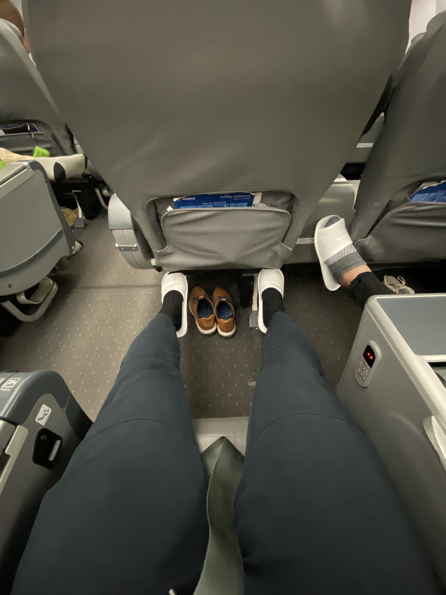

Additionally, there's a leg rest that extends out so as you recline, your legs are supported diagonally. The leg rest has a feet pedastal that unfolds so your soles / your weight can rest on it. This makes it so that as you're reclined you don't have to have your feet dangling in the air uncomfortably and makes for even weight distribution.

First time in a long time I have been able to sleep for hours in a flight.

## Phase 0: Landing

### Day 1: October 5th, Rome

Tonnarelli is my favorite type of pasta. It is a round pasta, but a bit thicker. It lends itself to good mouthfeel and texture as it is easier to have it be more al dente and "meaty."

As such, we went to a restaurant called Tonnarello where most of their pastas are made with Tonnarelli. We went, and found that there's a very long line. Fortunately, there's 2 locations that's very close to each other. While Serena's in line, I scouted the other location out and realized there's no line there. So we just went to the other location while the other people kept waiting in line.

The pasta was great, and the tiramisu is to die for. Their wine is too expensive though (5 euros for a glass of house wine and 16.5 euros for a handle--also, their house wine is WHITE wine, ew).

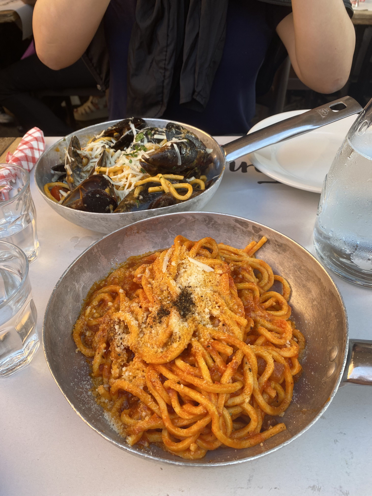

After that, we walked around a bit to hunt for a magical pastry called maritozzi. We found one and ate it:

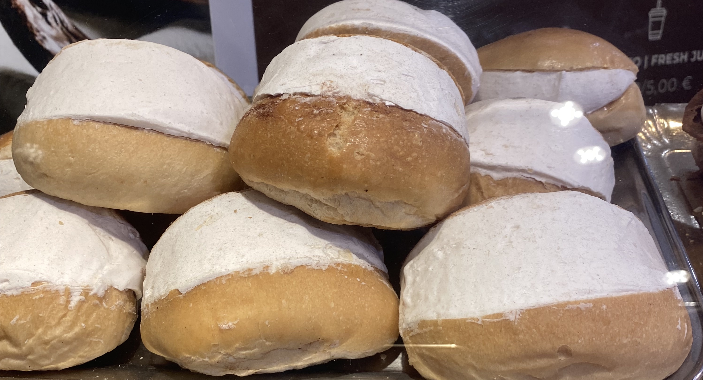

We walked off the calories by going to Giolitti and having a giant gelato (despite ordering the smallest size, we still got a lot--the trick is to have your female companion ask for the gelato with a smile, and they'll give you bigger scoops and heavy cream for free).

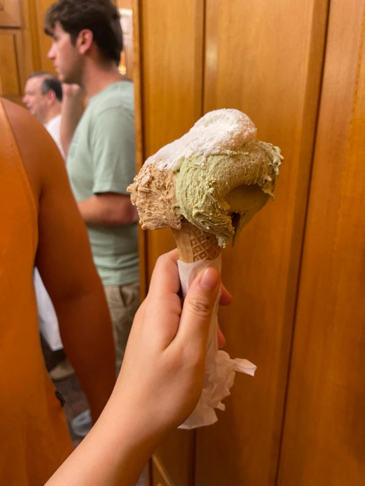

And then we walked it off further by wandering around town, then into a department store to do some window shopping. And then finally went back to our hotel which is located next to Roma Termini.

## Phase 1: Almafi

### Day 2: October 6th, Salerno and Amalfi

The next morning, we headed to Roma Termini to take a train down to Salerno.

Salerno's a relatively big town near the Almafi Coast, which houses ~13 small towns. It serves as a launching point where you can take a ferry to Almafi (one of the towns on the coast), where you can then take busses or other ferries to visit the other small towns.

After our train arrived and we walked to our hotel, we dropped off our bags and took a ferry to Almafi.

We disembarked, and ate lunch there. It was good; tons of seafood.

After lunch, we walked and explored the town. We were tired from the jetlag and so rested a bit at the big duomo in town. We bought a Almafi's signature "lemon on lemon" which is just a bunch of lemon sorbet scooped inside a hollowed-out lemon. The Almafi coast is famous for their lemons, so I bought a big thing of limoncelli for 10 euros as well.

We were tired and wanted to head back, so we tried to book a ticket online. We saw a ticket for 16:15 earlier but it looked sold out online. The next ride was 17:45 and that was devastating because we were jetlag and mostly wrecked and just wanted to go home and sleep.

Luckily, we tried the brick-and-mortar ticket office and they were still selling 16:15 tickets. We got on at 15:45 and the ship left the dock at **16:01.** 

Lesson learned: **Buying tickets at the counter for Almafi cost is in greater supply than online. Also, show up 30 minutes prior to disembarking because the ship leaves as soon as it's full. It also lets you pick a good seat.**

We headed back and took a nap. After that, we went for dinner.

### Day 3: October 7th, Private Boat Tour

Epic day. Expensive (about $1K), but well worth it.

We took a private boat tour, which started at 9AM. Our hotel is located ~15 minute walk from the pier where our boat was, so we woke up early and walked there.

We showed up early, and our guide was early as well.

The boat is equipped with:

* A room at the bottom, with a bathroom so you can pee any time you want
* A cooler that's plugged in, so it's a small fridge, basically. Has coke, prosecco, and more.
* A boiler that's connected to a shower hose at the back of the boat so when you're done swimming you can warm yourself up while washing off all the saltwater off you.
* A large awning near where the pilot is so you can go there if you don't want to get sunburned.
* A bed in the front of the boat so you can sunbathe and lie down while sailing around the Almafi coast

But let's talk about what we actually did.

We disembarked from Salerno and rode for maybe 40 minutes directly to Positano. Before we stopped at the port, we saw a family of dolphins swimming around our boat. It's the closest I've seen dolphins in my life. And there's a dolphins that was swimming alongside the boat very closely, too. We're somewhat lucky as the guide said he's only seen dolphins ~10 times this entire season.

<video controls  style="height:720px;">
  <source src="../images/dolphin.mp4" type="video/mp4">
  Your browser does not support the HTML5 video tag.
</video>

After the dolphins left, the guide anchored the boat and took aerial photos and videos of us using a drone. When the first drone photoshoot was done, we dove in the water and swam around. The water's super clean and there's a bunch of fish swimming around us as well. After that, we slowly sailed back the way we came. 

Because we're goind so slow, we coasted very close to the coastline where we can see all the small town up close, juxtaposed against the awe-inspiring and beautiful cliffs where they're built on.

We eventually made our way to what's called the Emerald Grotto, which is basically a cave that looks like a cenote. Inside the small, round cave, it is filled with water (like a cenote). From one of the sides, an emerald light coming in from one of the sides. It turns out this light is emerald because underneath the water is tunnel spanning ~16 meters which leads to the outside. The sun shines into this tunnel, and the resulting reflection is an emerald light that is shot into the cave. When the guide splashes his paddles, the white sand at the bottom of the cave further reflects the emerald light, causing an optical illusion to make the surface of the pond looks emerald as well. Anyway, this was mildly disappointing because the cave is actually quite tiny (maybe 50ft by 50 ft).

After that, we slowly coasted to lunch. The lunch was mediocore and is a typical tourist trap. OK food, not terrible not world-shattering, but overpriced. Whereas in town things are maybe 14-20 euroes per primi patti (pasta, most of the time), it's 22-25+ here. Sea bass is on the expensive side (American pricing), and lobster pasta is about 190 euro per kg. This is insane since you can get a lot of lobster with noodles in NYC Chinatown for about $35.

After that, we again slowly coasted along the Amalfi coast. We sat / lied down in front of the boat as we slowly sailed. And I was mostly just trying to absorb all I can. Everything from the calm, blue waters to the jagged cliffs, to the towns that live on those cliffs--it's an amazing experience where everything around you is forcing you to be peaceful and present. We stopped at a bunch of places where the tour guide would tell us some history about what we're looking at.

Eventually, we stopped by Almafi again (this time, a lot better because instead of trying to wade through crowds of people, it's just us 2) where we had photoshoot #2.

After that, we sailed to a nearby waterfall where we jumped into the water again. I learned the easy way that I shouldn't jump from the side of the boat where a ladder was but instead should jump from the back of the boat (the easy way is just being told not to do this as opposed to getting hit in the back of the head, dying on impact).

When we were done swimming around the waterfall, we got on board again and washed the ocean water off with very warm water at the back of the boat. Our day's supposed to end at 4PM and it was around 3:30PM at that time so we headed back, full speed ahead. But not before we were served prosecco and some fresh, sweet fruit (grapes and plums).

All things good must come to an end and we docked at around 4:15PM. And then we walked back to our hotel and showered where I'm now typing this up. BTW, below are how the pictures came out (only 2 below, but you get the idea):

We went to eat at La Traversa at around 6PM and it was amazing. Everything was about 10 euros and we had 2 primis, 1 secondi, and 2 appetizers. Plus a house wine. Total 61 euros only. The secondi was OK (but secondis in Italy is kind of mid in general), but the pastas were insanely good and paired really well with the house red.

Finished at 19:30 we wanted to see if La Botte Pazza down the street was opened since it was closed the night before. It wasn't (the schedule online says it should be opened at 7:30PM both this day and the day before). The store's supposed to have wine **on tap, for free,** which sparked interest. There's a sign outside for a funeral on October 7th so not sure if they're closed to observe the death of a loved one.

Anyway, after dinner we went for dessert at **Bar Nettuno, Salerno**.

I thought I had an ice cream sandwich before but apparently I haven't.

This place serves literal ice cream sandwiches. It's a gelato place but you can pick either a *cone* or a ***fucking brioche.*** Aside from that, it works like any other gelato place: you pick flavors and they scoop and spread it onto your brioche. They cut it in half so you can easily share it.

The bread's room temp and the ice cream's cold so it's got a great temperature juxtapose. The gelato is also really creamy and delicious. The bread inherently is also sweet which complements the gelato. The bread also has some sweet, lemony-flavored crust which tastes quite nice along with the ice cream.

So on this day we did the most *Succession* thing as possible by having a private boat tour in the Almafi coast and then ate a real ice cream sandwich.

### Day 4: October 8th, Positano

We got up early and took the ferry from Salerno to Positano. At around 10:30AM we met up with a photographer. The program is simply:

* The photographer will drive us around Positano in their classic, red Alfa Romeo
* Take photographs and videos of us
* Pay 300 euros

The photos and videos look something like this:

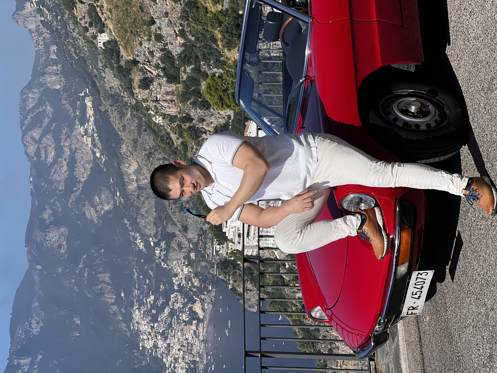

Really great, I know. The program ended at around 12:30PM and and then we ate lunch. After lunch, we walked around town, stopping at any shops that has an AC.

We found a dessert place where we ate some macaroons and 2 delizia al limone. The latter is light, not too sweet, and fluffy. There was a boat leaving at 15:30 so naturally we walked over and boarded at 15:05. Luckily, again, the ferry left early at 15:15 so it's good we didn't dilly-dally too long.

**Lesson: Show up early. Don't dilly-dally, else you'll quite literally miss the boat.**

Then, we went back to town. Rested for a bit and went to this spaghetteria called Al Dente, not to be confused with a pasticceria of the same name across the street (crucial to the story later).

Really delicious. Much cheaper than the Positano tourist traps. For reference, a pasta vongole here is 18 euroes whereas in Positano, it's about 25+.

In addition to the delicious food, we got some free entertainment! They sat a hillbilly and his wife next to us, and upon sitting down and realizing there's no paper menu and he had to use a QR code to look at the menu, he exclaimed loudly for the whole restaurant to hear:

> I HATE THIS PLACE

A nice waitress came and asked what's wrong, and immediately gave him the restaurant tablet so he can look at the menu. While the waitress was giving him the tablet, he asked her:

> This is terrible. Why do you guys do this?

Again, loudly. After this old (maybe ~70 years old) man-baby got his menu, he then immediately complained:

> This menu isn't in English!!

Because it is a stereotypical American thing to go to other countries and expect them to speak English. This is kind of hilarious though because we're in Salerno, which is kind of a hidden spot for the shallow-level tourist. So it's kind of amazing this guy made it here with that attitude, but also somehow expects everyone to just speak English. Though comically enough when he finally got an English menu he kept uttering phrases like:

> What the hell is this?
>
> It doesn't even matter if I got an English menu because I don't understand half these words!

Again, loudly. And for the record, the words in the menu were things like "clam" "cod" "cheek" and so on. Some words were not easy but it's not like it's rocket science to just ask the wait staff for recommendations.

Almost choking on my food from laughing, another wait staff came and started to take their order. To which this point asked:

> Does this place have the same owner as the Al Dente across the street?

To which the annoyed waiter replied:

> This place is for food. Across the street is for pastries. If you want a croissant, go over there.

Not getting the hint, he asked if the same owner owned 2 restaurants with the same name. As if he was proud that he could make such a high-level logical leap that 2 restaurants right across the street from each other, with the same name, would have the same owner, and he really wanted the waiter (and his wife) to know how smart he was for being able to do basic reasoning.

**Though for him, it *is* actually quite impressive, considering his mom and his sister are probably the same person.** 

After that, we walked around and ate another maritozzi along with a beignet as a snack. Though their beignet is more like a cannoli where the cream is similar to birthday cake cream, with fruits on top.

## Phase 2: Tuscany Countryside

### Day 5: October 9th, Siena

Woke up at 4:15AM to catch a train to Siena departing at 5:50AM. The train's route is from:

* Salerno to Florence (northbound). Around 4 hours.
* Florence to Siena (southbound). Around 1 and a half hours.

The latter is a smaller, commuter type train. The former's a much larger train.

We booked business tickets for the 4-hour portion, and it was great. At a glance:

* Seats recline (in-place, though)
* Basic breakfast is served; coffee, small croissant, some fiber biscuits, nuts/raisins pack, juice, and water. It was kind of like a little kid's breakfast. Not the most tasty.
* Spacious overhead bins. Normally, in economy, you'll be hard-pressed to fit larger luggages on the overhead bins and you have to then risk losing your luggage by putting it at the end of the train. Here, no such issue.

We arrived to Firenze at around 9:45AM with scheduled departure to Siena at 10:10AM. Alas, it was cancelled and we had to board the 11:10AM train instead. 

After ~8 and a half hours from waking up, we finally made it to Siena. We grabbed a bite to eat after checking into the Grand Continental. The meal was nothing to write home about; just some sandwiches--but the house wine **was only 5 euros for half a liter**.

Then, we walked around town and paid 15 euros each to tour the town's church. There were a few sections:

1. The main church area
2. A watchtower like area where you can view Siena from the top of the church
3. A museum area to look at various art and history lessons surrounding the area
4. And another church area

<video controls  style="height:720px;">
  <source src="../images/church_siena.mp4" type="video/mp4">
  Your browser does not support the HTML5 video tag.
</video>

After that, Serena was tired so we went back to the hotel to chill and take photos. I'm fine doing this because Grand Continental is booked via Amex platinum and is fairly expensive, so we wanted to get the most out of it.

The hotel itself looks grand and luxurious; staff is very friendly. Food is good (some dishes are amazing adn some are a miss but not necessarily terrible). Though amenities like gym and other basics are missing. They're self-proclaimed 5-star hotels but I think Google correctly labels them as a 3-star hotel based on the lack of standard amenities that you'd need to be classified as a 5-star.

Still, with Amex plat we got 90 euros of credit back so we used all of it towards dinner. We ate 2 starters, 2 primi pattis, and 2 secondis and were both very full. It totaled 150 euros for 2 people which isn't bad as you'd expect a fancy place like this hotel to be a ripoff. After the 90 euro credit, the meal's about 60 euros for 2.

### Day 6: October 10th, Saturnia

We left Grand Continental at around 11AM and went to a Hertz.

I think we got a free upgrade, and ended up getting a Jeep. It's a newer Jeep with airplay and everything. Scuffed up though. In Europe, you should take lots of photos and videos when renting a car. They'll nickel and dime you for the smallest dings that isn't even your fault. Thus, take tons of pictures so you can say to them "no this tiny scratch was already here the day I rented the car."

Drove for about 2 hours to end up at Saturnia which is kind of in the middle of nowhere. We mostly came here to experience the Saturnia hot springs. It's free and open 24/7. We'll go the next morning to avoid crowds.

But for now, we're staying at a winery hotel. Unfortunately, there's no real wine tasting left as the season's ended. The WiFi in this hotel is non-existent so internet is scarce. So we just wandered about the hotel grounds and swam in the cold pool. The cold pool felt really nice against the hot weather--it was kind of like ice cream, but for the body. Tons of wasps annoyingly buzzing around the grounds though as there's tons of grapes and plants everywhere.

There's also a tennis court but I don't think we'll use it.

We chilled for a bit, and took photos around the hotel grounds. They all look like some variant of the below, with varying success on posing/smiling properly.

While walking around taking pictures, I realized there's electric charging in the parking lot and my Jeep 4xE (Compass Trailhawk) is a hybrid. So I charged it for an hour and got it to ~40% and went into a nearby town to have dinner. We had:

* 2 pastas (tomato pici and pork-based tagliatelli)
* 1 ricotta spinach cheeseball
* 1 chicory side dish
* 1 beef dish
* 1 chicken dish
* 2 desserts
* 1/4 liter of red wine
* Water

For only ~90 euros.

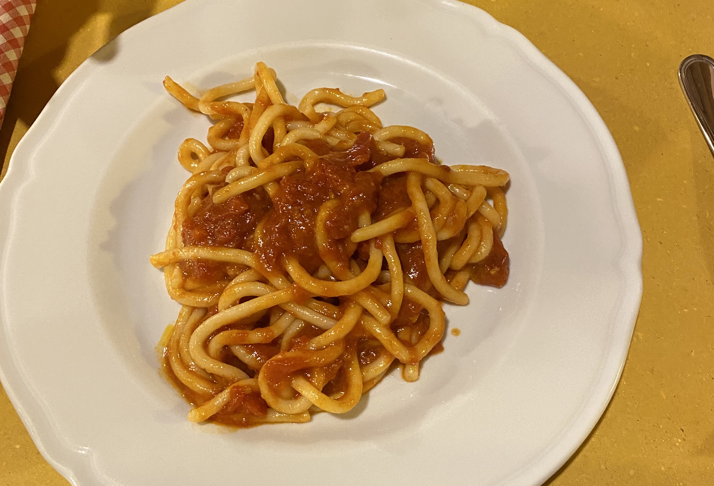

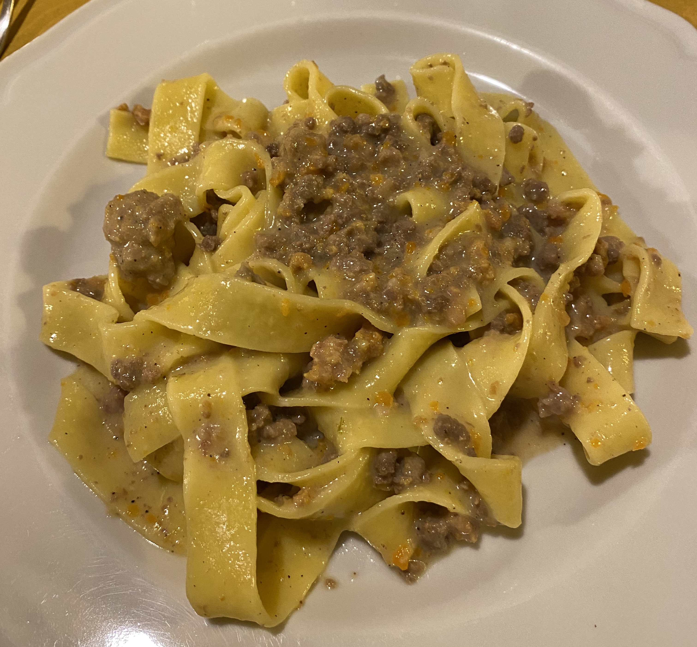

This was extremely delicious. Then, we went back home and called it a day.

### Day 7: L'Andana

The next morning, we woke up early to head to the Saturnia hot springs at 7AM. It was cold, and the thermal hot springs wasn't that hot. It was about body temperature (37C). It was kind of lukewarm, basically. But enough to shield me from the cold. Walking around is a pain because the bottom of the hot springs is all gravel, so it's like getting a painful foot massage everywhere you walk. Mediocore quality hot springs aside, it looks pretty beautiful.

<video controls  style="height:720px;">
  <source src="../images/hot_springa_saturnia.mp4" type="video/mp4">
  Your browser does not support the HTML5 video tag.
</video>

After that, we head back to the winery hotel we're staying at. I wanted to charge up my 4xe Jeep again so I can save money on gas. But some fucker parked his gasoline Audi at the spot that's specifically labeled "Parking reserved for electric cars". Fucking rich prick with his rich Audi thinks he can break the rules. Mildly fumed, I showered back at the room and before heading to breakfast, I wanted to ask the front desk to see if I can park next to the charger (but outside of the Audi's path to back up) to charge my car. But it turns ou the Audi was the staff's / owners. OK, fair enough. You put the sign up, so you should be able to park there. He moved the car and I was able to charge mine.

We had breakfast, chilled for a bit, checked out, and left for the next winery hotel: L'Andana. Jeep at 100% charge.

It was a ~1 hour 20 min drive, and I used all electric. At around 60km, I was able to reach my destination using virtually no gas. Despite the spec'd range at 50km, I made it to L'Andana with 37% left in battery charge. Alas, the electric charging at L'Andana isn't free and is quite expensive, actually (about $1 for every 3 miles of charge), so I didn't charge there.

Expenses aside, we were sat down immediately with a red wine welcome drink where a bell boy was standing there guarding a luggage like a soldier for 20 minutes while our room was being made ready. While we were waiting, we were given a *fucking itinerary* of what we'll do that day:

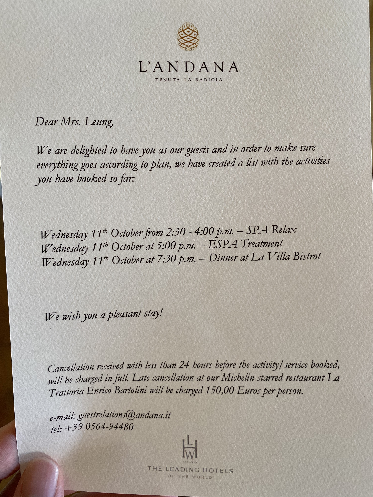

Once our room was ready shortly after, we were guided to our room, which had a free upgrade on behalf of Serena's Amex Platinum booking this place. Once we arrived to our room, there was a free bottle of Rose waiting for us in the room. The room was magnificent. It's hard to describe in words but here are the highlights:

* 3 windows in the bedroom, overlooking lush green mountains, vineyards, beautifully groomed treelines and hills.
* Wooden flooring all around.
* Bluetooth Marshall's speaker.
* Very large space. I estimate just the main bedroom is about 24' x 14'. The bathroom is another monster.
* Bathroom has heated floors. With a large bathtub. Good shower. Huge jack and jill sink. Electric fireplace. 2 windows overlooking the same view as the bedroom. It also has **2 large mirrors on opposite ends so it looks like there's an infinite amount of you.** And finally, there's a smaller mirror on top of the fireplace. There's a **dedicated AC** just for the bathroom because the heated floors can have the bathroom be a bit hotter. We turned it off though since the bedroom was made very cold so it's nice to warm up in the bathroom. Also, we have a lot of swimwear to dry so it's good the bathroom is warmer.

The bathroom is actually so beautiful that one time I wanted to go into take a piss but got distracted by the view and forgot I was there to take a piss. I've never gotten distracted by a bathroom's beauty and the view from the bathroom before.

Once we were done checking out the room, we walked around the grounds. The sunlight hitting the campus is inexplicably beautiful. For some reason, the vibrant greenness of the area makes it hard for me to wear sunglasses, as if I'm wasting the view if I'm wearing sunglasses. Here's one of the photos of the grounds; I don't think it does it justice but let's just say I've never walked around where it was so beautiful that it felt wrong to wear sunglasses.

Then, we went to check out the pools. There are many pools around but we only checked out the 2 closest to us. One outdoor (cold) one, and one warm (indoor) one. We swam around for a bit until it was time for our allocated slot to enjoy the spa. The spa consisted of:

* A vitality pool which is basically a warm pool with jets shooting out on all side. Further, there are 2 "showerheads" which basically shoot highly pressurized, vertical jets from the top which feels pretty good.
* A turkish bath which is basically just a dark steam room.
* A sauna.
* A 360-degree shower where you can get hosed from all sides with water of any temperature you want. This is useful after a long sauna session and you want to cool off immediately. You can also jump in the very cold pool outside as well.

When we were done with the spa, we went back to our hotel room and showered to get ready for the massage at 5PM. The massage was great and the oils they used smelled good. The masseuse was really weak though. I heard and felt her bones cracking massaging me, but it's a very soft touch compared to what you normally get in say, an Asia massage parlor.

Serena explained to me that Asia massage parlors are used more for 'healing' and so the massages are more painful, like hardcore foam rolling. Whereas western, hotel massages are more like just a place to relax and get touched.

When we got done with the massage, we went back to the room and cracked open the free bottle of Rose. We just sipped it while pacing around the bathroom and bedroom, peering out at the amazing view and looking / filming the sunset, while playing music on the room speaker.

Nice and buzzed, we went to dinner. It was good (same staff as the now-closed Michelin-Starred restaurant), but overpriced in my opinion. 30+ euros for a pasta compared to Positano's 20+ euros (and the latter's overpriced already). 40+ euros for secondis.

200+ euros spent and I didn't feel that full. Though, the food was good. Just overpriced. We went back to our room and I took a bath while drinking Rose, since the bath also came with a tray that hung across the bathtub, so you can put stuff on it while bathing.

After bathing, I video-called my parents to flex and called it a day.

### Day 8: Mugello

We woke up at around 7AM so we can secure the best table available for breakfast at 7:30AM. There's only 1 table that had the best view in the house, and we wanted it. While we were waiting for the breakfast buffet to open, I snapped a few pics.

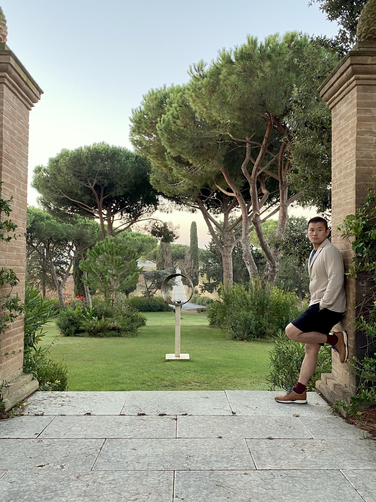

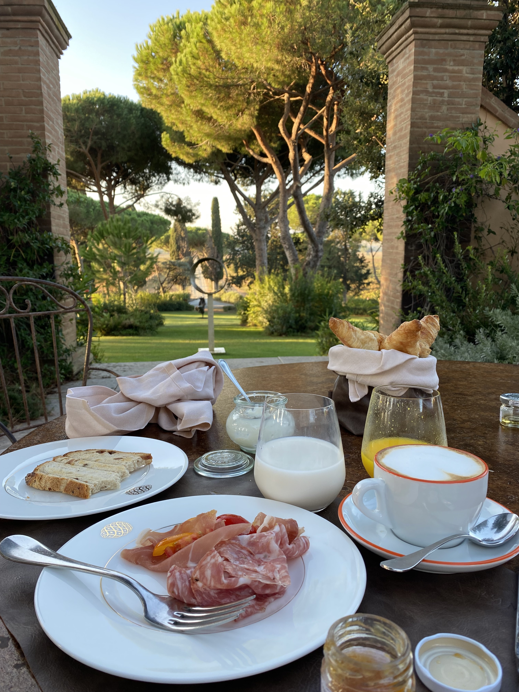

Because we weren't going to have lunch, we stocked up by eating a lot of breakfast and taking some candies / water from the spa area, as well as a chocolate brownie from the buffet area in case we were hungry later. Also, we ate a very full breakfast so we can stay full for most of the day.

When we're done hogging the best table, we finished breakfast at around 9:15AM. We walked around a little bit and went back to our room to admire it some more. Here's a pic of one of the room's window's view to do the room slightly more justice:

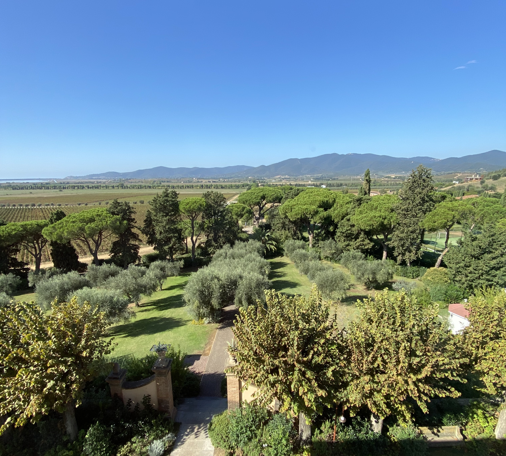

At 10AM, we went back down to do this spa rotation:

* Swimming in a warm pool.
* Getting sprayed by jets in the vitality pool
* Sauna
* Cold shower
* Steam room

After all's said and done it was 11AM. I rushed back to the hotel room to have one last bath and shower. I bathed myself for 45 minutes, packed for 15 minutes, and checked out at 12PM. Amex lets us check out at 4PM but we decided to leave earlier since I had a 3 hour drive to Mugello, the region where they forage white truffles.

The 3 hour drive was OK except for **autovelox.** This is an Italian speed camera brand where they have speed cameras to enforce your speed limit. This is normally fine but exceptionally painful for long stretches for road whose speed limit it modified to 40km/h (25mph)--in a freeway with no construction and just a straight road for miles. Pretty sure I snagged a few tickets. And they're very expensive too.

Arriving to Mugello, we went to our BNB which is basically a large room with a loft. It's also got this insane thermostat which took me a few seconds to figure out how it works. It's got many dials and I realized that each dial represents the climate you want for each hour of the day. Other words this is a chronothermostat. Or a very analog version of Nest or some modern-age, IoT climate control. You can still buy it on eBay and Amazon apparently.

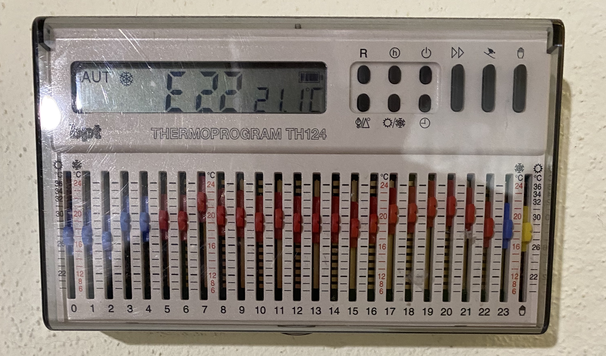

I drove about 10 minutes into town for dinner. We had:

* Some really great ravioli that's stuffed with cheese, but also has a semi-sweet ground sausage scattered on top of it. Really amazing. And the hard thing about Italian food to describe is that while the food is *simple,* it's still really good because the ingredients somehow just taste more fresh and vibrant.
* 2 pizzas: 1 "spicy" pizza (not spicy at all but was a tiny bit smoky), and 1 Heart-Shaped Pizza (burrata  + parma ham). It was Nirvana.

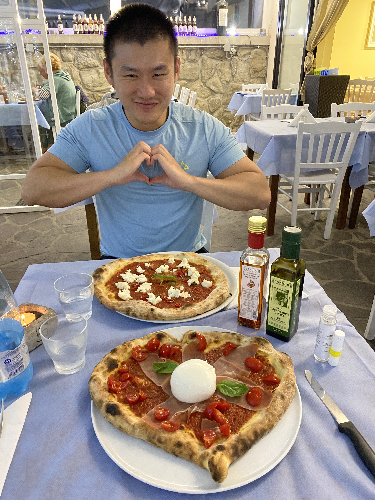

Went back to the BNB, browsed the internet a bit and then typed this up.

### Day 9: Truffles

Woke up, ate breakfast (it was OK), and at around 9:30AM we began a truffle tour. It was 8 people total and the tour basically consisted of:

1. Meeting up with a guide
2. Being served some coffee and cookies
3. Meeting up with a truffle hunter (and his dog, Achilles)
4. Following him around a dirt path and watching the dog hunt for, and dig up black truffles
5. Going back to the BNB to a cooking class, where a chef taught us how to make 3 types of different pastas
6. Eating 3 dishes of pastas, 2 with black truffles and 1 with white truffles
7. Eating a final dish of secondi (steak)

Overall, the experience was OK. Watching the dog hunt was great and it was a fun, short hike.

<video controls>
  <source src="../images/shrooms.mp4" type="video/mp4">
  Your browser does not support the HTML5 video tag.
</video>

The pasta cooking was fun and the pasta was good.

The main downsides are:

* The black truffles smelled really nice but didn't really have a taste to it. It got very easily overpowered by the pasta sauce.

* The white truffle supposedly is supposed to have more of a concentrated flavor, but not only did it smelled less pungent than the black truffle (black truffle smells more earthy whereas white truffle smelled more like greens to me), it didn't have any taste to it at all.

* The tour group were Americans which isn't inherently wrong but were very American which is very wrong. The lowlights: they talked about:

    * How the cistine chapel sucked.
    * How they all hated Italian pasta and it was horrible because it is al dente, as if the only correct pasta is American pasta.
    * Sea turtles for half an hour because one of them liked sea turtles.
    * How there isn't enough trees and nature in Rome (this is false, there's tons of trees, but the expectation that a main city center has a ton of nature is absurd).
    * How they didn't pay for the ferries in Venice because they couldn't figure it out, and therefore it's free to ride the ferries. And advised the others at the table not to buy tickets and just to ride it for free.
    * How Uber overcharges despite this being common knowledge and you're supposed to use another app called FreeNow (a cursory Google search would have revealed this).

    I guess I hate American tourists that think everything should be the exact same as America. This is idiotic because if that's the case then don't leave the country. To be fair though, they were from Ohio / Florida, which explains most of everything.

After that, we went to a nearby outlet and bought some Salomon shoes. We got **2 waterproof shoes** for $139 USD after tax rebate. For reference, midend shoes (the ones we bought) go for about $130 to $160 each so we got roughly a 50% discount.

We then went to dinner where once again, the pasta was great (1 truffle pasta with alfredo sauce, and 1 boar pasta with tomato sauce).

Went home and called it a day.

## Phase 3: Final Cities

### Day 10: Florence

Woke up and we put al our stuff in the rental car.

At around 8:30AM we ate breakfast until 9:00AM.

I drove the rental car to The Mall, Firenze. This is an outlet and we were wanting to see if we can get a good deal buying stuff. Loro Piana was disappointing with only overly bulky jackets. The other brands I wasn't really interested in. We went to Moncler and in that store we almost always buy something.

Last time I was at an outlet, I didn't buy anything but this time I was looking for a comfy, durable, breathable, waterproof, very lightweight jacket I can wear when it's warm yet wet. If it's cold, I can always put on more layers underneath. I got one for about 700 euros and Serena bought some hiking shoes for 300 euros. Tax-free is about 15% off.

Then, I drove to Firenze Hertz and returned the car. It went smoothly though I am anticipating some speeding bills 2-3 months from now. Additionally, I will go ahead and review this Jeep Compass 4xe now:

It kind of sucks for a 60k+ USD car. The electronics are wonky and carplay sometimes works, and sometimes doesn't. At the end, it didn't work. The cruise control can be interrupted by braking or pressing on the gas pedal, but unintuitively *resumes* after a little while.

Driving in Italy also is kind of hit-or-miss: their toll system is sometimes flawless where you swipe your credit card and it just works. But sometimes, it sucks and a lane will say it takes credit card, but doesn't. You try to put cash in, but it's unclear which slots take cash. You put money in slots only to find out that those aren't for cash. We were stuck behind the gate until someone behind the intercom just let us through.

After we went for gas and that was also insane: gas stations only take credit cards that have a PIN to them. This is kind of absurd and unheard of. So we paid cash. The **attendant who was smoking at a gas station** told us to put 50 euros into the machine but we figured 40 was sufficient. It was. It cost about 39 euros to fill up the tank so we lost out on about 1 euro.

After the car was returned, we checked into our hotel at around 1:15PM. And then we ate Florentine steak immediately. An entire package meal for 2:

* 1kg Florentine steak
* 2 large sides
* Per person: 1 bruschetta, 1 bread with pate, and a lot of various types of parma ham

For only 84 euros. Adding a 12-euro small wine bottle, it came out to around 100 euros. The meal ended at 3PM and we had until 7PM to eat another big meal.

Feeling full, we walked 21K steps across many various shops, ponte vecchio, and more. Quick rundown:

* Audemars Piguet is useless as usual. They only have the Code 11.59 to shill and nothing else.
* Rolex had a Yachtmaster 2 for about 18K euros. After tax, it'd be about 16K euros which is an OK deal. Not the best, not the worst.
* Loro Piana costs about the same as what it'd cost in New York, except instead of paying 10% tax, you get a 12.5% tax rebate. So it's probably a ~20% discount.
* After 2 years, we revisited our favorite gelato spot in Florence: Cantina Del Gelato (the one next to the bridge). It used to be run by this lady but it seems like the business has changed hands, or she's expanded. The fruity flavors were still really good and they've got a new "black rice" flavor now which tastes like sticky rice which I liked.

Then we went to get dinner at a relatively famous restaurant: [Ristorante Buca Mario](https://www.bucamario.com/). It's pretty huge so it is a good thing we had a reservation. Pasta was really great--it tends less al dente and more soft so tourists probably love it. As we had steak for lunch, we didn't also get steak for dinner. We also had ossobuco and tripe. Both were good. Feeling very full, we also had dessert: tiramisu and some berry cake.

We walked home and counted the number of mosquitos bites we've accumulated throughout the trip. As of day 10, we both have 13 mosquito bites. I have all of them on my legs. Serena has them distributed across her arms and legs.

### Day 11: Florence, Part 2

One of the great things about Florence is that there's tons to see. Everything from historical churches to gardens owned by rich families.

We opted to walk around and mostly go into stores though, as we saw everything last time.

Today, we walked into a main square and I drank a cappuccino for 1.50 euro.

Walked around a bit and went to lunch. We had:

* Carpaccio
* Seafood ragu pasta
* 1.1 kg of Florentine steak

It was pretty good. Then we walked around Florence some more, checking out everything from luxury shops to cheap, roadside shops.

In one of these roads where they were shilling leather goods, there's a famous place where they sell cow organs (literally called Lampredotto Cart). We had their lampredotto sandwich which tasted really good because the sauce is delicious and they made it a little spicy. We finished it, walked to the other side of the market and looped back to buy a small tray of lampredotto (cow organs dipped in the sauce, served on a small plastic tray instead of a sandwich).

Smooth, buttery, bouncy organs whose flavor is enhanced by the spicy sauce with tons of herbs.

Walked around some more and ate once again at Cantina Del Gelato.

Then we kept walking around some more, looping around Florence once again. We enjoyed the churches from the outside without getting in line; the exterior of the churches are something that any cheap bystander (like us) can marvel at.

Checking out everything from Celine to Zegna, we went to an early dinner. Being pretty full, we just shared 2 pastas and called it a day.

On the walk back to the hotel, we checked out some select stores selling sportswear like Adidas / Nike goods. We also went to a supermarket to see what kinds of things locals were buying. And then finally we stopped at another gelato shop to have one final gelato.

After that, we made it back to our hotel (G&G Suites) which is right next to the station. Which is good because the next day we'll need to go to the station to enjoy our final city and full day in Italy: Rome.

### Day 12: Rome

Woke up, took the 8:59AM train to Rome. We took the business class which again, has more luggage room, reclining seats, and has a free meal.

We arrived at around 10:30AM and checked in. Our room wasn't ready until 2PM so we left to go to the **legendary Da Enzo.** After a ~35 minute walk, we got there at around 11:45AM, about half an hour early.

During the whole day, it was sprinkling and raining lightly so I got a chance to test out my Moncler jacket which is supposed to be lightweight, breatheable, waterproof, and windproof. And it was all 4 of those things. Even though I walked around for hours for it, I wasn't ever too hot.

The line starts to build up about 20 mins from open, so we went to a nearby shop to drink cappuccino. We always go to that shop to drink because it's cheap and there's a bathroom, and it's like 30 seconds walk from Da Enzo. Normally the protocol is Serena waits in line and I go to grab a cappuccino. But this time around, we got there so early there's nobody waiting, so we both went in to enjoy some coffee.

Once that was done we lined up and at around 12:15PM, we got in. We got:

* Gricia / Amatriciana which are both rigatoni-based pastas with guanciale
* Cacio e pepe which was a delightful, simple, cheesy pasta
* Ossobuco
* Tripe
* 1/2 liter red wine
* Tiramisu and mascarpone for dessert

Of note: I noted down in previous visits that the red wine was very cheap: at only 8 euros for mezzo litro (half liter). But this time around, it's actually 7 euros.

Dessert, however, is comically expensive. The insanely delicious pasta cost about 12-15 euros a pop but desserts which are a much tinier portion, are also 12 euros a pop.

After that, we walked back to Spanish steps and tried to do some shopping.

* The Rolex saleslady is Russian which probably tells you everything you need to know. Rude and unhelpful.
* AP is disappointing, as usual. They only have ugly offshores and the movato-looking Code to sell. At least the service isn't complete crap like Rolex.

Maybe I'll just buy a G-shock or an Apple Watch or something in the future and call it a day.

Went to BV with Serena and she got a couple bags. The salesperson was really great. Gave us water and champagne. He showed me a bunch of bags, which were tempting to buy, but ultimately I didn't buy anything since I didn't have a great use case for the bags. Maybe when I am richer, especially because they've got lifetime cleaning and repair warranty.

Then, we went to Loro again and I tried out the windmate bomber, as well as the classic windmate jacket. It is very comfy. Breakdown:

* The bomber is very simple and elegant and comfy, but the interior pockets are awkward to use. It works by being able to be worn both inside and out. But only one side has zippered pockets. The pockets are positioned so that you can stick your hands in it, but this means the symmetric interior pockets require you to reach your hand to the side of your body in order to retrieve things that's in front of your body.
* The lighter windmate jacket is great except the pockets are all button-secured. The salesman says they don't use zippers since it's a thinner fabric and so interior pockets with zippers would be ugly. Though it's very comfy, I didn't buy it because I already got the Moncler jacket that I want to use for about a season or 2 before I buy another expensive jacket.
* The heavy, winter windmate jacket checks all the boxes. It's got zippered pockets and many interior pockets, and looks incredible. Too bad I already have a thicker Moncler jacket and can't really justify another big winter coat purchase since I don't really use it that much, and if I needed to use a winter jacket I already have one I'll use until it breaks. Which is hopefully never.

We went back to our hotel in a very crowded subway and got our room at around 6PM. Then, we wanted to go to Nerone (their wait staff is always very funny and happy from our last trip)--too bad they were full and turned us away.

So we ate Chinese food instead. It was pretty good and very cheap. We had:

* Duck
* Spicy chicken
* Fried noodles
* Garlic/vinegar/parsley pork
* Bok choy
* Wang Lao drink
* Fried ice cream

Only 45 euros!

With our final dinner out of the way, we knocked out around 20K steps today, and 21K steps the day before. Not sure how we did 30k+ steps for many days in a row when we did Portugal / Spain for a month, but the shoes I'm wearing are getting old (Cole Haan)--previous trips used a newer React sole or a ZoomX sole which are fine to walk for 20-30K steps.

### Day 13: Departure Day / Rome

We woke up around 10AM, packed, and left the hotel at around 11AM. Left our luggage at the hotel and walked around a bit and ended up at the same place we went to on Day 1 to eat a big maritozzi. Then, we made our way to a restaurant called Trattoria Antonio al Pantheon. We had:

* Beef tartare (to die for). They did something interesting which is to season it with tiny bits of fried pork / cheese (they call it carbonara style).
* 2 pastas, both with pork cheek (guancale). One is carbonara based, the other is tomato based sauce.
* Ossobuco -- the Roman style is done with a tomato sauce, we had the other style which is done in another sauce which is more brown / salty, and it had peas. It was good.
* Patanegra which is the back of the neck of pig. Very delicious and crispy on the outside, and moist on the inside, like a really delicious ribeye. Additionally, there is some arugula on the side, as well as a mini-quiche pie thing that had roasted eggplant for stuffing.

Overall, the place was really great. But we were extremely full due to the food we had last night + maritozzi, so we couldn't finish it all.

After that meal, we went to the Pantheon and to our horror, it is **no longer free.** The past few years we went, we either lucked out or it was simply free. Tourists were able to walk in and out quickly and you can enjoy the magic that is the oldest and largest unreinforced concrete structure in the world. So now, it's free every 1st Sunday of the month but otherwise is 5 euros. As it is no longer free, tourists will take a much longer time, and as a result, the wait times are much longer.

For dessert, we went to Giolitti once again. Amazing, as usual. Now extremely stuffed, we decided to walk it off by walking around the Spanish steps.

Then, we took a subway ride back to our hotel from Spagna to Repubblica. It was around 3PM and called a taxi to FCO. Got to FCO at around 3:40PM. Walked around some stores and then to the Plaza Premium Lounge.

Showered at the lounge (apparently showering is only available for Amex Plat holders and not Priority Pass) and it was OK. Not huge, not small.

Got on the plane and it was same as last time: ample space. I find Norse Airways food to be vastly superior to United's garbage. That said, you get 2 meals for transatlantic flights:

1. Main meal which for me was chicken and rice + accessories. This tasted pretty good.
2. Secondary poor excuse for a meal, which was just bread and a pastry dessert. The latter was good but the bread was hard and gross.

This pattern is similar to our JFK->FCO flight. The main meal's good but the second meal was disgusting ham and cheese + brownie; we just took the brownie.

When we arrived to JFK it was **absolute chaos.** The immigration line backed up to basically the bridge connecting the plane to the airport building. After 10 minutes of confusion, the staff told us that US citizens can bypass most of this line.

After we walked a few minutes, passing perhaps a couple thousand people waiting in line, there's another few hundred US citizens waiting in the regular lines. 

But we have Global Entry, so that'd be good, right?

Nope, not when you're in JFK!

The kiosks were down and Global Entry folks just had a "shorter" line--but it was probably about the same wait as the regular line as there's only 1 agent processing all the Global Entry folks, whereas a regular US citizen line had 4 agents. We got to the back of the Global Entry line and luckily the last 10 of us were eventually spintered off into another dedicated lane. So after 20 minutes of waiting, we eventually only had to wait for about 10 people. This isn't bad considering the alternatives were:

* Global entry regular = 1+ hour wait
* Regular US citizen ~ 1+ hour wait
* Non US-citizen ~ 4 hour wait.

We ubered and made it home and that was our trip.
