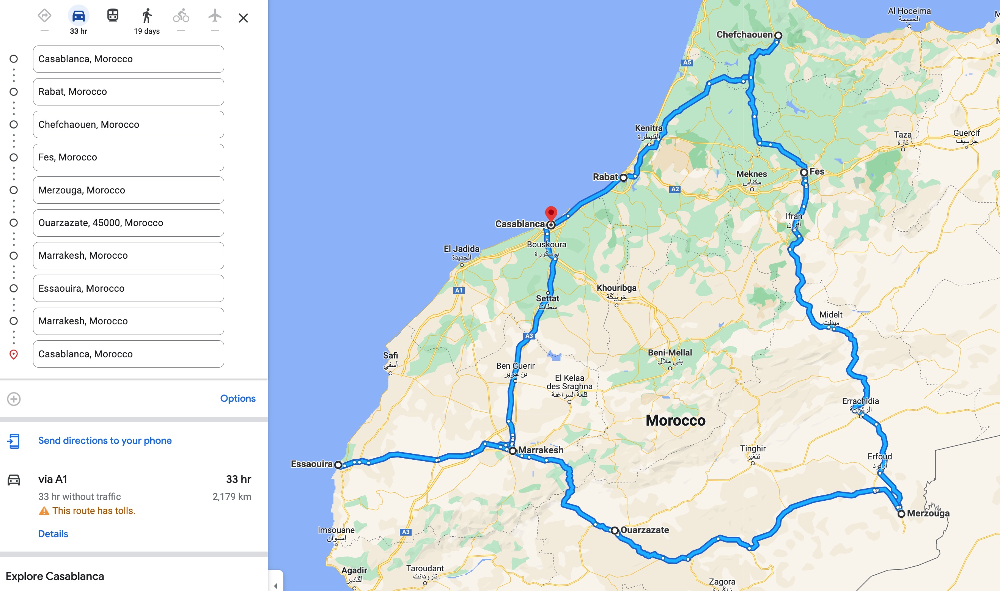
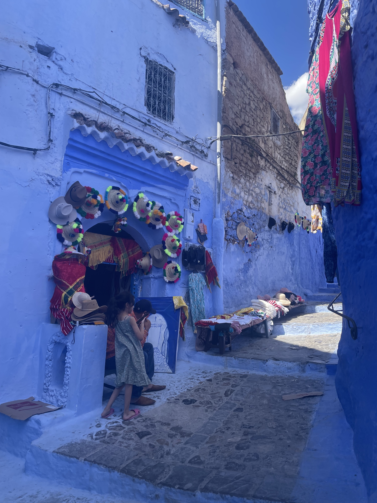
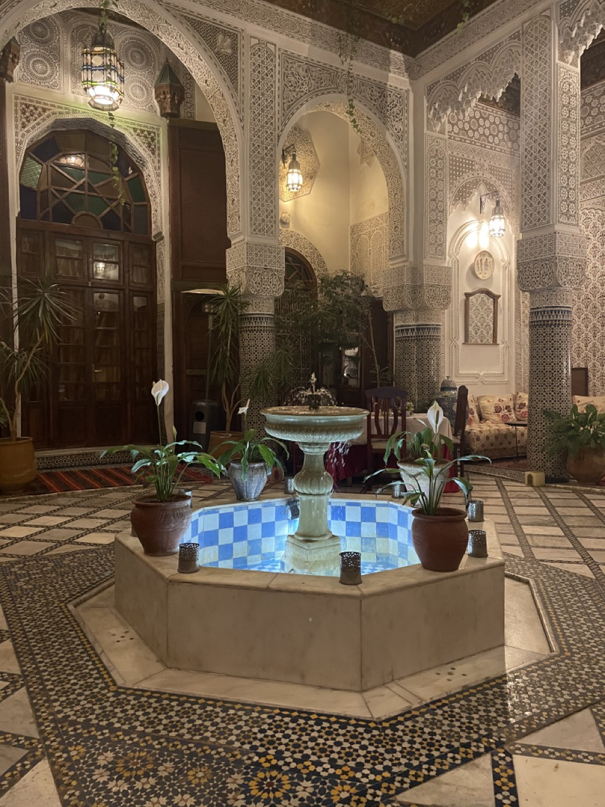
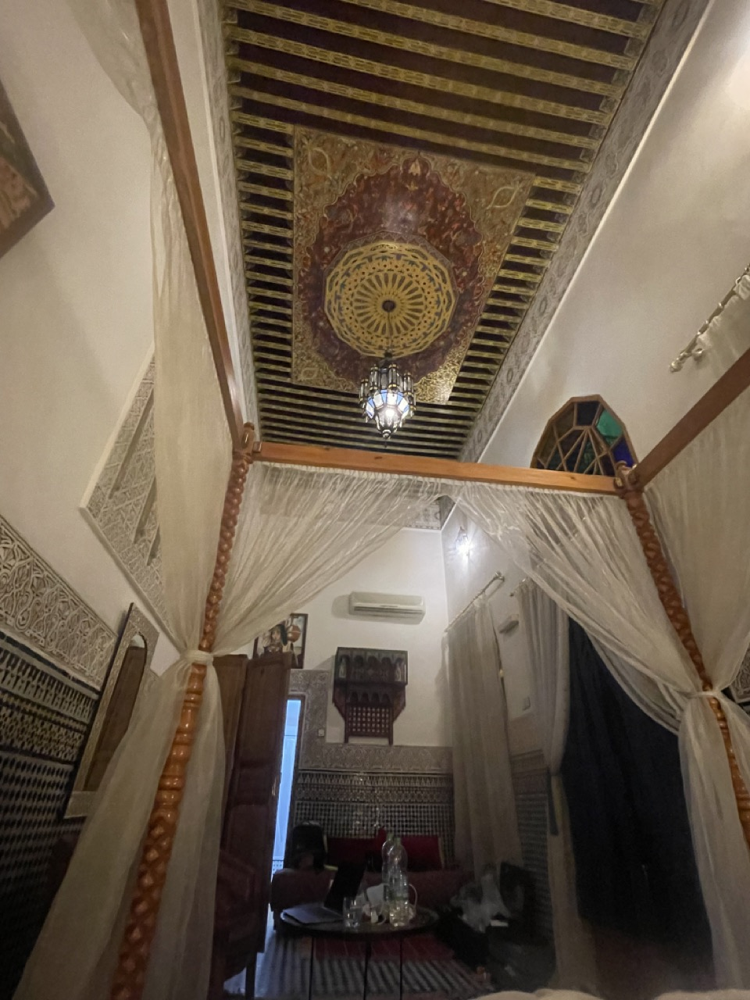
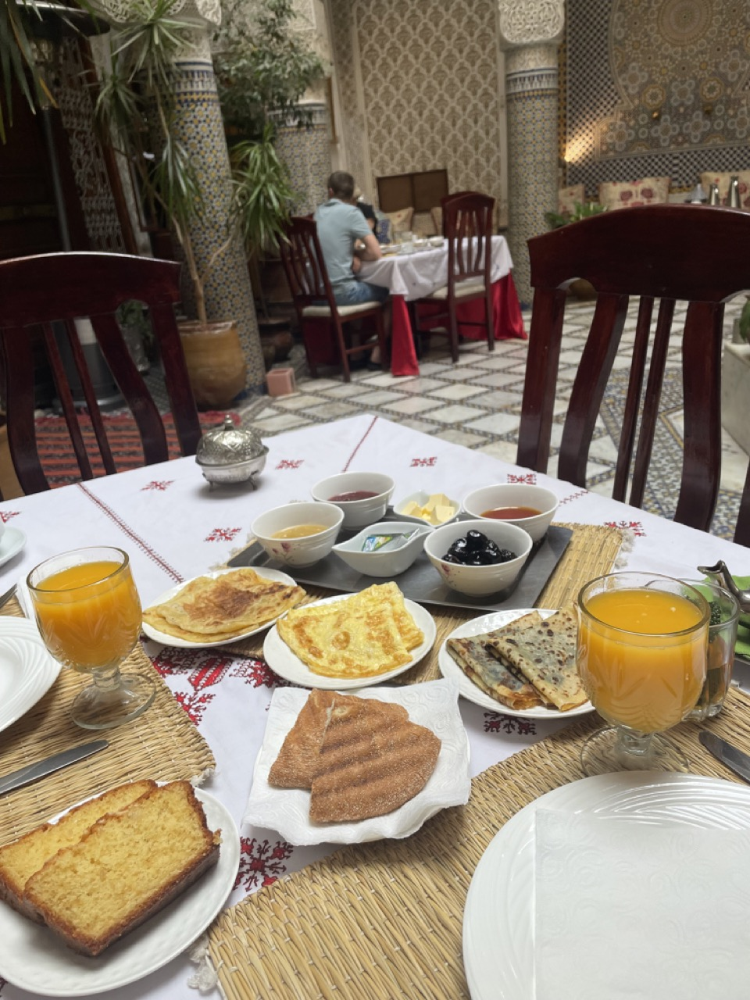
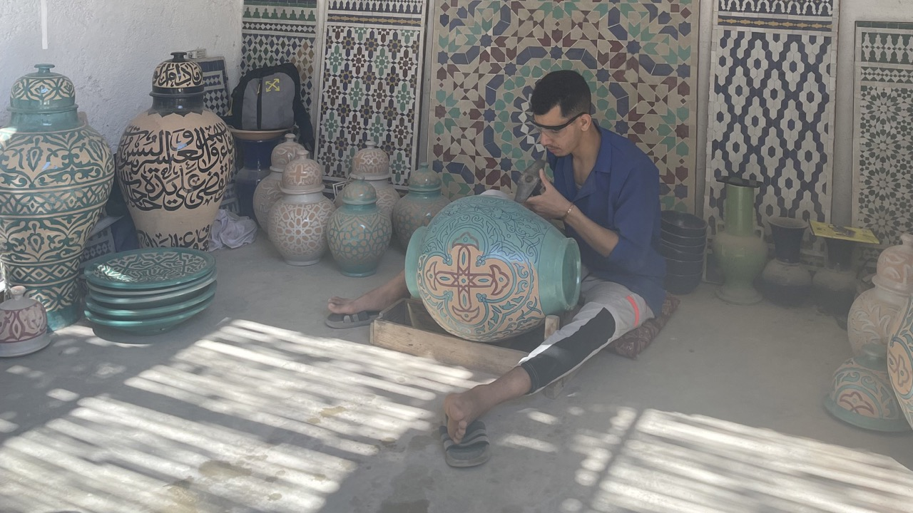
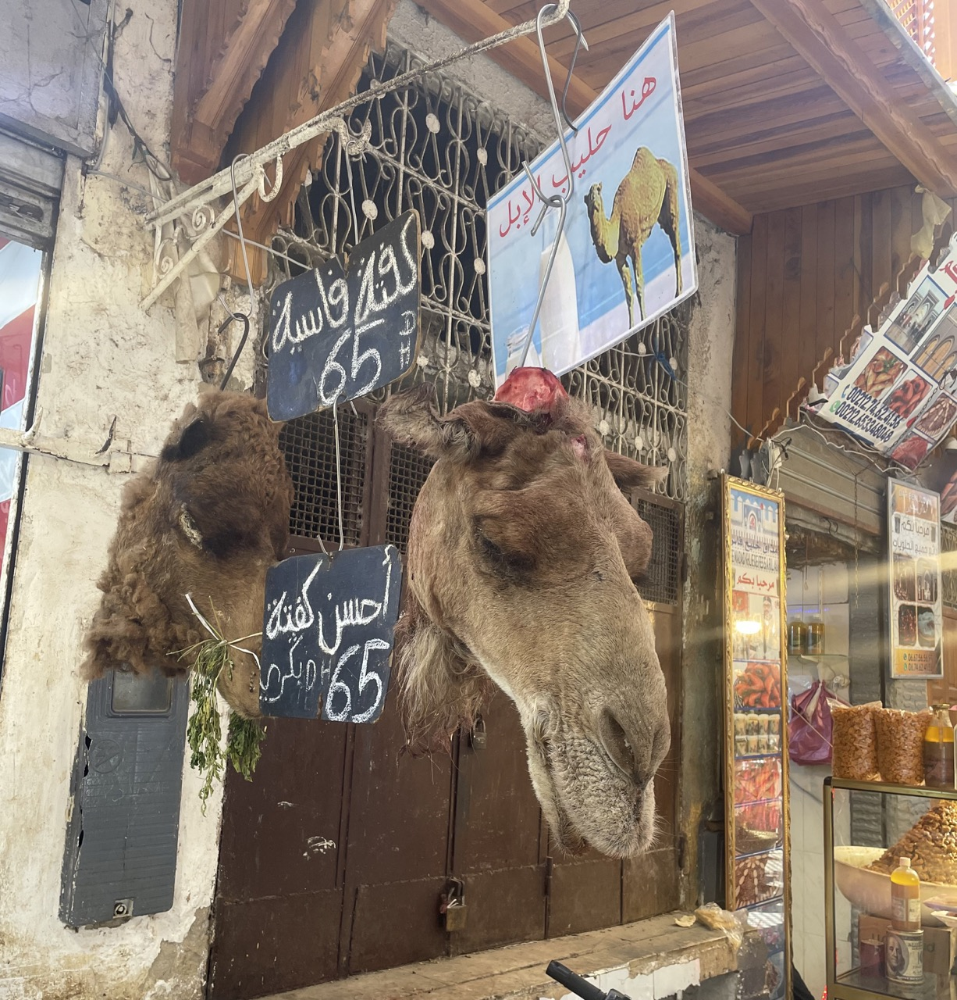
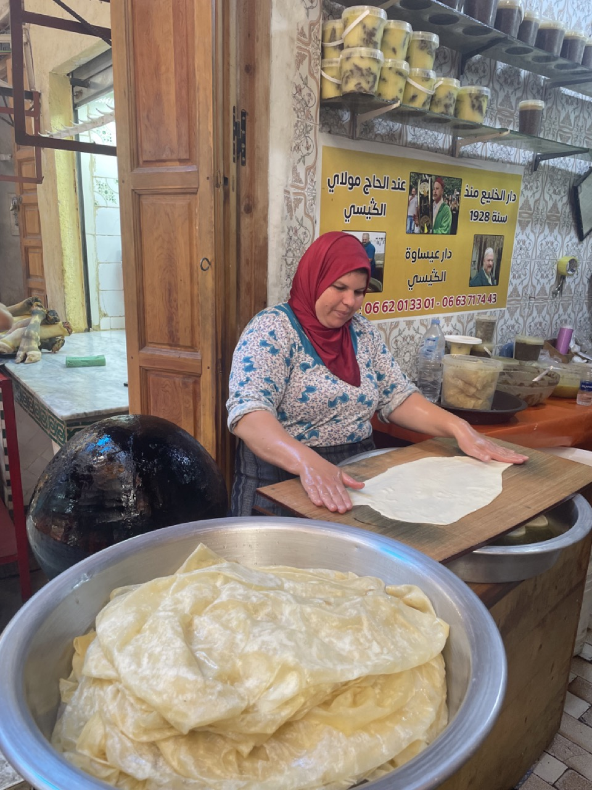
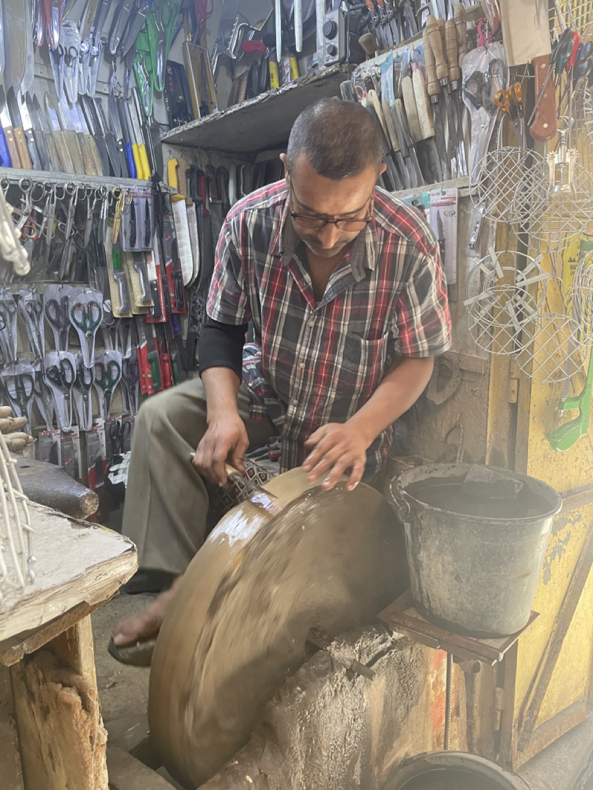
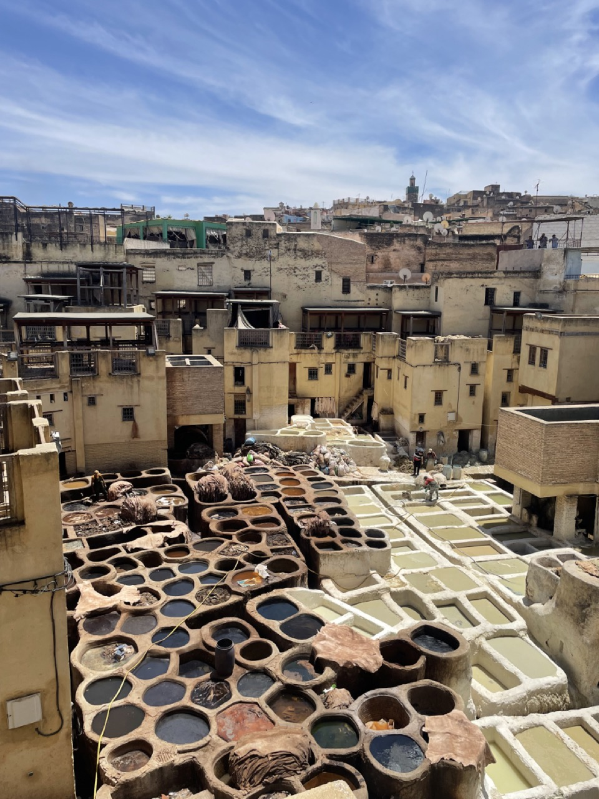

# Morocco

## Overview

We traveled from May 12 thru May 23, 2023.

We booked a private tour with [Morroco Daily Tours](https://www.moroccodailytours.com/) for about $3K. This means you get a private driver that takes you around different places and you don't really have to plan anything. No crowding in busses adhering to some group schedule. Stop whenever you want, wherever you want. Just tell to driver to go and they'll drive you there.

It's our first time doing this kind of a VIP trip because if you did this anywhere else, it'd be prohibitively expensive. But with $3K, it included:

* VIP service
* Breakfast at all hotels
* Lodging
* 3 or 4 dinners

I highly recommend them. Our journey was like this:

<figure markdown>      <figcaption>We started in Casablanca and went clockwise</figcaption> </figure>

## Casablanca (May 13)

Redeye flight. I didn't sleep. It was one of those rundown airports where you get off the plane onto the tarmac, and then you take a bus to your terminal.

My customs was slightly delayed because I didn't know that we had to know where we were staying. I just told the customs officer I don't know where I was staying as the tour guide booked it.

**Terminals are switched.** Maps say you will land in Terminal 1 but you'll land in Terminal 2. When we departed at the end of our journey, Google said we will depart at T1 but instead needed to walk to T2. No biggie though as they're in the same complex. Minor inconvenience is having to coordinate with the driver and have them switch terminals.

It was hot and our luggage took an hour *after customs* to arrive. Run-down, slow service was to be expected, so I wasn't mad.

Greeted by our driver, he was dressed in a suit so the vibe completely changed from there on from run-down, poor-service to VIP, excellent service.

We went to a Mosque and it was cool.

After, we headed directly for Rabat since we were told that other than the Mosque, there's not much to do in Casablanca.

### Lessons

1. **Mental framing is important**. If I had expected an airport in a 3rd-world country to be as modern and as quick as a 1st-world one, my expectations would be set too high and I'd be very disappointed.
2. **Know the address (or at least the place you're staying) the first night** when you travel internationally.
3. **Allot for ample time when going to a new country.** Businesses are inefficient in the world; airports are no different. If you don't know how much time something will take, you should allot for more time. For example, if you had to book and catch a bus after landing to Morocco, you'd probably book a ticket 2-3 hours after your landing time to account for delays, being at the wrong terminal, etc. Luckily, we had a private driver so he just waited for us.

## Rabat (May 13-14)

We arrived to our hotel after a few hours in the car (comfy, it was an 8-seater Mercedes). We checked into a Riad (traditional hotels, more explanation later).

Grabbed dinner at a restaurant located at the 2nd (top) floor. The 'roof' was made out of beautiful rugs and they made [Tajine for us](https://en.wikipedia.org/wiki/Tajine). Tasty, moist meat.

We would have it a lot on this trip, but just know that food here at the time of writing costs about <mark>**50-150DH (about $5-$15 USD) per thing of Tagine.**</mark>

We then explored and walked around the dense market in Rabat, where a lot of locals were. Then some old ass, witch-looking motherfucker came up and ***pinched Serena in the arm***. The old witch was smiling / happy when she did that so not sure if she was putting a curse on Serena or if she just hasn't seen an Asian before.

Probably the latter.

Mildly upset and humored simultaneously, we went back to the Riad.

Woke up the next day, ate breakfast, checked out an 11th century Mosque / ruin nearby, and set off to Chefchouen.

## Chefchoeun (May 14-15)

Jews used to live here and painted the town blue as a sign of respect to God, or peace, or something (different sources cite different reasons for why they painted it blue). Regardless, the town reminds me of [this song](https://www.youtube.com/watch?v=6DBA5Wx9T7U&ab_channel=Audioandlyrics) and also makes for an Instagram destination.

If you're not sure what Instagram is, it's an ancient app that geriatrics use to share photos and show off their lives and grandkids.

<figure markdown>     <figcaption>I'm blue
Da ba dee da ba di</figcaption> </figure>

We hiked up a mountain near the town Mosque to see the sunset and went back to our hotel. The next day's itinerary was just "going to Fes" and we weren't going to do anything there, so we spent the morning taking more photos of the blue town.

## Fes (May 15-17)

### Riads, Typical Breakfast

We arrived to Fes and took a bunch of pictures of the Riad because it was pretty. Here's an exterior and interior shot with some explanations.

<figure markdown>   { width="600" } </figure>

Most Riads have a deep tie with Islam and its architecture have the following properties:

* No animal or human idols. Thus, mosaics are in various geometrics shapes.
* Balconies always look *inward* into the courtyard, as opposed to out in the street. This is because modesty is considered a virtue in Islam, and so all the showy things are hidden inside walls.
* Riad courtyards are generally square and symmetric in nature, with a fountain in the middle.
    * The reception courtyard is generally an imagination of what the afterlife looks like.
    * The fountain in the center represents the fountain of life.
    * And the 4 quadrants in the square courtyard represents the rivers of water, milk, wine, and honey.
    * Riad courtyards vary in extravagance. Later on in the trip, we see some Riads that don't host guests but instead serve as a museum and follow the same architecture and very similar designs, but is much more extravagant in size / plants / gardens.

The interior looks like the below and had a very high ceiling.

<figure markdown>   { width="600" } </figure>

The designs are beautiful but it's a bit run down and a little dirty. When you step on the floor with your bare feet there are like chunks of dirt or mosaic for example. The AC was also broken. But the staff was friendly and tried to do their best to help, so it may these mild inconveniences very bearable. We watched *Succession* and woke up the next day to a traditional Morrocan breakfast:

<figure markdown>   { width="600" }
  <figcaption>Typical breakfasts is orange juice, tea, pastries, olives, and jam. There was little to no variance in breakfast across the hotels we stayed all over Morocco.</figcaption>
</figure>

While variety isn't a big forte of Morocco (think Tagine every meal), meals varied in quality based on how they make it. For example, some had room-temp pastries, and some had warm / hotter pastries, etc. Tagines varied based on the cut of meat--some were very dry with very little sauce to dip with bread, whereas some were perfectly moist with tons of sauce.

### Ceramics

Fes is a city of artisans, and one of our first stops was to see how they make mosaics. They do this manually. These guys require <mark>**6 years of study before being allowed to work in these shops**</mark> and we saw processes where they'd go from molding Tagines from scratch, to building complicated tables and vases by manually chipping patterns with a hammer. Going through this process is a great sales tactic because it made us engaged and we ended up buying about $100 USD worth of ceramics.

<figure markdown>   { width="600" } </figure>

### Walking Tour

#### Why do we need another guide?

Our driver served as a guide as well and would tell us what we were driving through and stop at various spots and explain stuff to us. But there were parts of the journey where I guess there are dedicated walking tour guides that will show you that specific area. I think our driver couldn't also be the one to walk and show us these specific places because:

1. You need to pass a specific test for that region (say, Fes), to be able to serve as a tour guide for that region.
2. I think you need some sort of license to be able to be a tour guide for a specific region.

Thus, a tour guide for Fes is a specialist in helping tourists navigate through Fes. As such, our driver / guide dropped us off to meet our Fes guide, Islam.

#### Jewish architecture

He started the tour showing us some buildings on the outskirts of the Medina (their "old town"). Jews lived in this region and had a mass exodus post-WW2 through 1970s. The architecture is mostly mixed-used buildings: shops on the 1st floor and the shop owners' residence on the 2nd floor. The balcony looks outside onto the street which lets shop owners keep tabs on their store (contrast this with a Riad where the balconies look *inwwards* into their courtyard).

#### Markets, Artisans

We then went inside the Medina, which is the largest Medina in Morocco (about 540 acres). These consisted of small streets with tons of local folks selling their goods. Think Disney Hollywood Studio's Star Wars: Galaxy's Edge village, but with narrower streets and much bigger. Some examples:

<figure markdown>   { width="600" }
<figcaption>
  Not sure what they're selling here but made me hungry for camel meat, which I'll have later.
</figcaption></figure>

<figure markdown>   { width="600" }
<figcaption>
Freshly made bread. She tosses it onto the black sphere on her right which cooks the dough. We had some with some rosewater-based jam. The tour guide bought it for us. Was really good.
</figcaption></figure>

Later on, the tour guide showed us "rest stops" that used to exist--these were lodging that traveling traders would use after a long journey on their camels arriving to Morocco. Think of it as a place for 'layovers' for traders that normally need to travel with their camel for months.

We then went to a textile shop where we saw them weave everything from cotton to silk to agave, and we bought maybe $100 USD worth of stuff. Walking around, we also saw a friendly knife maker that let us play with his scissors and knives:

<figure markdown>   { width="600" } </figure>

The best thing about all this is none of the shops we went through were pushy and we were told many times that there was *no obligation to buy*. This ironically made us 'open up' so we never felt shy about asking questions and understanding the product and their process, which if you think about it, is an indirect way of selling ourselves. If they had been more pushy I would shy away from engaging as much with the vendors, and thus would buy less.

Which is why the next place kinda sucked.

We went to a tannery and the guy gave us some mints to smell to 'mask the smell.' It's just a leather shop and it smells like leather--why do I need to mask the smell?

But we found out.

He led us up to the rooftop where he'd explain the tanning process. As we were walking up, the stench got more and more concentrated. By the time we got to look at this beautiful view:

<figure markdown>   
<figcaption>
Tannery. Dying stations on bottom left, softening baths in the middle (white), and tucked away are 2 giant washing machines (one top, one right) to process the leather.
</figcaption></figure>

It smelled like sewage. The reason for this smell is because part of the process requires them to use pidgeon shit. And pidgeon shit does a few things:

1. Softens up the hard leather
2. Makes the leather more easily absorb dye
3. Makes it so that the flesh and the hide is more easily separated

Spoiler alert: the mint didn't help.

**Anyway, we went downstairs and the pushy sales started**. He talked about how great his product is and how waterproof and fireproof is leather are. And how they use goat skin because it's the best quality. Then he talked about why his high-quality jackets are so "cheap"--it's only based on quality and not brand so it's a great deal. Then he kept on talking some more. Finally, he told us to try some jackets. This is cool and all except:

* What good is a fireproof jacket to me?
* If I were to buy an expensive leather jacket, it better be a brand name, quality be damned. The whole point of buying expensive things is to show off.
* They have really good looking leather jackets with a hood, but the hood itself isn't waterproof. So what's the point? I'll still get wet if it rains. Why wouldn't I just buy a raincoat again or use my waterproof Aigle or Moncler--or better yet, stay home?
* I'm not even in the market for a leather jacket. He didn't even ask me whether I had a need for a leather jacket and just assumed *because it's good quality*, the market wants it. But I don't want it. It's clunky and heavy. If he had asked me, he could have redirected our limited time together to sell me on what I really want, which are weekenders / leather travel bags.

Further, when I asked how much the jackets were he wouldn't tell me until the end. Why? If you only tell me as we're about to leave the store, there's no room for negotiation. **It turns out it was $520 for a leather jacket and $350+ for a leather duffle.** Cheap, my ass.

As we were leaving the store he kept asking us what our best price was. We said maybe $200 for the jacket but he kept saying that's insulting--but we told him multiple times that we don't want to buy it already, so not sure why he was insulted. Not entertained anymore, I just threw this out:

> Hey listen, we're not buying it because we just don't need it. And we're not going to buy something we don't need.

This shut him up nice because he doesn't know how to handle that objection.

I get that tanneries are expensive to run and they want business, but selling like this is amateur hour and one of the things I hate most is witnessing incompetence.

### Lessons

1. **Good people make adverse conditions more tolerable.**
2. **"No obligation to buy"** is the best sales phrase, because it makes me want to buy even more. It builds goodwill for some reason, even if vendors don't mean it.
3. Conversely, pushy sales and bullying tactics lowers conversion--especially for high-ticket products. **The best sales seek to understand what the customer wants first, then sell them the thing that they kind of already want.** Selling ice to someone dying of thirst in a desert is much easier selling it to an eskimo. BTW "I can sell ice to an eskimo" is the most stupid brag because it indicates poor strategy.

## Dessert Camp (Merzouga)

## Ouzazarte

## Merrekesh

## Takeaways

* bad place w/ good people > good place w/ bad people
* sales tactic: not pushy = more likely to buy
  - Wood craftsman vs leather jacket salesperson
  - WIIFM: Leather jacket = talks about how great their leather is. Don't care. Talks about how 'cheap' to buy their jacket (ended up being 500 euros) because they focus on quality, not brand name. Again, he says all this without knowing what the customer values. Most rich people that can buy these things value brand because they want to show off. They don't care about quality or keeping warm or having a fireproof jacket.
- Poor people can be happy too. Different people just have different types of problems to solve.
