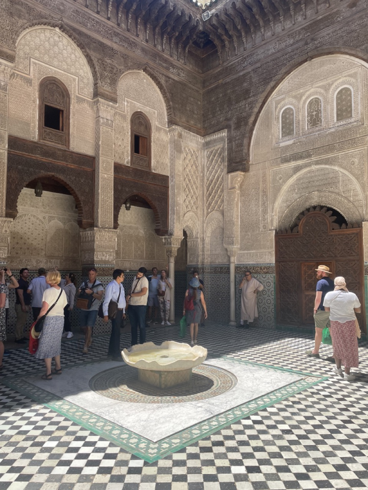
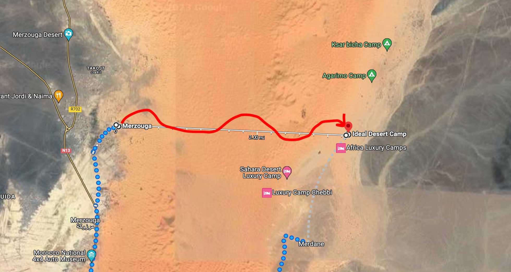
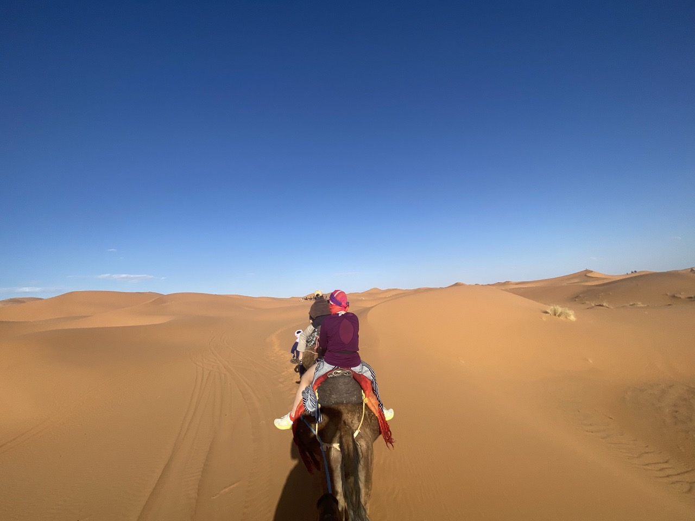
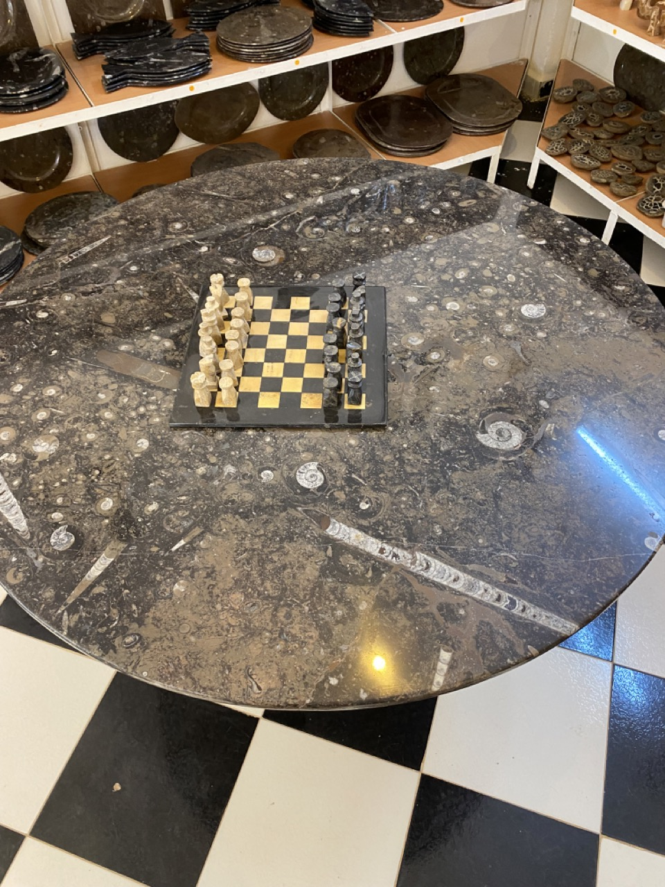
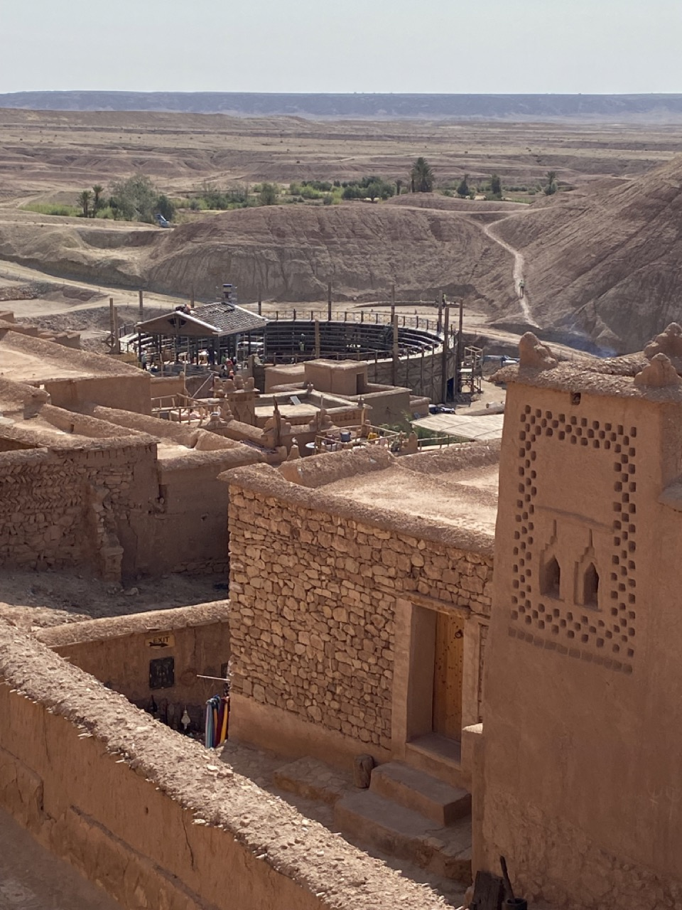
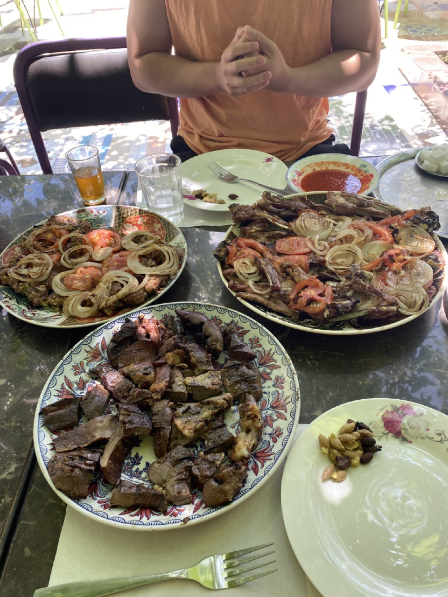

# Morocco

## Overview

We traveled from **May 12 thru May 23, 2023.**

We booked a private tour with [Morocco Daily Tours](https://www.moroccodailytours.com/) for about **$3K total, for 2 people (so $1.5K each)**. This means you get a private driver that takes you around different places and you don't really have to plan anything. No crowding in busses adhering to some group schedule. Stop whenever you want, wherever you want. Just tell to driver to go and they'll drive you there.

It's our first time doing this kind of a VIP trip because if you did this anywhere else, it'd be prohibitively expensive. But with $3K, it included:

* A private car
* VIP service
* Lodging
* Breakfast at all hotels
* 3 or 4 dinners

I highly recommend them. Our journey was like this:

<figure markdown>      <figcaption>We started in Casablanca and went clockwise</figcaption> </figure>

## Casablanca (May 13)

Redeye flight. I didn't sleep. It was one of those rundown airports where you get off the plane onto the tarmac, and then you take a bus to your terminal.

My customs was slightly delayed because I didn't know that we had to know where we were staying. I just told the customs officer I don't know where I was staying as the tour guide booked it.

**Terminals are switched.** Maps say you will land in Terminal 1 but you'll land in Terminal 2. When we departed at the end of our journey, Google said we will depart at T1 but instead needed to walk to T2. No biggie though as they're in the same complex. Minor inconvenience is having to coordinate with the driver and have them switch terminals.

It was hot and our luggage took an hour *after customs* to arrive. Run-down, slow service was to be expected, so I wasn't mad.

Greeted by our driver, he was dressed in a suit so the vibe completely changed from there on from run-down, poor-service to VIP, excellent service.

We went to a Mosque and it was cool.

After, we headed directly for Rabat since we were told that other than the Mosque, there's not much to do in Casablanca.

### Lessons

1. **Mental framing is important**. If I had expected an airport in a 3rd-world country to be as modern and as quick as a 1st-world one, my expectations would be set too high and I'd be very disappointed.
2. **Know the address (or at least the place you're staying) the first night** when you travel internationally.
3. **Allot for ample time when going to a new country.** Businesses are inefficient in the world; airports are no different. If you don't know how much time something will take, you should allot for more time. For example, if you had to book and catch a bus after landing to Morocco, you'd probably book a ticket 2-3 hours after your landing time to account for delays, being at the wrong terminal, etc. Luckily, we had a private driver so he just waited for us.

## Rabat (May 13-14)

We arrived to our hotel after a few hours in the car (comfy, it was an 8-seater Mercedes). We checked into a Riad (traditional hotels, more explanation later).

Grabbed dinner at a restaurant located at the 2nd (top) floor. The 'roof' was made out of beautiful rugs and they made [Tajine for us](https://en.wikipedia.org/wiki/Tajine). Tasty, moist meat.

We would have it a lot on this trip, but just know that food here at the time of writing costs about <mark>**50-150DH (about $5-$15 USD) per thing of Tagine.**</mark>

We then explored and walked around the dense market in Rabat, where a lot of locals were. Then some old ass, witch-looking motherfucker came up and ***pinched Serena in the arm***. The old witch was smiling / happy when she did that so not sure if she was putting a curse on Serena or if she just hasn't seen an Asian before.

Probably the latter.

Mildly upset and humored simultaneously, we went back to the Riad.

Woke up the next day, ate breakfast, checked out an 11th century Mosque / ruin nearby, and set off to Chefchouen.

## Chefchoeun (May 14-15)

Jews used to live here and painted the town blue as a sign of respect to God, or peace, or something (different sources cite different reasons for why they painted it blue). Regardless, the town reminds me of [this song](https://www.youtube.com/watch?v=6DBA5Wx9T7U&ab_channel=Audioandlyrics) and also makes for an Instagram destination.

If you're not sure what Instagram is, it's an ancient app that geriatrics use to share photos and show off their lives and grandkids.

<figure markdown>     <figcaption>I'm blue
Da ba dee da ba di</figcaption> </figure>

We hiked up a mountain near the town Mosque to see the sunset and went back to our hotel. The next day's itinerary was just "going to Fes" and we weren't going to do anything there, so we spent the morning taking more photos of the blue town.

## Fes (May 15-17)

### Riads, Typical Breakfast

We arrived to Fes and took a bunch of pictures of the Riad because it was pretty. Here's an exterior and interior shot with some explanations.

<figure markdown>   { width="600" } </figure>

Most Riads have a deep tie with Islam and its architecture have the following properties:

* No animal or human idols. Thus, mosaics are in various geometrics shapes.
* Balconies always look *inward* into the courtyard, as opposed to out in the street. This is because modesty is considered a virtue in Islam, and so all the showy things are hidden inside walls.
* Riad courtyards are generally square and symmetric in nature, with a fountain in the middle.
    * The reception courtyard is generally an imagination of what the afterlife looks like.
    * The fountain in the center represents the fountain of life.
    * And the 4 quadrants in the square courtyard represents the rivers of water, milk, wine, and honey.
    * Riad courtyards vary in extravagance. Later on in the trip, we see some Riads that don't host guests but instead serve as a museum and follow the same architecture and very similar designs, but is much more extravagant in size / plants / gardens.

The interior looks like the below and had a very high ceiling.

<figure markdown>   { width="600" } </figure>

The designs are beautiful but it's a bit run down and a little dirty. When you step on the floor with your bare feet there are like chunks of dirt or mosaic for example. The AC was also broken. But the staff was friendly and tried to do their best to help, so it may these mild inconveniences very bearable. We watched *Succession* and woke up the next day to a traditional Moroccan breakfast:

<figure markdown>   { width="600" }
  <figcaption>Typical breakfasts is orange juice, tea, pastries, olives, and jam. There was little to no variance in breakfast across the hotels we stayed all over Morocco.</figcaption>
</figure>

While variety isn't a big forte of Morocco (think Tagine every meal), meals varied in quality based on how they make it. For example, some had room-temp pastries, and some had warm / hotter pastries, etc. Tagines varied based on the cut of meat--some were very dry with very little sauce to dip with bread, whereas some were perfectly moist with tons of sauce.

### Ceramics

Fes is a city of artisans, and one of our first stops was to see how they make mosaics. They do this manually. These guys require <mark>**6 years of study before being allowed to work in these shops**</mark> and we saw processes where they'd go from molding Tagines from scratch, to building complicated tables and vases by manually chipping patterns with a hammer. Going through this process is a great sales tactic because it made us engaged and we ended up buying about $100 USD worth of ceramics.

<figure markdown>   { width="600" } </figure>

### Walking Tour

#### Why do we need another guide?

Our driver served as a guide as well and would tell us what we were driving through and stop at various spots and explain stuff to us. But there were parts of the journey where I guess there are dedicated walking tour guides that will show you that specific area. I think our driver couldn't also be the one to walk and show us these specific places because:

1. You need to pass a specific test for that region (say, Fes), to be able to serve as a tour guide for that region.
2. I think you need some sort of license to be able to be a tour guide for a specific region.

Thus, a tour guide for Fes is a specialist in helping tourists navigate through Fes. As such, our driver / guide dropped us off to meet our Fes guide, Islam.

#### Jewish architecture

He started the tour showing us some buildings on the outskirts of the Medina (their "old town"). Jews lived in this region and had a mass exodus post-WW2 through 1970s. The architecture is mostly mixed-used buildings: shops on the 1st floor and the shop owners' residence on the 2nd floor. The balcony looks outside onto the street which lets shop owners keep tabs on their store (contrast this with a Riad where the balconies look *inwwards* into their courtyard).

#### Markets, Artisans

We then went inside the Medina, which is the largest Medina in Morocco (about 540 acres). These consisted of small streets with tons of local folks selling their goods. Think Disney Hollywood Studio's Star Wars: Galaxy's Edge village, but with narrower streets and much bigger. Some examples:

<figure markdown>   { width="600" }
<figcaption>
  Not sure what they're selling here but made me hungry for camel meat, which I'll have later.
</figcaption></figure>

<figure markdown>   { width="600" }
<figcaption>
Freshly made bread. She tosses it onto the black sphere on her right which cooks the dough. We had some with some rosewater-based jam. The tour guide bought it for us. Was really good.
</figcaption></figure>
Later on, the tour guide showed us "rest stops" that used to exist--these were lodging that traveling traders would use after a long journey on their camels arriving to Morocco. Think of it as a place for 'layovers' for traders that normally need to travel with their camel for months.

<figure>
<video controls>
  <source src="../images/moroccan-rest-stop.mp4" type="video/mp4">
  Your browser does not support the HTML5 video tag.
</video>
    <figcaption>Typical lodging / rest stop for ancient long-haul traders.</figcaption>
</figure>

We then went to a textile shop where we saw them weave everything from cotton to silk to agave, and we bought maybe $100 USD worth of stuff. Walking around, we also saw a friendly knife maker that let us play with his scissors and knives:

<figure markdown>   { width="600" } </figure>

The best thing about all this is none of the shops we went through were pushy and we were told many times that there was *no obligation to buy*. This ironically made us 'open up' so we never felt shy about asking questions and understanding the product and their process, which if you think about it, is an indirect way of selling ourselves. If they had been more pushy I would shy away from engaging as much with the vendors, and thus would buy less.

Which is why the next place kinda sucked.

We went to a tannery and the guy gave us some mints to smell to 'mask the smell.' It's just a leather shop and it smells like leather--why do I need to mask the smell?

But we found out.

He led us up to the rooftop where he'd explain the tanning process. As we were walking up, the stench got more and more concentrated. By the time we got to look at this beautiful view:

<figure markdown>   
<figcaption>
Tannery. Dying stations on bottom left, softening baths in the middle (white), and tucked away are 2 giant washing machines (one top, one right) to process the leather.
</figcaption></figure>

It smelled like sewage. The reason for this smell is because part of the process requires them to use pidgeon shit. And pidgeon shit does a few things:

1. Softens up the hard leather
2. Makes the leather more easily absorb dye
3. Makes it so that the flesh and the hide is more easily separated

Spoiler alert: the mint didn't help.

**Anyway, we went downstairs and the pushy sales started**. He talked about how great his product is and how waterproof and fireproof is leather are. And how they use goat skin because it's the best quality. Then he talked about why his high-quality jackets are so "cheap"--it's only based on quality and not brand so it's a great deal. Then he kept on talking some more. Finally, he told us to try some jackets. This is cool and all except:

* What good is a fireproof jacket to me?
* If I were to buy an expensive leather jacket, it better be a brand name, quality be damned. The whole point of buying expensive things is to show off.
* They have really good looking leather jackets with a hood, but the hood itself isn't waterproof. So what's the point? I'll still get wet if it rains. Why wouldn't I just buy a raincoat again or use my waterproof Aigle or Moncler--or better yet, stay home?
* I'm not even in the market for a leather jacket. He didn't even ask me whether I had a need for a leather jacket and just assumed *because it's good quality*, the market wants it. But I don't want it. It's clunky and heavy. If he had asked me, he could have redirected our limited time together to sell me on what I really want, which are weekenders / leather travel bags.

Further, when I asked how much the jackets were he wouldn't tell me until the end. Why? If you only tell me as we're about to leave the store, there's no room for negotiation. **It turns out it was $520 for a leather jacket and $350+ for a leather duffle.** Cheap, my ass.

As we were leaving the store he kept asking us what our best price was. We said maybe $200 for the jacket but he kept saying that's insulting--but we told him multiple times that we don't want to buy it already, so not sure why he was insulted. Not entertained anymore, I just threw this out:

> Hey listen, we're not buying it because we just don't need it. And we're not going to buy something we don't need.

This shut him up nice because he doesn't know how to handle that objection.

I get that tanneries are expensive to run and they want business, but selling like this is amateur hour and one of the things I hate most is witnessing incompetence.

#### School house Islam

Then we went to the [oldest university in the world](https://en.wikipedia.org/wiki/University_of_al-Qarawiyyin). The school used to be a regular University that allowed for studies in various degrees and disciplines in the past. It's been since converted to a school dedicated to studying Islamic studies.

<figure markdown>   { width="600" } <figcaption>Note the geometric architecture and how the courtyard resembles that of a Riad's</figcaption></figure>

### Rest of day

We went back to our hotel and walked around. There were many markets nearby and we found a Chinese place that sold <mark>**camel dumplings.**</mark> It was delicious--tasted like a cross between beef and chicken, maybe. It was one of the best meals there so far because it was one of our first meals there that didn't involve a Tagine or dry meat.

Went back to the Riad and left the next day.

### Lessons

1. **Good people make adverse conditions more tolerable.**
2. **"No obligation to buy"** is the best sales phrase, because it makes me want to buy even more. It builds goodwill for some reason, even if vendors don't mean it.
3. Conversely, pushy sales and bullying tactics lowers conversion--especially for high-ticket products. **The best sales seek to understand what the customer wants first, then sell them the thing that they kind of already want.** Selling ice to someone dying of thirst in a desert is much easier selling it to an eskimo. BTW "I can sell ice to an eskimo" is the most stupid brag because it indicates poor strategy.

## Desert Camp (May 17-19)

Next day, we drove a long time (from about 8AM to 5PM, with rests in between) to what my iPhone says is Et-Taous, Morocco. We hopped on camel to get to Erg Chebbi, where our hotel would be. Google Maps says Et-Taous -> Erg Chebbi is about 24km and camels aren't that fast. Thus, my best-guess of our camel route was probably something like this instead:

We hopped on some camels and started making our way over to our hotel, the Ideal Desert Camp. The mounting/dismounting process was very natural--if you've ever played any video games like Skyrim or anything where you need to mount/dismount animals, it's almost exactly what you'd expect.

We <mark>**rode for about 2 hours**</mark>, and the surroundings were surreal:

We then settled down at a sand dune at around 7PM to watch the sunset. By this time, my ass was hurting. Not just due to the soreness of my ass muscles from maintaining balance for 2 hours, it was that I'd been chafing my ass as the camel rocked back and forth. But eh, all in all, a pretty minor ass scrape. On the sand dune, while waiting for the sunset, the guides brought out some snowboards if you wanted to sandboard.

<figure>
<video controls>
  <source src="../images/morocco-sandboarding.mp4" type="video/mp4">
  Your browser does not support the HTML5 video tag.
</video>
    <figcaption>They thought I couldn't snowboard so told me to sit on the snowboard. To be fair, my shoulders look stiff AF.</figcaption>
</figure>

It was a cool experience but I only rode it once since my mouth was full of sand by the time I hit the bottom of the slope. Also, walking back up sucks because while it's a great thigh workout, breathing hard while there's a ton of sand in your mouth is not fun.

After we watched the sunset, we kept riding the camels to get into the hotel. By the time we got there, it was about 9:15PM where we were served some tasty Moroccan tea. So the whole 'camel journey' lasted about 4 hours, 15 minutes. We were told that dinner was at 9:40PM so we went back to our hotel and rinsed the sand out of our mouths and ate dinner. It is a tent in the middle of the desert, but <mark>**they miraculously had hot-running water, shower, a sink, and a toilet inside our tent**.</mark>

We ate dinner and it was kind of the same as what we've been eating:

* Tagine with eggplants, cheese, and tomato
* Grilled meats with rice and veggies
* Fruits as dessert

This was a good meal since the grilled meats weren't dry and the tagine with cheese is actually pretty good.

One minor issue is that **they don't have enough electricity** so all the chargers in the tent are USB chargers. **Thus, there's no hair dryer** or anything to charge your computer with. Good thing we bought a [portable charger](https://amzn.to/3MxzTxS) beforehand, which can work to charge laptops (but still nothing to dry hair with--I don't mind but sucky for Serena).

The next day we were picked up by our driver around 10AM and went to visit the nomad people. These folks live near the Sahara and close to towns and basically their lives consists of:

* Taking care of their fleet of ~60 goats
* Eating their goats for survival
* Going to town and selling / trading their goats or other goods for other materials
* Building sturdy tents and clay buildings to survive the harsh desert envrionment

<figure>
<video controls>
  <source src="../images/morocco-nomads.mp4" type="video/mp4">
  Your browser does not support the HTML5 video tag.
</video>
    <figcaption>Nomad dwellings.</figcaption>
</figure>

They gave us "Berber pizza" which is basically like a fresh-grilled naan sandwich with tomatoey stuff sandwiched in between. They also gave us Moroccan tea so we can sit and chill with our driver / guide. Had a lengthy discussion with our guide about the nomad folks and how his family used to also be nomads. We concluded that despite the harsh conditions that they need to live in, the kids looked genuinely happy and that life was simpler. Maybe satisfaction in life doesn't have to come in massive wealth or brand names or other material things.

After that, we went to play with ATVs! We rode to a local peak and the view was amazing. We took a bunch of pictures, but I won't show them here because they don't really capture how high up we climbed with the ATVs--but here's a video of me sucking at ATVs:

<figure>
<video controls>
  <source src="../images/morocco-atv.mp4" type="video/mp4">
  Your browser does not support the HTML5 video tag.
</video>
    <figcaption>I didn't fall.</figcaption>
</figure>

We were still in the same desert area but instead of going back to the tents for that night the tour guide had arranged a hotel for us to stay at. This is because it can get very hot and the weather can get very bad, very quickly, so staying for 1 night only in the tent minimizes our exposure. And I'm glad we switched because **as soon as we got to our hotel, there was a major sandstorm.** We can hear the wind whipping through the outside and when I peaked outside our room to the courtyard, a ton of sand was swept in by the storm--<mark>**the air was literally a brown fog, indoors**</mark>.

Their pool, which looked beautiful when we first walked in (see picture [here](https://darhassan.com/wp-content/uploads/2017/03/Riad-Dar-Hassan-Header.jpg)), which normally has white and blue tiles, turned yellow and brown after the sandstorm.

We just hid in our hotel and ate dinner and went to sleep. The WiFi was mid, so I couldn't get much work done. The next day, we ate breakfast at the hotel (which was delicious, but very similar dishes to the desert camp) and left.

### Lesson

* Money is a great resource to have, but geniune happiness is found elsewhere.

## Ouzazarte (May 19-20)

Africa has a lot of natural resources and a lot of places are untouched, so one of our first stops for the day was to [see fossiles here](https://www.tripadvisor.com/Attraction_Review-g317070-d3199419-Reviews-Macro_Fossiles_Kasbah-Erfoud_Meknes_Tafilalet_Region.html). Their <mark>**fossiles are allegedly 300-500 *million* years old**</mark>. I say allegedly because they have a commercial intent so it's hard for me to say for 100% if it's all just bullshit. But assuming it isn't bullshit, it's quite amazing.

Most countries, if they have a bunch of super old fossiles laying around, would put it in a museum and protect it. Here? Nope! Just chop up the fossile-containing rocks, polish it into items and monetize the hell out of their national treasure. It's all about the money here.

Naturally, we bought $80 worth of fossilized kitchen items.

<figure markdown>
  
  <figcaption>Table and plates, which are various rocks, with 300-500 million year old fossiles embedded in them.</figcaption>
</figure>

Then, we stopped by a place where we learned how the nomad folks did their irrigation. They dug canals by hand, and these were accessible through wells that they also dug.

After that stop, we saw some goats and kept driving until we reached **Ouzazarte** AKA the "Hollywood of Africa."

<figure>
<video controls>
  <source src="../images/morocco-goat.mp4" type="video/mp4">
  Your browser does not support the HTML5 video tag.
</video>
    <figcaption>Yum</figcaption>
</figure>

They call it Hollywood of Africa because tons of movies were filmed there. Some names that come to mind:

* Gladiator
* Game of Thrones
* Lawrence of Arabia
* Indiana Jones
* Prince of Persia

We stayed the night in Ouzazarte as it was a long drive there.

The next day, we went to a Unesco Heritage site nearby ([Ait Benhaddou](https://en.wikipedia.org/wiki/A%C3%AFt_Benhaddou)) and they were **building a set for Gladiator 2** there. They're going to build it for 6 months and apparently will only film it there for 3 days. Cheap labor, I guess.

<figure markdown>
  
  <figcaption>Set for Gladiator 2; I think this is the Coloseum they're building?</figcaption>
</figure>

Then, we went up to the top to take in some views and left to see how Moroccans make argan oil. For:

* Food--they'll roast the argan nuts first, and then put it in a grinder and grind it by hand (or by machine), and a brown slush comes out. This brown slush can be used as is or mixed with other things like hazelnuts or honey to make jams.
* Cosmetics--They'll grind it without roasting it and the oil is much lighter in color. Then they mix in chemicals to make soaps, creams, and more.

It was very expensive so we didn't wanna buy anything. Except we did, and spent about $100 on 500mL of pure argan oil, creams, and jams.

We then <mark>**ate my favorite meal of the whole trip**</mark>. I wish I had the name of the place to recommend you, but according to my camera roll's geolocation, it's in Zerkten somewhere. It's a local place where you (by which I mean our guide) tells a butcher what meats / how much we want, and he'll cut it up. I think we had:

* 1kg of lamb
* 0.5kg minced lamb
* 0.5kg of kidneys, livers
* 1.5L water
* Large pot of Moroccan tea

Or about 4.4lbs of food.

<figure markdown>      <figcaption>Protein farts</figcaption> </figure>

The meat was juicy and good and the grilled tomatos/onions were *really, really* good. Sweet, moist, and the tartness of the tomatoes cut through the heavier flavor of the lamb and kidneys.

Guess how much it cost?

No seriously, guess.

It only cost <mark>**300 DH (or $30 USD)**</mark>. And they gave us 2 packs of gum for free on the way out. It was so cheap that even our guide said that it was a great deal, even for local people.

Belly full of protein farts, we then drove to Marrakesh, our final destination for the trip.

## Marrakesh (May 20-23)

This is a big city and is very similar to Fes. Large markets, and the city is separated into 2 regions: new town and old town (their medina / historical center).

### First Dinner

### YSL

### Walking Tour: Marrakesh

### Walking Tour: Essaouira

### Lessons

## Takeaways

* bad place w/ good people > good place w/ bad people
* sales tactic: not pushy = more likely to buy
  - Wood craftsman vs leather jacket salesperson
  - WIIFM: Leather jacket = talks about how great their leather is. Don't care. Talks about how 'cheap' to buy their jacket (ended up being 500 euros) because they focus on quality, not brand name. Again, he says all this without knowing what the customer values. Most rich people that can buy these things value brand because they want to show off. They don't care about quality or keeping warm or having a fireproof jacket.
- Poor people can be happy too. Different people just have different types of problems to solve.
- "Duty"
