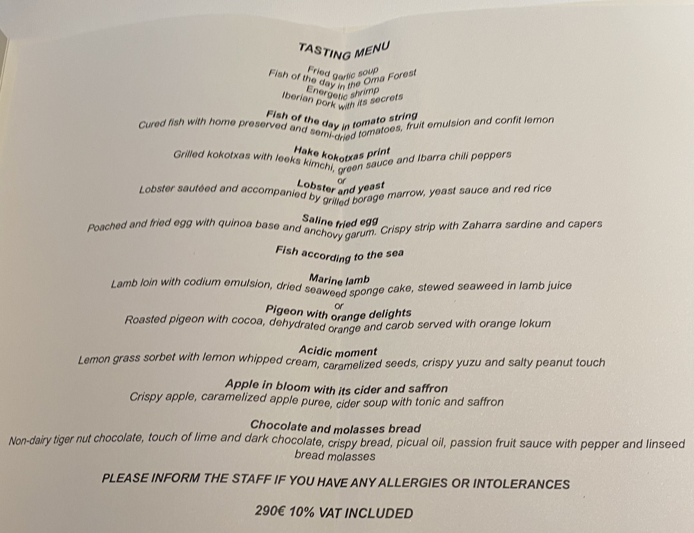

# Spain 2024

## Overview

Serena had a business trip in Malaga, so I met her in San Sebastian to eat. 

San Sebastian is the food capital of the world, boasting the highest number of michelin stars per capita.

I like food, and we've been wanting to go for a long time.

The main hurdle is that it's kind of out of the way. But seeing as how Serena has a Spain business trip, we might as well capitalize on that and visit San Sebastian.

It also coincides with my birthday, so this is a nice birthday trip as well.

Itinerary is Oct 10 through Oct 16.

## JFK to San Sebastian

*Iberia sucks.*

That was my thought after watching a lot of YouTube videos.

And I was anxious because the itinerary is JFK -> MAD -> BIL. With a 1-hour connection. Within the 1 hour, I needed to:

1. Get out of the plane
2. Go through customs
3. Go to another terminal
4. Go through security in the other terminal
5. Check out the lounge
6. Find my gate

Given Iberia's reputation, there are a lot of things that can go wrong here.

Fortunately, everything went very smoothly. The food wasn't terrible. I was able to make my transfer while knocking out all 6 things in an hour.

Things that sucked:

* No lounge if you're not business class (no credit card perks in T8 JFK)
* Everyone coughing everywhere, kind of disgusting as I can feel droplets landing on my arm
* When you recline, your knees jam up against the seat in front of you
* My recline is broken. Every few hours, it would slowly un-recline and I have to recline again.

Landed in BIL around 8:15AM local time, caught 8:45AM bus to San Sebastian, and arrived to hotel at around 10:15 AM.

## San Sebastian

### Dia Uno: I kicked an old man out of a queue

Surprisingly, there was a hotel room available and the nice man at the counter gave us wonderful service / recommendations. After a quick shower, we headed out and our first stop **IS TO EAT BASQUE CHEESECAKE.**

We went to the restaurant **WHERE BASQUE CHEESECAKE WAS INVENTED** (La Viña) and consumed:

* **Basque cheesecake**. It is really creamy and smooth. The cheese is a silky texture. Not too heavy, yet decadent. The burnt bits weren't bitter but gave it a smoky flavor. This is in contrast with imitations where the cheesecake might be too dense, or the crust is too burnt, overpowering the cheesecake.
* **Cafe latte.** I'm jetlagged.
* **Tortilla.** Back in 2021 when I went to Barcelona, the tortillas were OK. Was tough, dense, and just like a not-sweet tomago. Here, it's heaven. My enthusiasm was curbed. The potatos inside had a very satisfying texture, and the egg was mildly runny. The whole effect is a very creamy, yet savory tortilla that had a really nice egg yolk flavor to it.

**All for only $13.15 USD.**

Here's a photo of my enjoying the cheesecake.

**5/5. Easy. Great first meal in Basque.**

We finished at 11:28AM.

Then we went next door to La Cepa (all these Pintxos restaurants were next to each other in their old town, which is a relatively small town center). We had:

* **Ham + mayo + tomato pintxos**. The parma ham and the mayo's flavor mixed really well.
* **Chorizo + pimiento (pepper) skewer**. It was freshly fried and the spicy oil they used on it was excellent.
* **A large bowl of fried pimientos**. Really, really good. Hard for fried peppers in olive oil not to be good.

**All for only $14.24 USD.**

<figure markdown>{ width="600" }
  <figcaption>He said this was a 'small portion' of fried peppers. OK.</figcaption>
</figure>

**For the value, again, 5/5.**

We finished at 11:44AM.

Then we went to a place called *Bar Sport.* The story behind this is last time we went to Spain, and we ordered a large thing of fois gras which I rarely ever get the chance to eat, *Serena ate 90% of the portion.* I have been giving her shit since then so a fois gros revenge was in order. We got:

* **3 portions** of fois la plancha (grilled fois gros) pinxtos
* Red wine

Fois gros is normally expensive, but in total **this was only $21.80 USD.**

The fois gras is *really* savory and *extremely heavy.* Normally, I can eat very fatty foods and I don't really feel full. But on my last bite of fois, I experienced for the first time in my life going from "mmm, this is good, I'm quite hungry and can eat a lot more" to my stomach telling my brain "you are extremely full, please stop eating" between bites.

In retrospect though, it was extremely delicious. Cooked perfectly. Remarkably generous portions to turn my hunger into a food coma in literally, not figuratively, a few bites. **5/5.**

We finished at 12:23PM.

Then we went to Casa Urola. We had:

* **Cappuccino**. I am still jetlagged.
* **Mushroom mini-pie / quiche.** It was really savory and complex. You'd mistake it for an amuse bouche at a fine-dining restaurant.
* **Scallop with some garlic/white sauce reduction, topped with seaweed.** Again, by itself, you'd mistake it for a fine-dining course.
* A large thing of water.

I was *really* full from the fois. But the scallop was really delicious. Normally, when I'm extremely full, food no longer tastes that good. This is one of the few, if not the only time in my life where I'm in slight pain due to fullness but really want to keep eating because the dish is so damn good.

Also, the plating at Casa Urola is superb. But I'd say if you just judge by the taste and uniquness, eating pintxos around San Sebastian old town is like cherry-picking the most interesting fine-dining bites you're interested in, and paying only a few Euros per pinxtos.

In Casa Urola's case, it was **$18.08 USD**. **5/5.**

We finished at 12:48PM.

In other words, within about 90 minutes, we ate everything above across 4 restaurants.

As I'm still jetlagged, we went to the hotel room to rest. We finally worked up the courage to go eat outside at around 6PM.

We went to a place close to our hotel, la bodega donostiarra gros. We had:

* Beef tripe. Texture is really great. The sauce is not too savory but it was just right considering how savory everything else we had in the day was.
* Tuna in olive oil. Kind of dry.
* "Blood pudding" -- this actually was really good. Instead of tasting like regular blood pudding which is very salty and fatty a lot of times, this tasted more exactly like soondae. It was more chewy and lighter, while still being peppery and meaty enough to taste really delicious.
* Tuna with anchovies. Tuna still kind of dry.
* More water.

<figure markdown>{ width="600" }
  <figcaption>A small dinner, before our dinner.</figcaption>
</figure>

All this was for **$20.87 USD.** I'm not too impressed by the tuna as the canned tuna I eat at home is less dry, but since everything else is pretty good, **3.5/5**.

Right after, we made our way to Ganbara, whose claim to fame probably came from Anthony Bourdain talking about it at some point. We got *very* lucky to be able to get in here.

The internet recommends waiting in line 30 minutes *before* opening. We only went 15 minutes before because we had the pre-dinner, and we didn't know any better. When we got in the semi-long queue, the owner came out and split the line in 2.

The reasoning's because if the line's too long, the other shops are blocked by the line, so while the first 1/3rd of the line can stand in front of the restaurant, the rest formed a line across the road. Fair enough.

But this one old guy came and started lining up in the front 1/3rd of the line, effectively cutting in front of everyone else waiting in line. There were some discussions to tell the guy but eventually I went in. The reason's because these restaurants are small, so even 1 customer can be the difference of whether I get to eat here or not.

> Sir, the end of the line's over there.

And off he went, to the correct end of the line.

The owner came out and started counting who could go in the restaurant and who couldn't. **SERENA AND I WERE LITERALLY THE LAST ONES.**

This reminds me of the famous [poem](https://en.wikipedia.org/wiki/First_they_came_...) about speaking up.

> First they came for the socialists, and I did not speak out—
>      Because I was not a socialist.
>
> Then they came for the trade unionists, and I did not speak out—
>      Because I was not a trade unionist.
>
> Then they came for the Jews, and I did not speak out—
>      Because I was not a Jew.
>
> Then they came for my queue—and I told him to get to the back of the line.

We ate:

1. Razor clams. These tasted *really* fresh and juicy. They also topped it with olive oil which further enhanced the flavors.
2. Their famed mushroom dish, which has a raw egg yolk and a bunch of expensive mushrooms on the plate with olive oil. It was amazing. I've never had so much intense mushroom flavors in my mouth in a single meal.
3. Spider crab pastry. The pastry is really creamy and very soft, almost like whipped cream. The textural juxtapose with the flaky crust, like you would in a flaky-crust egg tart, is really well done.
4. A few txokoli (light white wine).
5. Monkfish skewer, with alternating shrimp and sauces. The shrimp was nice and bouncy, with a light flavor, which is a really nice flavor juxtapose with the monkfish which is more soft/creamy with a heavier flavor.
6. Fried milk pastry with ice cream. The milk inside the fried pastry is nice and fluffy and warm, like a loving hug. This contrasts well with the vanilla ice cream. The fried milk is actually a bit sweet, and the vanilla ice cream is more neutral-sweet. Thus, the ice cream acts as a nice way to temper both the sweetness and the temperature.
7. Giant shrimp. The head juice is really creamy and delicious. And luckily from our previous experience at Lisbon's Ramiro's, we know how to dissect a giant shrimp without its delicious juice leaking all over the place. No real talent needed to make this one, but the ingredient is so amazing it just stands on its own. It's also 40 euro for 1 shrimp.

<figure markdown>{ width="600" }
  <figcaption>Fresh, delicious razor clams.</figcaption>
</figure>

<figure markdown>{ width="600" }
  <figcaption>A variety of mushrooms I can't name, topped with an egg yolk to make it creamier. In the background is the spider crab pastry.</figcaption>
</figure>

<figure markdown>{ width="600" }
  <figcaption>Very large shrimp, using my head size as a reference.</figcaption>
</figure>

<figure markdown>{ width="600" }
  <figcaption>Fried milk dessert, with txokoli light drink to balance out the seafood and mushrooms.</figcaption>
</figure>

In total, this was **$137.51 USD.** Easy 5/5. Spectacular, unique flavors.

After shoving 6 meals down my stomach, I realized I was on a bulk. So we walked around and saw a pasteleria and had a *suspiros* (meringue) which had a powdered / sugary crust, but a savory, creamy egg yolk paste, similar to ovos moles. Only **$2.19 USD**.

After dessert 1 was done, we stumbled upon a gelataria and ate a small cup of gelato: 1 scoop nocciola (they called it Ferrero Rocher) and 1 scoop pistaccio. Only **$3.29 USD**, which is cheaper/more generous than my favorite gelato place in the whole world, Giolitti.

About 21K steps.

### Dia Dos: Wow

We slept in until around noon. Walked to Arzak, a local 3-star michelin restaurant. They've had, and held the stars since 1989. This means they've had 3-michelin stars since I've been alive.

We ate their from 1:15PM to around 4PM. It is too much for me to type out all the food so I'll just send pictures:

<figure markdown>{ width="600" }
  <figcaption>Though there were choices for some of them, we just each got the other option so we can try everything.</figcaption>
</figure>

<figure markdown>{ width="600" }
  <figcaption>They put 2 flavors of butter in the shape of a walnut. The orange side is more spicy, with paprika, etc. The white side is more savory, done with anchovies! Both sides were great but the white side was more unique.</figcaption>
</figure>

<figure markdown>{ width="600" }
  <figcaption>Fried garlic soup. Very light and crispy on the outside. When you bite into it, ultra-umame garlic soup explodes in your mouth. It's like truffle explosion, but garlic instead and a really nice crispy shell instead of a boring ravioli.</figcaption>
</figure>

<figure markdown>{ width="600" }
  <figcaption>Fish of the day in oma forest. The fish biscut's head and tail had some paprika sprinkled on one end, and something else on the other. The fish was nicely done as it's served basically sashimi style. Very oily and raw, it's soft meat contrasts with the biscuit nicely. And it being a more fatty-flavored fish, its taste constrasted with the tart sauce on the biscuit very well also.</figcaption>
</figure>

<figure markdown>{ width="600" }
  <figcaption>Energetic shrimp. The shrimp again was sashimi style, so it was delicious on its own. But the sauce was this, and I quote from my notes, "lemongrassy, buttery, crabby." Basically very lightly seafood-flavored, yet heavy and had complex acidic fragrants. One of my faves.</figcaption>
</figure>

<figure markdown>{ width="600" }
  <figcaption>Iberico ham with its secrets. The secret is kimchi.</figcaption>
</figure>

<figure markdown>{ width="600" }
  <figcaption>Fish of the day. I liked this because the fish was served sashimi style, which made the acidity contrast with it a lot better than if it was cooked. Probably my favorite.</figcaption>
</figure>

<figure markdown>{ width="600" }
  <figcaption>They brought out something for me to put my fanny pack, like it was an Hermes or something.</figcaption>
</figure>

<figure markdown>{ width="600" }
  <figcaption>Hake kokotxas print. The fish print is salt. The meat is fish cheeks. Muy bien.</figcaption>
</figure>

<figure markdown>{ width="600" }
  <figcaption>Lobster and yeast.</figcaption>
</figure>

<figure markdown>{ width="600" }
  <figcaption>Saline fried egg. Also one of my faves. The poached egg is also lightly fried (left). The biscuit on the right has some sardines and capers. You break the egg, and you're supposed to break the biscuit and mix it all together and eat it. Yum AF.</figcaption>
</figure>

<figure markdown>{ width="600" }
  <figcaption>Fish according to the sea, option 1: some fish. Option 2 was better.</figcaption>
</figure>

<figure markdown>{ width="600" }
  <figcaption>Fish according to the sea, option 2: some other fish. With a honey-like glaze and grapefruit. The grapefruit's small bite and slight tartness balanced out the glaze and the fish extremely well.</figcaption>
</figure>

<figure markdown>{ width="600" }
  <figcaption>Marine lamb. The lamb was good, and the sauce was interesting. The spounges were more crunchy and less spoungy. The seaweed was really good, very bouncy and contrasted the lamb sauce quite well.</figcaption>
</figure>

<figure markdown>{ width="600" }
  <figcaption>Pigeon with orange delights. The gaminess of the pigeon was just right and very buttery. Balanced well with the slight tartness of the sauce.</figcaption>
</figure>

<figure markdown>{ width="600" }
  <figcaption>Acidic moment. Very punchy and they had my favorite ingredients: lemongrass, yuzu, and coriander (cilantro).</figcaption>
</figure>

<figure markdown>{ width="600" }
  <figcaption>Apple in bloom with its cider and saffron.</figcaption>
</figure>

<figure markdown>{ width="600" }
  <figcaption>First off menu dessert. Some ice cream with a caramel base. It was good. Though not as crazy and unique as some of the foods above.</figcaption>
</figure>

<figure markdown>{ width="600" }
  <figcaption>Chocolate and molasses bread. The brand was nice and crunchy. The chocolate was nice and sweet.</figcaption>
</figure>

<figure markdown>{ width="600" }
  <figcaption>Off menu dessert 2. This is some chocolatey thing. The brown sauce on top is the membrane of the cocoa plant. The ice cream on the side is spicy mango with orange.</figcaption>
</figure>
<figure>
<video controls>
  <source src="../images/spain24/arzak/amuse.mov" type="video/mp4">
  Your browser does not support the HTML5 video tag.
</video>
    <figcaption>Amuse bouche. 2 of them were too sweet for me. One of them that looks like a honeycomb is dark chocolate. The nut looking one had coconut and cream inside, which ws really good. And the green one in the middle exploded with passionfruit juice as soon as you bite inside.</figcaption>
</figure>

**614 euros total for 2 people**. Includes 3 glasses of alcohol. 5/5, this place is called the "cathedral of food" for good reason, it turns out (I feared that it would be just hype).

After, we walked back to the hotel for a little bit and then headed back out to the town.

After a long walk on the ocean front, we went back to the old town for pintxos.

We went back to Casa Urola, and had:

Some cod, in some tomato sauce. It was quite good. Not pictured as we didn't snap a pic.

* <figure markdown>{ width="600" }
      <figcaption>Steak with potato foam. Cooked rare, which is the correct way to do it. I liked the potato foam because it's a really interesting take on steak + mashed potatos. Really creamy and smooth, and balanced out the more heavy steak well. There was also a sweet pepper to contrast the fatness from the steak.</figcaption>
    </figure>

    <figure markdown>{ width="600" }
      <figcaption>Pigeon with mini-fries. The pigeon is gamey, but in a really buttery sort of way. I'm surprised pigeons can be so fatty and taste so good. Maybe I'll pick some up on the streets when I get back.</figcaption>
    </figure>

    <figure markdown>{ width="600" }
      <figcaption>Fois gras and white beans. Fois gras is yummy as always, but the white beans added to it even more. Yesterday's fois was with bread which was really filling. But today's beans seem to help balance out the heavy feeling from the fois. I could just be less jetlagged.</figcaption>
    </figure>

    <figure markdown>{ width="600" }
      <figcaption>Porcini mushroom with white sauce and an egg yolk. It was savory, fatty, and the bounciness + fragrant of the mushroom really goes well together.</figcaption>
    </figure>

Topped with Txokoli (white wine) and a red wine.

**All this for $35.49 USD**. It was a bit crowded, so the vibe was "meh" -- we managed to score a seat with the back facing the street though so it was less stuffy. Still, food is 5/5.

Then we went to a place called the Kapadokia Bar. We had:

<figure markdown>{ width="600" }
  <figcaption>Orzo with iberico ham, in a carbonara sauce.</figcaption>
</figure>

<figure markdown>{ width="600" }
  <figcaption>Prawn ravioli, finished in a pesto sauce.</figcaption>
</figure>

<figure markdown>{ width="600" }
  <figcaption>An oxtail taco with lime, various herbs, and avocado sauce.</figcaption>
</figure>

**For $24.65 USD**. Really nicely done. I could see all of the above being in a tasting menu. Fairly spacious standing room. 5/5.

Then went back to La Viña and picked up 1 tortilla and 2 portions (4 slices) of basque cheesecake. It was *extremely* crowded so did not want to eat there at all. We found a church and sat on one of the benches outside to eat it to-go. The tortilla was not as good as yesterday, but the cheesecake was amazing.

All this for **only $17.53 USD**. 4.5/5.

To burn off some calories, we walked along the coast for a bit before heading back to the hotel.

Ended up around 16K steps.
