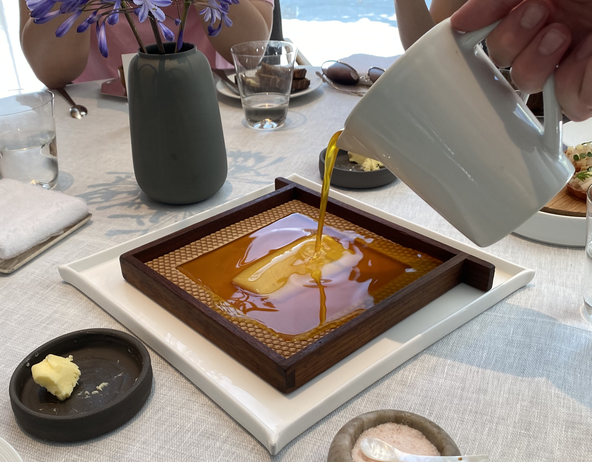
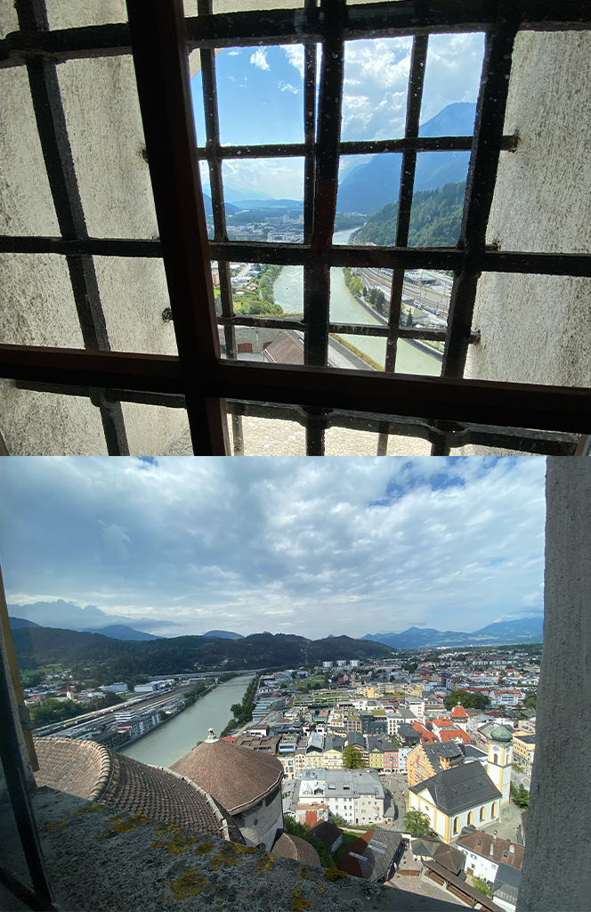
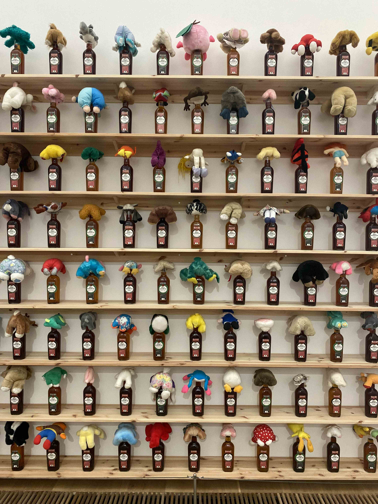
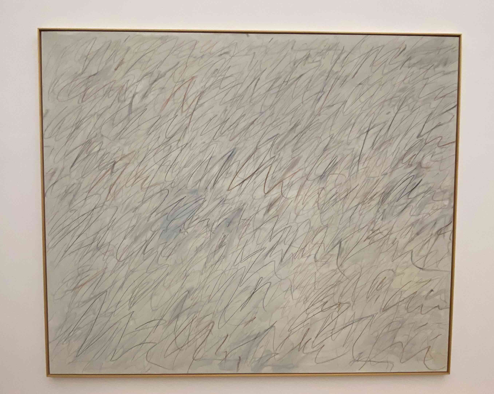
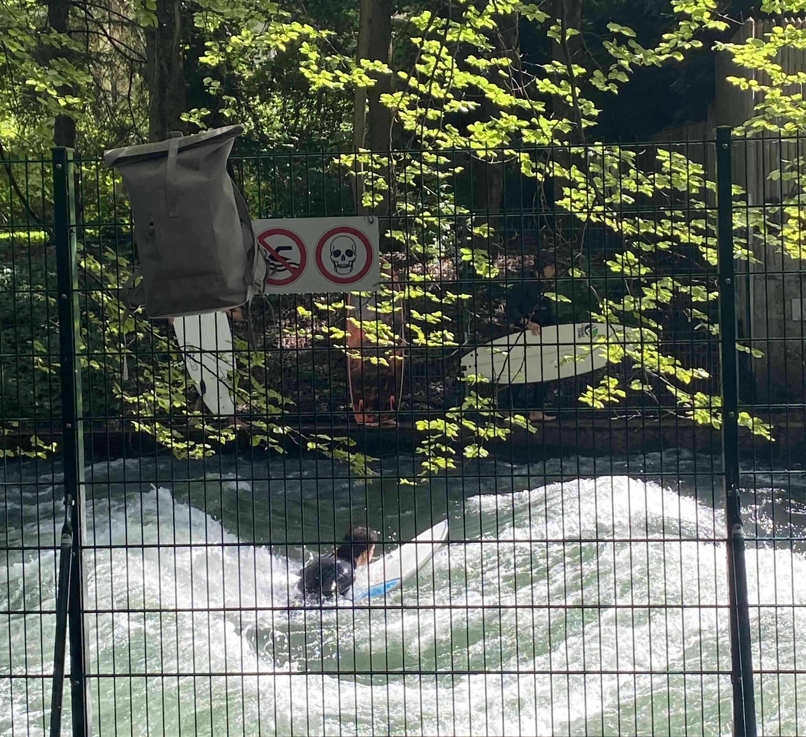
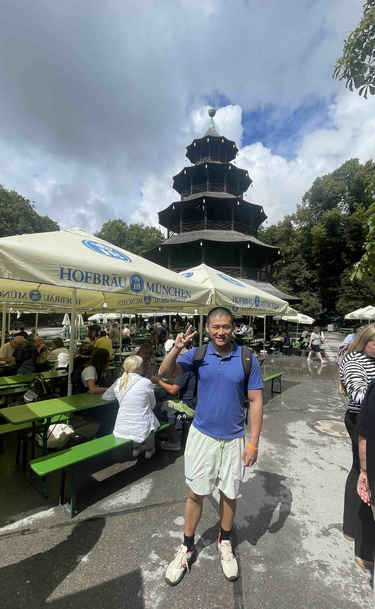

# Vienna, Insbruck, Dolomites, Kufstein, Munich 2024

## Overview

This is a 12 day trip traveling to different places. August 7-19.

For Serena's friend's wedding. And then romantic excursion with Serena.

## Prologue: Taylor's Tears

Someone puked on the plane shortly after takeoff. 1 step from the bathroom. Whole flight smelled like cheese. Her mom said it isn't her first time. The obese girl came out of the bathroom with a beaming smile, proud of what she did to everyone else on the plane. Not sure why they didn't use the barf bag on every seat. Probably because it was on purpose and she wanted to puke in high traffic area (i.e. she's an asshole).

Anyway, EWR->VIE.

EWR is a shitshow, as usual. TSA Pre was about 20 minutes.

Luftansia business lounge re-opened recently though, so we actually have a lounge for the first time in EWR.

Got on airplane and I went to the bathroom. When I went back, Serena told me passenger in front of her having a nervous breakdown due to:

1. She thought she booked a window seat for +$70, but ended up in the middle seat (but couldn't find a receipt for it)
2. Taylor Swift concert in Vienna is cancelled due to terrorist attacks.

Turns out, the whole plane was mostly women going to Taylor's concert.

The Nervous Breakdown women started handing out frienship bracelets she handmade which were Swiftisms like:

*Midnights*

*Shake It Off*

And so on.

Wanted to quip and asked if she had one for *Cancelled*. But it's probably too soon, as most of the plane bought inflated plane ticket prices (due to the demand for seeing Taylor) and will be staying at inflated price hotels, in Vienna, with almost nothing to do.

Various passengers complained.

Flight attendant complained how she got a new dress at target just to see the concert.

Long story short, they all coped and did some kumbaya shit together and took a bunch of selfies and videos together.

But obviously, the real solution is just to not get swept up in a celebrity's marketing scheme so you feel like you have to pay exhorbitant amounts and travel across the globe just to watch them sing a few songs that tug at your heartstrings. This is because you can't control terrorist attacks / cancellations, but you can control your downside risk should such things happen.

I like Taylor as much as that next person, but I'd watch her if she was nearby. Not if she's halfway across the world.

## Chapter 1: The Austrian Wedding

### Day 1: 2-Starred Michelin Restaurant

Landed around 7AM.

Got into city at 8AM.

Dropped off bags at hotel lobby, and they let us use the spa to freshen up / shower.

Ate breakfast / bought coffee.

Coffee here is 9 euros which is obnoxious. So we went to luxury shops to **bait free water and coffee**. You basically pretend to be an interested buyer, where then the sales would ask you if you want something to drink (coffee, water, and/or champagne are the usual choices). Exploit their attempt at forcing reciprocity by leaving after you finish your drinks.

Walked around til 12PM where Serena's friends booked a 2-starred michelin restaurant.

It had all the michelin restaurant things. They cooked a piece of char with melted honeywax, and then excavated it once the wax solidified. And it was perfectly cooked. They also had caviar and was pretty extra.

Some dishes taste good, and some dishes were mediocre, but the one I liked best was this:

<figure markdown>   { width="600" }
  <figcaption>Most impressed in this 2-star by the technique of how the executed this fried potato hash</figcaption>
</figure>

<figure markdown>   { width="600" }
  <figcaption>Melted honey wax to cook the fish. Solidified later and they excavated the fish, perfectly cooked. Didn't taste like honey though.</figcaption>
</figure>

A textured grilled/fried potato. Each slice tasted like McDonald's french fries.

1127 euro total, which is just enough for my new Capital One card to meet its requirements to get 40K signup bonus points.

After, we went home and napped until 5:30PM or so. Then went to the welcome dinner.

### Day 2 - Watching Everyone Else Shop But Me

Woke up. Ate breakfast downstairs. Went to hotel gym.

Hotel gym is tiny. Just a dumbbell rack that goes up to a whole 10kg. And a single machine that has:

* Flyes
* Lat pulls
* Leg extensions
* A pullup bar at the bottom for rows or bicep curls
* Handles for bicep cable preacher curls

It seems like every position you take in the machine, you could accidentally do another exercise.

Anyway, as I hogged the machine for a few sets this guy kept watching me closely for ~5 sets before working up the courage to ask to work in. The way he watched me was weird because you generally just glance to see if someone's taken up a machine but Serena said this guy was watching me do every exercise.

After gym, went back to room to shower and went out to some art museum. Art of note were [Napoleon Crossing The Alps](https://en.wikipedia.org/wiki/Napoleon_Crossing_the_Alps) and [The Kiss](https://en.wikipedia.org/wiki/The_Kiss_(Klimt)), the latter of which Serena and I posed a parody in front of the painting.

Went to eat lunch at Café Landtmann. It was between OK and subpar. 3/5.

High fashion shopping was next (with the intent to goad salespeople into giving us free water/alcohol). First few shops didn't really offer anything, but Burberry gave us lemonades and alcoholic drinks. We then went to Moncler, where they didn't offer us anything despite a couple of Serena's friends committing to buying a few of their expensive jackets already.

Having none of this, I explicitly asked for water.

Seeing as how Serena and her friends were trying on new jackets for ~1h, I asked the staff to help me find some cool jackets I could rock as well. They gave me some, but they were all veto'd by either Serena or her friends due to at least one of the following:

* Size
* Cutting
* Style
* Color

So the girls all bought jackets (6) except me. Total time spent there was about 2 hours.

Afterwards, we ate at a place called Plachutta. It was good. Here's a video of the platter of food:

<figure>
<video controls>
  <source src="../videos/austria_muchfood.mp4" type="video/mp4">
  Your browser does not support the HTML5 video tag.
</video>
    <figcaption>Lots of sclerosis-causing foods here.</figcaption>
</figure>

Dishes of highlight were:

* Liver mouse
* Calf liver
* Beef tongue
* Bone marrow

At the end, they kept pushing me for a 10% tip, to which I said no because there's already a 4.8 euro service charge per person. And in Europe, it is not customary to leave a percentage based tip. So nah.

5/5. Except 4/5 because the weird tipping thing.

### Day 3: The Wedding!

Did breakfast, skipped gym, and went to go shopping.

Witnessed Serena's friends buy some Hermes rings and bracelets.

Went back home, changed, and hopped on a bus to the wedding.

Arrived at 3PM after a 90+ minute bus ride, and the ceremony starts at...3PM. Many people had full bladders, so the ceremony was delayed until 3:10PM so people with bladder control issues (i.e. me) can empty them.

Apertifs from roughly 4P-6P. There was salami with truffles which was really good. I drank quite a bit...of coffee. I also drank some free alcohol as well, but drinkwise it was probably:

1. 1.5 schnapps
2. 3 glasses wine
3. 3 espressos (and 3 more in the morning, totaling 6)

As I type this at 1AM after a long day, I am wide awake (I normally sleep at 9PM for comparison).

Dinner from around 6P-8P. It was good. Highlights:

* Steak
* Risotto
* Blueberry Macaroon -- nice and tart

8P-9P was just chill and wedding cake cutting / socializing. The wedding cakes were actually 3 cakes/pies and were really good. I liked all 3 varieties they offered, in this order:

1. Lemon meringue pie
2. Coffee cake
3. Chocolate mousse

The tartness in the lemon meringue pie really comes through. None of that pussy ass American shit where they say it is a lemon meringue pie but it's just diabetes with a small hint of lemon. The sourness punches through and tastes strong and balances very nicely with the cream on the top of the pie.

9PM was fireworks and first dance, and they danced twice as we demanded an encore. I loved the fireworks as it was super up-close. I haven't had fireworks this up close since I celebrated July 4th at a friend's place where his neighbors were illegally setting off fireworks (which also subsequently set off a bunch of car alarams). But to be fair, this is probably even closer -- the cannons were about 10 meters away.

We all headed to the dance floor and danced at around 10PM. I'm a great improvisational dancer as I like feeling and moving to the beats, and I am generally uninhibited (even when sober).

Headed home from the wedding venue, which is a castle, at around 11PM and then arrived back at hotel at around 12:00AM.

### Day 4: Now I Know Why Arnold Left Austria

Sunday, everything's closed. Not much stands out today.

I do remember that there's a church blasting Taylor Swift for stranded Swifties. But I thought churches were built to worship God and/or Jesus, not false idols (and definitely not celeb idols).

And I guess that's Austria in general for me. The wedding-specific event stands out to me, but everything else is just OK. There's sausages, cheese, and ham for food. There's a limited selection for shopping. Some museums.

Everything Austria has to offer, most other cities offer better versions.

Most things here are just OK (5 to 6 out of 10), but nothing really stands out in Austria, specifically. Nothing's terrible here, except for the lack of air conditioning in most places. People here smoke a lot and there's a lot of body odor here. Food's only charcuterie.

Well, on to the next city.

## Chapter 2: Nature Calls

### Day 5: Eating (Mostly) Normal Food In Innsbruck

Yesterday, I reservation an Uber XL to show up at 5:20AM to pick us up to go to the train station for 45 euros.

Today, I was taking a dump at around 4:45AM and still no driver took the order. Nearby, there's a bunch of cars and it was only 20 euros if I cancelled the reservation and booked an XL directly.

At 4:48AM I was done with my dump and wanted to cancel, but alas, someone took the order and it'd be 48 euros to cancel.

**The lesson here is don't procrastinate. If there's a good deal, execute immediately.**

Not only that, instead of an XL showing up, just a regular ass 4-person Prius showed up. 2-starred.

We took a train ride to Innsbruck as a way to stage for the next phase of our trip, as a private guide will pick us up from Innsbruck and then show us around Dolomites. Thus, this was mostly a rest day.

For 5 hours of business class train, it only cost 220 euros (110 pp) -- this is insane considering we got a 4-seater cabin to ourselves. An old couple came to take the other 2 seats they reserved, but they wanted more space, so they left after a minute (presumably to find untaken seats in business class). The 5 hours went by fast.

I learned some React.js for a couple hours and fell asleep.

After, we arrived at Innsbruck at 11AM and was able to check in early. Then, we went out to eat at an Italian place. It was really, really good.

For the first meal, we had a salad with burrata. The burrata was super fresh and moist. The pasta was some ragu, and the cherry tomatos really popped. Really hit the spot for my depraved taste buds. **4.5/5 meal.**

Right after, we went to another Italian place. We had a pizza which was mushroom + parma ham. It was really good. The crust was airy/fluffy, like a freshly baked foccacia. The tagliatelle pasta dish had a very rich tomato + olive oil sauce, with some veggies and guancale, which was amazing as well. The mushroom in the pasta was juicy and buttery. The pasta was piping hot *and* al dente which is not a combination I've had in years. Basically, the perfect pasta dish. **5/5 meal.**

You might be wondering, I'm still in Austria, why's there so much Italian food?

Innsbruck is a small strip of land sandwiched between Switzerland, Germany, and Italy. So its cuisine has plenty of influence from all 3 countries.

It's also why it is a great location / staging area, if you want to go travel between these countries.

Before dinner, we went to the hotel spa. First time me and Serena did sauna together. We did a very hot one at around 80C and a much cooler one at ~37C. Went back to our room, showered, and headed out.

For dinner, we had Thai food which was OK (3/5, not worth attaching pics here)--we had a papaya salad which wasn't spicy at all, a coconut crispy duck curry which was good (but could be crispier), and nasi goreng which they confused for curry fried rice. The fried rice was too moist, and to serve nasi goreng as curry fried rice is insane. Nasi goreng and curry fried rice has rice in common, but that's about it. It would be like if I put deep dish pizza on a menu and served you cheeze-its.

Despite this, the restaurant was jam-packed with white people. And it's a large restaurant where the dishes weren't cheap at all.

This brings us to the second lesson: **As long as the market's good, you can get away with selling a mediocre product.** Thus, the most profitable thing that the restaurant did was to invest the time to pick a place to serve Thai food where 1) the people won't know it's mid Thai food, and 2) there's not a lot of competition--this is much better time spent than making their dishes excellent in a more competitive / educated market.

### Day 6: Mountains & Water

Our tour guide picked us up at ~9A after we did hotel breakfast. Drove us to Dolomites.

Dropped us off at bus stop to take us up to 3 Peaks. Walked around from around 1:30PM to 2:30PM and took the bus back down. Our tour guide then drove us to look at a bunch of lakes. One of the lakes had row boats, which was closed due to incoming bad weather. There was a thunderstorm and we went inside to eat some snacks.

Highways there reminded me of Colorado, as there's many mountain roads.

The mountains + lakes reminded me of Yellowstone / Norway / Preikstolen-type hikes.

After the lakes, our guide drove us some more and we ended up in Chiusa in Bolzano province (we're in Italy now). We broke bread at her favorite restaurant in this small town. The food:

* Pasta was overdone (not al dente)
* Pasta was OK, but not that hot
* Bread was good
* They had ribs, which were very moist. Had horseradish sauce as side but it was too mild
* I normally don't like white wine, but their local white went down smoothly

Food was OK (better than Vienna), but nothing groundbreaking aside from the ribs.

When our tour guide finally went back to her room, Serena and I walked around the small town a little bit to digest / take in fresh air.

The hotel we're staying at is cheaper as we need to accomodate the tour guide as well (about 100 euros per room) -- it has no air conditioning. If I don't post tomorrow, it means I've died from a heat stroke.

### Day 7: ...I Smell Bullshit

Today, we went up another mountain in the Dolomites. This one's a bit grander and has more room because it's not off a cliff like yesterday's.

Instead, you take 2 gondolas up to the peak and there's tons of trails for you to walk around. This place is called Seceda.
<figure>
<video controls>
  <source src="../videos/seceda_1.mp4" type="video/mp4">
  Your browser does not support the HTML5 video tag.
</video>
    <figcaption>Some Heidi shit going on here.</figcaption>
</figure>
I walked up to a cliff and took some pictures. The ones where I was standing didn't come out too well as I was hunchbacked trying to keep my center of gravity low so I don't fall off the cliff and die. Here's one of me sitting and looking cool though:

Me posing in the Dolomites looks way cooler than [Federer doing the same for LV](https://www.instyle.com/thmb/u4HFeuOJ3IO1XSvVWO2P-Fwb7o4=/750x0/filters:no_upscale():max_bytes(150000):strip_icc():format(webp)/Screenshot2024-05-17at7.27.11PM-453a5e530d12456e84df9e6ff6ffb360.png).

After, we wandered to another trail and saw some alpine bulls. They have a distinct bullshit smell. Most cows' feces have a dirtlike smell in the US. These smell more grassy.

Then, we wandered some more and ate some cake while looking at the view.

We then went down the mountain and went to some photos of a farmer's backyard. This place is supposed to be a [photographer's wet dream](https://www.ranuihof.com/en/residenzaranuihof/chiesettadiranui/). Other than it being very pretty and colorful, I don't know all the technical details of why photographers love it so much. Interestingly, farmers hate tourists stepping on their grass and invading their pastures, as it ruins the grass for grazing and for repackaging / selling. This farmer capitalized on tourist market's obsession with taking photos while in meadows by setting up an automated payment system where you enter/exit a small path to a church and you can take as many photos as you want. This controls the loss of grass to be in the path, and the barrier to the path is a [full-sized turnstile, like in the MTA](https://www.turnstiles.us/product/full-height-turnstile-mta-transit-curved-arm-single/), activated by a credit card payment.

**In other words, *this farmer capitalized on the market opportunity and made it 100% passive* by having tourists self-service the whole customer journey: pay, go in, take pictures, and leave.**

With photo-op done, we ate lunch with our tour guide. I ate knurdels for the first time which is basically a big breaded ball. Was good, but since we sat outdoors there were flies and some wasps.

The European way is to sit outdoors and eat which is supposed to be a way to relax. I personally don't think getting attacked by wasps every meal is a good way to relax and I will never get why people want to sit outdoors and get sunburned while eating. Give me that comfy, air-conditioned shit every time.

Interestingly, wasps have only been a problem in recent years as Austria passed legislation to ban bee-traps. This is to promote bees/wasp population for mysterious reasons. But before this law, bee-traps were everywhere in front of restaurants, so diners won't get attacked.

As an aside, I feel like they take this eco-friendly shit way too far in Austria. Most places don't have air-conditioning to save electricity. Obvious ploy to save money only, and not about the envrionment at all.

Because obviously stopping global warming means nothing if we all died from a heat stroke while fighting off an allergic reaction to wasps. *Was just trying to eat outside and lay in my hotel room, now I'm dead, thanks.*

Anyway, after lunch was over, we took a 2h 30 minute journey to Kufstein. Supposedly 2h journey, but the last 40 minutes we got slammed by a relentless rain/hailstorm. In the video below, you'll notice that for the most part, as soon as the windshield wiper wipes away water, it is instantly flooded again with a new layer of water, obscuring view.

<figure>
<video controls>
  <source src="../videos/hell_hail.mp4" type="video/mp4">
  Your browser does not support the HTML5 video tag.
</video>
    <figcaption>Spoiler alert: I didn't die.</figcaption>
</figure>

Having survived this not-so-traumatizing experience, we had dinner at our hotel restaurant. This is most due to us not wanting to walk in the rain after being completely drenched at check-in. It was actually really good. We had:

* Veal liver
* Tagliatelli with chantrelle

The liver was great because it wasn't gamey at all. They probably soaked it in vinegar to get rid of the gamey smell. The sauce is also nice and tart, and it also had a very tart apricot. This balances very nicely with the heaviness of the liver.

Chantrelle is an expensive type of mushroom, and they used a ton of it with pea sprouts + cheese to do pasta. It tasted very unique and more importantly, very delicious.

## Chapter 3: Romantic Something Something

### Day 8: Small Towns Are Underrated

This is the first day where Serena and I are alone. No weddings, no friends, no tour guide. Just romantic something something.

There's a place nearby in Kufstein called Kaiser Mountain (King Mountain) and we took the Kaiser lift to get there. It's pretty nice and you can see green mountains everywhere. Unlike the Rocky Mountains where it is just a bunch of rocks, there's a nice mixture of rocks, small rivers, and greenery here.

The ski lift ride up is **literally 30 minutes long, each way.** With an intermission in between (so 2 x 15 minute rides) to use the restroom. I've a video of going up but for brevity, the video going down looks better as you can see the houses in the valley, so I'll just attach that instead below.

After we got up there, we looked at the viewpoint:

Then we headed straight to the alpaca shed. It was guarded by an electric rope as the area was closed as today's a public holiday, but you can just unhook it and let yourself in. They were really chill and cool. Just look at them:

<figure>
<video controls>
  <source src="../videos/alpacas.mp4" type="video/mp4">
  Your browser does not support the HTML5 video tag.
</video>
    <figcaption>Cute.</figcaption>
</figure>

Once we're done with the alpacas, we went to eat lunch at a restaurant near the peak of the mountain. They served cows right next to the restaurant, and I'm pretty sure the owner lives in the restaurant as there's a bedroom there and the kitchen looked residential. The snacks (and view) we have there is amazing though:

We had apple strudel, apricot cake, and some local beer (lemonade + beer). We also had buttermilk which tasted like a lighter yogurt drink.

Took the 30-minute ski lift back and went back to the hotel:

<figure>
<video controls>
  <source src="../videos/going_down_kaiser.mp4" type="video/mp4">
  Your browser does not support the HTML5 video tag.
</video>
    <figcaption>Other than the noise of my fidgeting, note that it is eerily quiet.</figcaption>
</figure>

Our hotel has a staycation package where they include:

* Free drinks
* Free "coffee and cake"
* Free 5-course dinner

So we got the coffee and cake. It was good but wasps is really a huge issue here--we had our snack indoors.

After all those carbs, we walked around town just to soak in the small town vibes. But we bumped into a bus that took us to a big lake ([Hechtsee](https://de.wikipedia.org/wiki/Hechtsee)) nearby that's a popular attraction. We were planning to go there tomorrow as busses only come once an hour, but since we got lucky and randomly bumped into a departing bus, we jumped in right away.

**Transport costs:** Hotels in Kufstein offer a "Kufstein Card" where you can enjoy various amenities for free. One was the ski lift in the morning (you can only do it once) -- the other is unlimited bus rides.

We got to the lake and it was 4.50 euro per person to get in. It turned out the lake wasn't just a viewpoint, but a huge beachlike area with tons of things to play around with. From swings, to ping pong, to paddleboards, diving boards, and other weird contraptions built on the lake.

After the lake, we went back to the hotel and showered. I learned React for a bit and then went down to redeem the free 5-course dinner. We had:

1. Bread with 3 spreads: heavy pistaccio cream, tomato, and onion + crab.
    1. The pistaccio was very pistaccio, and I've never tasted anything like it.
    2. The tomato was too salty as they added salt on top of the tomato. I don't think this was necessary as tomato comes with natural MSG already.
    3. Onion + crab spread was delicious. They put a few slices of fried onions on the top of this spread to further draw out flavors.
2. Sparkling wine, went down easy.
3. First course: Some meaty veal thing. It was savory, but was nicely balanced by the lime gel / capers.
4. Second course: Very nice savory soup. They put frothy cheese or something at the top and it helped balance out the saltiness of the soup. There's a lot of bread on the table still so it is easy to further balance the saltiness. The soup also came with garlic bread croutons + chives, which is really good.
5. Third course: Same tagliatelle in yesterday's entry, except instead of chantrelle, they did black truffles, and it was in more of an antipasti portion.
6. Fourth course: Chicken. It was a little dry, but only a little bit. Really like their use of pea shoots and pea stock with the chicken. The "farmer's curd" also just seems like thanksgiving stuffing which is nice and bready, and a little sweet.
7. Fifth course: Cake. It was a good cake. Not too sweet. The outlier here is the pineapple, which they took the time to burn some sugar at the top so it formed a nice, crunchy crust, like a creme brulee. Biting on the juicy pineapple to contrast the cake was already really good, but the juxtaposition of the soft texture of the pineapple vs. the crunchy, potato-chip-like texture of the crust...chef's kiss.

Interestingly, we got the German menu. I saw the word "ananas" and tried to guess what it means. See if you can guess?

The obvious and correct answer is...

bana--pineapple.

Yep, ananas means pineapple.

Anyway: tasty, full eating, and most importantly, no wasps. **Easy 5/5.**

Our tour guide told us a few days ago that small towns have good food. This is because unlike big towns, small town restaurants rely heavily on repeat customers, instead of having a steady stream of brand new customers / tourists. Everyone also knows each other in a small town, so word spreads quickly if your food is low quality. Thus:

> If you make the shit, everyone will know it is shit.

And so only great food survives in small towns. Not only that, small town food prices are much cheaper as they're meant to cater to locals that aren't necessarily wealthy.

Way above average food with way below average prices means **small towns (in Europe) are the ultimate food arbitrage**.

Starting to enjoy small European towns more and more, as opposed to big/busy ones where you have to fight with tourists to get any scraps of good food.

The downside is the wasps and lack of AC. You might think "well, then just go in the fall/winter" -- but most restaurants close when it's not high season (summer). So for small towns you'll have great food arbitrage but you'll need to share it with wasps normally, while having a heat stroke.

### Day 9: We did a lot but doesn't feel like it

We woke up without an alarm, ate breakfast, and went back to the same lake as yesterday.

Only this time, we were in our swimsuits and ready to swim.

We swam around the lake and I enjoyed these amenities from the beach:

* Floating wooden islands for you to sunbathe, in the middle of the lake
* Diving board
* Big floatie, resembling a mini American-Ninja warrior course
* A wooden ship linked to a rope where you can pull on it and go back and forth

There were no paddleboards to rent. But anyway, we also swam around the lake quite a bit. Got there at around 10:30AM left around 12:30PM. 6 euros per person. Much less crowded today as it isn't a public holiday.

When you get close to Austrians, they start speaking German to you. Even when you look like I do.

That's when I had the realization that since these people are likely to have never left Austria, they have the same view of the world as when I was 6 and I immigrated to the US--there's no concept of language, human beings only communicated through speech. But the speech / language was universally the language I spoke.

Went back to town and ate lunch:

1. Blood sausage with tomatos and egg. Blood sausage is normally gamey and this isn't, so good technique on them. It's also much creamier than normal blood sausage, which is more chalky. I do like the raw taste of iron/gaminess though, so I prefer if they didn't take the extra step to remove it. But all in all great technique and still delicious.
2. Flammkuchen (flame cake, which is just a thin crust pizza) with mountain cheese and bacon bits. Yummy, especially the crust which is crispy to the point that it's got the texture of a potato chip. The dough in the middle is a bit too doughy though.
    1. 
3. Shredded pancakes, or Kaiserschmarrn. Had this in Vienna, it was shit. Tasted like shredded eggos. Had it here in Kufstein, it was *amazing.* First, sliced fruit to pair with the pancakes to balance out the sweetness with some tartness. Also, the pureed apple sauce (cup in picture) doesn't seem like they added additional sugar, so it was also light and tart which balanced the pancake. The pancake itself is amazing. Nicely and fluffy and eggy on the inside, just like egglettes in Hong Kong. Juxtaposed with the crust which is caramelized and crunchy. So while the texture had a pleasant juxtapose, the sweetness of the cake + tartness of the sauce also balances out really well. Amazing dish.
4. Affogato: Unlike American affogatos that has too much ice cream / sweets, this was just right. An expresso with a humble serving of vanilla ice cream. And they serve it iwth a biscotti on the side, along with a little bit of water. Kind of like how they serve turkish coffee in Turkey. Except with ice cream. Quite sweet and satisfying.

Whole thing was around 65 USD. Very filling. Indoors, no wasp. Decent value. 4.5/5.

After lunch, we went up to a castle to enjoy some views. Going up was through this diagonal lift:

<figure>
<video controls>
  <source src="../videos/going_up_fort.mp4" type="video/mp4">
  Your browser does not support the HTML5 video tag.
</video>
    <figcaption>4X speed. This used to be manual and was called the Bavarian machine--it was powered by a big hamster wheel where large freights of ammo and supplies were transported up the castle. An equivalent of a few km of running is done to move a load.</figcaption>
</figure>

At the top was the king's tower, which was refurb'd to be a prison later on. Compare / contrast the views here:

<figure markdown>   { width="600" }
  <figcaption>The view from a Kufstein prison cell vs regular view.</figcaption>
</figure>

This fortress is huge with 20k+ sq meters (or about 200k+ sqft). It was a gift to court one of the OG queens of Tirol.

Once that was done (around 4PM), we went to a local mall to do some shopping. I bought a 8-euro tank top at C&A.

Got back to hotel at around 4:45PM and rested for a bit as it was forecasted to rain.

Then, I worked on this journal entry up until 6PM, and I'll head to dinner soon.

At this point, I feel like we haven't done anything all day and don't feel tired at all. But when I actually write my itinerary above up until 6PM, it's actually quite a lot of stuff we did.

At 6PM, we went down to the bar to claim our free welcome drink. The main draw for the bar is the decor--it is built in a cave. The welcome drinks (gin) were kind of watered down and weak -- fairly bland.

Drinks are overpriced: a shot of Beefeater = 30 euros. So we just did our free drinks and left.

Cave was kind of cool, but pretty gimmicky and not worth the effort of uploading.

I understand businesses wanting high margins, but obvious ripoffs kind of ruin the brand.

After, we walked across the street to an Italian place (L'Incontro Ristorante Pizzeria) and had dinner.

1. Rigatoni pasta with melted mozzarella. Really good. More of a heavy / sweeter take on pomodoro sauce.
2. Penne with tuna/anchovies/capers. Also really great. More of a sour / savory take on pomodoro. So we had pomodoro 2 ways basically.
3. Salmon pizza with rockets (arugula) and burrata. Owner's son / waiter (this is a family business) offered homemade spicy sauce which we gladly put on the pizza. Again, really good. Crust is a bit doughy but the cheese and salmon flavor was on point. The spicy sauce wasn't really spicy--it was more of a fermented bean paste with a hint of sauce. Sauce is great; like something you'd put in a sauce on the side when you do hot pot. With this already-savory pizza might be a bit too much.
4. Homemade apple cake. They call it cake but it is more of a crumbly pie. I know Serena really likes the homemade style Italian cake, which we've only had once in Lake Como back in 2021 trip to Italy. And I thought this would be the place to try and see if they did it in the same style. Being a family restaurant, they did! Serena liked it. I also really liked it. It's flavorful but not too sweet.

Serena liked the pie so much by the time I took a picture some of it was already eaten.

Pasta 5/5. Pizza 4/5.

**Overall: 4.5/5. Total spend was $67 USD.**

Then we went for a 20 minute stroll just to burn off some carbs and enjoy the small town one last time before we went back to the hotel and turned in.

## Chapter 4: Munich

### Day 10: Overwhelmingly Underwhelming

Checked out of our Kufstein hotel at around 740AM, and took the 8AM train to Munich, arriving at around 920AM.

Walked to King's Hotel Center, room wasn't ready, so we put our luggages in.

Went to a nearby farmer's market to eat:

* A very long bratwurst
* Currywurst

The bratwurst just tasted like breakfast sausage, and currywurst sauce was good, but the sausage was cold. Then as we were wrapping up this snack, a wasp came and attacked the food. **2/5.**

Then we went around the luxury street and did a bunch of window shopping, along with some minimal shopping. One thing with Moncler that I find insanely good is that *their service is so good it is really hard to leave.* Some locations have crappy service but that saves me money. But good locations put other luxury brands like Zegna / Loro to shame. To highlight good service:

* They will recommend you similar clothes
* Give you advice for various pairings
* Encourage you to try many things and be patient with you
* Is fine if you don't buy

Of course, this varies from salesperson to salesperson, but in general the best of Moncler salespeople is much better than the best of other luxury brand's salespeople.

We went to get lunch afterwards and ate:

1. Suckling pig with dark beer sauce. Nice, crispy skin. Juicy meat.
2. Duck, also with dark beer sauce. Nice crispy skin. A little dry, but in general OK.
3. Sauerkraut -- really good. Had an apple-flavored to it so the sourness of the kraut balanced nicely with it.

Had this at Spatenhaus An Der Oper (Spartan at the Opera). Total cost $88.15.

Sauerkraut was good, and suckling pig is good as well but not the best I've had. Duck was OK--I could do better. Extremely overpriced though. **2/5.**

Walked around some more and did a bunch more window shopping. Then, we we got into Hofbrauhaus Munchen. This is supposed to be a tourist spot and very old / legacy popular.

It's shit.

We sat and waived down various waiters for *30+ mins* and all of them were like "I'm not here." Having enough of shit staff, we just left since we weren't allowed to order anything. **Hofbrauhaus Munchen = 0/5.** Went to another place closeby that's very similar. We had:

1. A light beer, and a dark beer. To my surprise, this just tasted like any other grocery-store beer. Nothing stands out. Super boring.
2. Pork knuckle, as it's the quintessential Bavarian food. Again, with dark beer sauce. The skin's crispy, but meat's a bit dry.
3. Kaiserschmarrn. Not the best, not the worst. Crispy on the outside, but not as crispy as the previous entry. Their apple sauce was quite good but the cranberry sauce was too sour and overpowered the pancake. The pancake itself wasn't as eggy as yesterday's entry.

It was OK, and I'd imagine if we had food at Hofbrauhaus, it'd be similar as ratings are similar. **The food is really just OK and not worth a visit. 3/5.**

Then we walked around a department store and finally made our way to Global Blue. The process for tax refund here seems to be much more strict than Italy. You need to go in, have them check your goods, get a stamp, and then *mail* the stamped customs form back in. In Italy, you just scan your passport and you're done.

Made our way back to the hotel to collect our luggage, and it's apparently *self-serve.* There's no service to get your luggage for you, and you are free to steal other people's shit as you like.

One thing I've noticed about Munich is:

1. When you're the customer, they're really sloppy and lazy about service, and simply just don't care in most places.
2. When you need to collect money, they're extremely anal and meticulous and highly reluctant to give you back what's yours.

In other words, **Munich is an extremely adverserial place.**

Not to mention the food is repetitive and boring. Chainsmokers everywhere.

Such an underwhelming place.

Though I suppose it's good for 3 things:

1. A useful city for us to transfer to get back home.
2. Get me to 'check off' that I went to Germany, and to save me time in the future as I'd never consider coming back again.
3. Makes me grateful for good European countries, like Italy and Portugal. I liked those countries before, but now I *really* like them as I never understood how good they were until I witnessed the worst.

Totaled 21,408 steps.

### Day 11: Another 21K Steps Day

Walked to some place called Cafe Joon to eat breakfast. The pictures made the food look edible, so we walked there.

But edible food's in high demand so there was a long line at the door by the time we got there. The waitress came out and basically told us they weren't going to serve anyone and the restaurant's full.

So we quickly went to another place called Cafe Jasmine. There's less people there as the hours on Google are wrong and said they open at 10AM. We got there at 9:50AM. Had:

1. Avocado toast + salad. This is exactly what you'd think it tastes like. We ordered scrambled eggs but they gave us a fried egg instead.
2. Pesto pasta. There's some arugula and 2 tiny balls of cheese, but if you mix the pasta with it, the arugula wilts. Basically you just end up eating a bunch of bland boiled pasta with hints of pesto.
3. Tumeric coffee. This was actually good. Not much coffee flavor, just tumeric + milk.

**$40.49 USD. 2/5.**

Then, we went to a museum where on Sundays, tickets is just 1 euro. As there's nothing to do in Munich and it's raining, it go jam-packed after we went in. And by the time we left, there was a long line around the corner of people waiting in the rain to get in.

The exhibits was OK. Big exhibit on Andy Warhol + Keith Herring, the former being the mentor for the latter. Some good art, and you get to see more of a range from Herring's work. From his famous ones all the way back to when he did street art. And then on the other floor of the museum is some American artist named Cy Twombly. I don't really get his art -- it is just scribbles marketed as art. For example, he drew a bunch of roses in scribbles and the marketing for it is that 'nature is really chaotic and so he drew roses this way.' He also had a bunch of paintings derivative of Monet's lilies. Kind of a lazy copycat.

Not sure why this museum's all American artists.

<figure markdown>   { width="600" }
  <figcaption>Some artwork about how there's an alcoholic culture here.</figcaption>
</figure>

<figure markdown>   { width="600" }
  <figcaption>I drew this exact piece in my notebook when I was 7. My mom threw it out.</figcaption>
</figure>

But for 1 euro each to get out of the rain, why not.

Then we went to a place to eat noodles, called Pho You. We had:

1. Some beef pho. They were very stingy on the quantity of beef. Like 3 thin slices. And the slices were chewy and tough, so it was not even good quality meat. The broth was almost as good as Costco instant pho noodles' broth!
2. Peanut tahini noodle. This was good and reminescent of those microwave dinners with thick peanut sauce.

**Cost: $31.78. Solid 3.5/5** as it is almost as good as microwave-able dinners / Costco instant pho noodles.

Munich is great if you:

1. Like the taste of beer and binge drinking beer
2. Don't care about how food tastes / cannot tell the difference between good and bad food
3. **...Surf?**

In some park (my app says I took it in Englischer Garten Sud or English Garden), people use the rivers to surf. There are a few spots where surf is constant. People line up and practice surfing in these constant surf zones.

This is great for surf training since you can fall, climb back up, then jump in again immediately to do another rep. On a beach, you need to wait for another surf before you can practice again.

<figure markdown>   { width="700" }
  <figcaption>Note the 'no swimming' and 'death' signs.</figcaption>
</figure>

After watching people allegedly defy death, we walked to a nearby Biergarten in the English Garden called "Chinese Tower." It looks more like a Japanese Pagoda to me but whatever. It was self-serve and we got:

1. A long red sausage
2. A currywurst
3. 1L light beer

I liked that this was self-serve so you don't have to watch staff not do their jobs. Just grab your stuff and go.

Cost: $33.87, you get 2 euros back when you return the 1L giant mug, so **$31.66**. 3/5, it tastes exactly what you think it tastes like. But, you go mostly for the vibe.

And for the Chinese Tower.

<figure markdown>   { width="600" }
  <figcaption>Only non-white there. So I had to consecrate the tower.</figcaption>
</figure>

Once we were done with the Chinese Tower, we went to another 1-Euro museum. We looked at everything from modern art to cars / evolution of technology. It was pretty good. And we were able to get away from the rain for a bit.

Then, we walked back to the hotel where on the way was Noppakao Thai Imbiss. No clue why this is only a 4.4 on Google whereas other trash is 4.7+. **This is hands-down the best place we ate at in Munich.** We had:

1. Larb (pork). Nice and spicy. Fragrant / aromatic flavors from veggies.
2. Tom kha with chicken. Coconut milk really comes through and it tastes literally like good soup you'd get in Thailand.
3. Spring roll. Sweet & spicy sauce really makes this. The rolls themselves were OK.
4. Pad thai with chicken. Also really great with wok hei and strong fish sauce flavors.

**Cost: 29 euro (cash only). 4/5.**

We didn't get dessert as it was a ripoff (mango sticky rice was 9.5 euros). Walked back to the hotel in the rain.

## Epilogue

The tax refund process wasn't as bad as I thought, though much more troublesome than Italy. They did check our goods.

The Lufthansa lounge staff told us to go to the Business lounge, despite our Amex card lets us into the Senator lounge (less crowded, more to eat). After pointing this out to them, they let us in the Senator's lounge where there's a lot of space which is good because flight was delayed for ~2 hours. The breakfast food was mid, but the lunch food had baked chicken which was great.

The coffee sucks though as the cappuccino was 90% milk.

We boarded then plane after a while and it's my first time sitting on the upper deck of the plane.

As some kid speaking German kept kicking my seat even after I told her to stop, I pondered about this trip and concluded that *Germany isn't for me.* Austria is better because it at least has nature and Kufstein which has pretty good (but expensive) food.

Being from US / NY, it is easy to self-deprecate and shit in the places you live in. Especially if you visit Italy where the culture runs deep, and the food is yummy and cheap. Or Japan, where it is much safer and cleaner than NY.

But Germany/Austria, much like Dubai, makes me glad I live in the US instead of those places. Cannot imagine eating a fairly limited diet my whole life, and not having much to do except drink beer. Though accordingly to Serena when I probed her to see if there were worse countries than Germany, she pointed out Switzerland is probably worse as the food sucks just as much there, except way more expensive. Still, my ratings overall:

Germany: 1/5.

Austria: 2.5/5.

Wedding: 5/5.

## Lessons

* Execute on good deals / arbitrages immediately. Procrastinating even a few seconds = opportunity gone. The market won't let good opportunities appear for long. (Uber fiasco)
* As long as the market's good, you can just have a mediocre product. Focus almost all efforts on the market, and just ship a shitty product you improve upon later. (Mediocre Thai restaurant jam packed)
