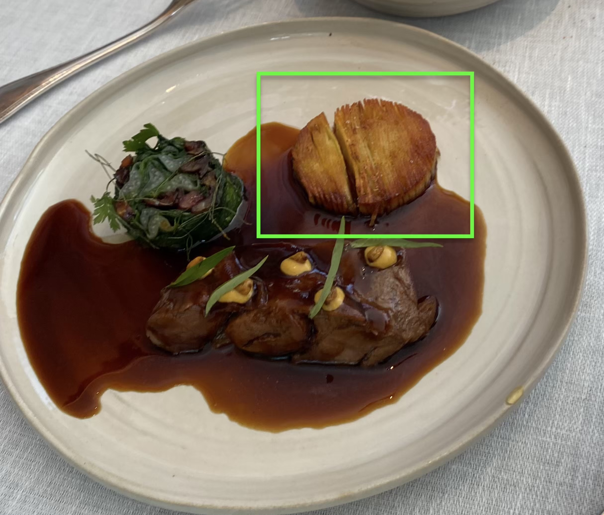

# Vienna, Insbruck, Dolomites, Kufstein, Munich 2024

## Overview

This is a 12 day trip traveling to different places.

For Serena's friend's wedding.

## Departure: Taylor's Tears

EWR->VIE.

EWR is a shitshow, as usual. TSA Pre was about 20 minutes.

Luftansia business lounge re-opened recently though, so we actually have a lounge for the first time in EWR.

Got on airplane and I went to the bathroom. When I went back, Serena told me passenger in front of her having a nervous breakdown due to:

1. She thought she booked a window seat for +$70, but ended up in the middle seat (but couldn't find a receipt for it)
2. Taylor Swift concert in Vienna is cancelled due to terrorist attacks.

Turns out, the whole plane was mostly women going to Taylor's concert.

The Nervous Breakdown women started handing out frienship bracelets she handmade which were Swiftisms like:

*Midnights*

*Shake It Off*

And so on.

Wanted to quip and asked if she had one for *Cancelled*. But it's probably too soon, as most of the plane bought inflated plane ticket prices (due to the demand for seeing Taylor) and will be staying at inflated price hotels, in Vienna, with almost nothing to do.

Various passengers complained.

Flight attendant complained how she got a new dress at target just to see the concert.

Long story short, they all coped and did some kumbaya shit together and took a bunch of selfies and videos together.

But obviously, the real solution is just to not get swept up in a celebrity's marketing scheme so you feel like you have to pay exhorbitant amounts and travel across the globe just to watch them sing a few songs that tug at your heartstrings. This is because you can't control terrorist attacks / cancellations, but you can control your downside risk should such things happen.

I like Taylor as much as that next person, but I'd watch her if she was nearby. Not if she's halfway across the world.

## Day 1: 2-Star Michelin Restaurant

Landed around 7AM.

Got into city at 8AM.

Dropped off bags at hotel lobby, and they let us use the spa to freshen up / shower.

Ate breakfast / bought coffee.

Coffee here is 9 euros which is obnoxious. So we went to luxury shops to **bait free water and coffee**. You basically pretend to be an interested buyer, where then the sales would ask you if you want something to drink (coffee, water, and/or champagne are the usual choices). Exploit their attempt at forcing reciprocity by leaving after you finish your drinks.

Walked around til 12PM where Serena's friends booked a 2-start michelin restaurant.

It had all the michelin restaurant things. They cooked a piece of char with melted honeywax, and then excavated it once the wax solidified. And it was perfectly cooked. They also had caviar and was pretty extra.

Some dishes taste good, and some dishes were mediocre, but the one I liked best was this:

<figure markdown>   { width="600" }
  <figcaption>Most impressed in this 2-star by the technique of how the executed this fried potato hash</figcaption>
</figure>

<figure markdown>   { width="600" }
  <figcaption>Melted honey wax to cook the fish. Solidified later and they excavated the fish, perfectly cooked. Didn't taste like honey though.</figcaption>
</figure>

A textured grilled/fried potato. Each slice tasted like McDonald's french fries.

1127 euro total, which is just enough for my new Capital One card to meet its requirements to get 40K signup bonus points.

After, we went home and napped until 5:30PM or so. Then went to the welcome dinner.
